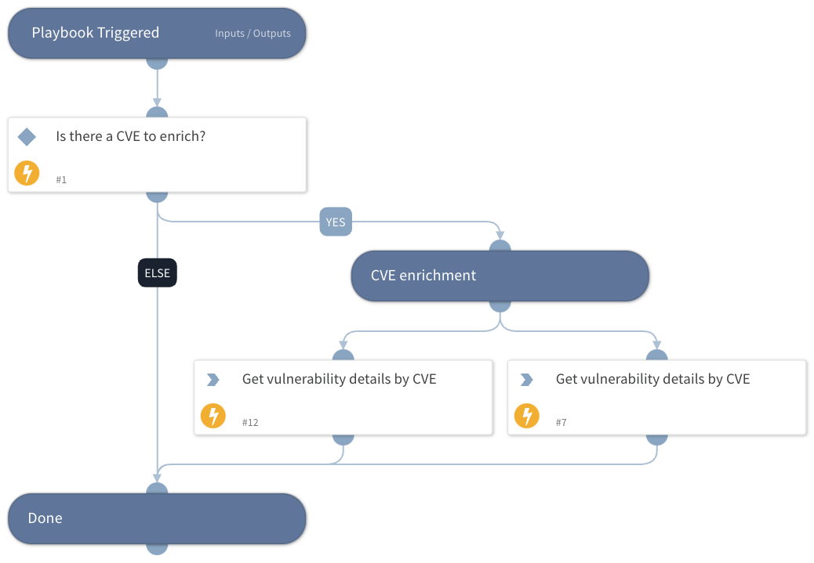

This playbook performs CVE enrichment using the following integrations:
- VulnDB
- CVE Search
- IBM X-Force Exchange

## Dependencies

This playbook uses the following sub-playbooks, integrations, and scripts.

### Sub-playbooks

This playbook does not use any sub-playbooks.

### Integrations

* VulnDB
* CVE Search

### Scripts

This playbook does not use any scripts.

### Commands

* cve-search
* vulndb-get-vuln-by-cve-id
* cve

## Playbook Inputs

---

| **Name** | **Description** | **Default Value** | **Required** |
| --- | --- | --- | --- |
| cve_id | The CVE ID to enrich. | CVE.ID | Optional |

## Playbook Outputs

---

| **Path** | **Description** | **Type** |
| --- | --- | --- |
| CVE | The CVE object. | unknown |
| CVE.ID | The ID of the CVE. | string |
| CVE.CVSS | The CVSS score of the CVE. | number |
| CVE.Published | The date this was published. | date |
| CVE.Modified | When the CVE was last modified. | date |
| CVE.Description | The CVE description | string |
| VulnDB.Vulnerability.ID | Vulnerability ID. | unknown |
| VulnDB.Vulnerability.Title | Vulnerability title \(human readable\). | unknown |
| VulnDB.Vulnerability.Description | Vulnerability description \(human readable\). | unknown |
| VulnDB.Vulnerability.Solution | Vulnerability solution \(human readable\). | unknown |
| VulnDB.CvssMetrics.Id | CVSS reference value. | unknown |
| VulnDB.CvssMetrics.ConfidentialityImpact | CVSS confidentiality impact. | unknown |
| VulnDB.CvssMetrics.AvailabilityImpact | CVSS availability impact. | unknown |
| VulnDB.CvssMetrics.Score | CVSS score. | unknown |
| VulnDB.cvssMetrics.integrity_impact | CVSS integrity impact. | unknown |
| VulnDB.Vendors.Id | Vendor ID. | unknown |
| VulnDB.Products.Id | Product IDs. | unknown |

## Playbook Image

---

