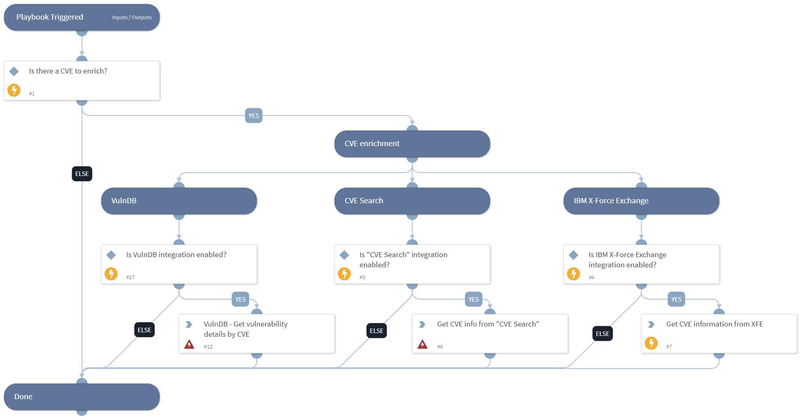

This playbook performs CVE Enrichment using the following integrations:
- VulnDB
- CIRCL CVE Search
- IBM X-Force Exchange

## Dependencies

This playbook uses the following sub-playbooks, integrations, and scripts.

### Sub-playbooks

This playbook does not use any sub-playbooks.

### Integrations

* VulnDB

### Scripts

This playbook does not use any scripts.

### Commands

* vulndb-get-vuln-by-cve-id
* cve
* cve-search

## Playbook Inputs

---

| **Name** | **Description** | **Default Value** | **Required** |
| --- | --- | --- | --- |
| cve_id | The CVE ID to enrich. | CVE.ID | Optional |

## Playbook Outputs

---

| **Path** | **Description** | **Type** |
| --- | --- | --- |
| CVE | The CVE object | string |
| CVE.ID | The ID of the CVE | string |
| CVE.CVSS | The CVSS score of the CVE | number |
| CVE.Published | The date this was published | date |
| CVE.Modified | When CVE was last modified | date |
| CVE.Description | The CVE description | string |
| DBotScore.Vendor | The vendor used to calculate the score. | string |
| DBotScore.Score | The actual score. | string |
| DBotScore.Type | The indicator type. | string |
| DBotScore.Indicator | The indicator that was tested. | string |
| XFE.CVE.Xfdbid | The XFBID of the CVE. | string |
| XFE.CVE.RiskLevel | The risk level of the CVE. | string |
| XFE.CVE.Reported | The reported date of the CVE. | string |
| XFE.CVE.Cvss | The CVSS information of the CVE. | string |
| XFE.CVE.Stdcode | The CVE stdcodes. | string |
| XFE.CVE.Title | The title of the CVE. | string |
| XFE.CVE.Description | The description of the CVE. | string |
| XFE.CVE.PlatformsAffected | The affetcted platforms due to the CVE. | string |
| XFE.CVE.Exploitability | The exploitability of the CVE. | string |
| VulnDB.Vulnerability | The Vulnerability object | string |
| VulnDB.Vulnerability.ID | Vulnerability ID. | string |
| VulnDB.Vulnerability.Title | Vulnerability title \(human readable\). | string |
| VulnDB.Vulnerability.Keywords | Vulnerability keywords. | string |
| VulnDB.Vulnerability.Solution | Vulnerability solution \(human readable\). | string |
| VulnDB.Vulnerability.PublishedDate | Vulnerability published date. | date |
| VulnDB.Vulnerability.TDescription | Vulnerability description \(human readable\). | string |
| VulnDB.Vulnerability.SolutionDate | Vulnerability solution date. | date |
| VulnDB.Vulnerability.DiscoveryDate | Vulnerability discovery date. | date |
| VulnDB.Vulnerability.ExploitPublishDate | Exploit publish date. | date |
| VulnDB.CVE-ExtReferences | The Vulnerability References Objects | string |
| VulnDB.CVE-ExtReferences.Value | CVE \(constant string\). | string |
| VulnDB.CvssMetrics | The Common Vulnerability Scoring Metrics | string |
| VulnDB.CvssMetrics.Id | CVSS reference value. | string |
| VulnDB.CvssMetrics.AccessVector | CVSS access vector. | string |
| VulnDB.CvssMetrics.AccessComplexity | CVSS access complexity. | string |
| VulnDB.CvssMetrics.Authentication | CVSS metric authentication. | string |
| VulnDB.CvssMetrics.ConfidentialityImpact | CVSS confidentiality impact. | string |
| VulnDB.CvssMetrics.AvailabilityImpact | CVSS availability impact. | string |
| VulnDB.CvssMetrics.Generated_on | CVSS metric date. | date |
| VulnDB.CvssMetrics.Score | CVSS score. | string |
| VulnDB.cvssMetrics.integrity_impact | CVSS integrity impact. | string |
| VulnDB.Vendors | Vendors Object | string |
| VulnDB.Vendors.Id | Vendor ID. | string |
| VulnDB.Vendor | Vendor Objects | string |
| VulnDB.Vendor.Name | Vendor name. | string |
| VulnDB.Products | Products Object | string |
| VulnDB.Products.Id | Product IDs. | string |
| VulnDB.Products.Name | Product names. | string |
| VulnDB.Products.Versions | Products version | string |
| VulnDB.Products.Versions.Id | Product version IDs. | string |
| VulnDB.Products.Versions.Name | Product version names. | string |
| VulnDB.Classification | Classification Object | string |
| VulnDB.Classification.Longname | Classification name \(long\). | string |
| VulnDB.Classification.Description | Classification description \(human readable\). | string |

## Playbook Image

---

