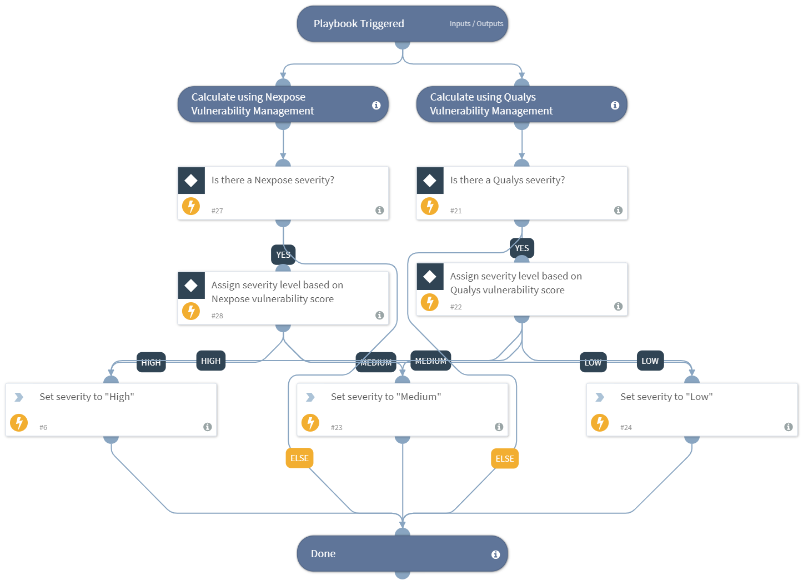

Calculates the incident severity level according to the methodology of a 3rd-party integration.

## Dependencies
This playbook uses the following sub-playbooks, integrations, and scripts.

### Sub-playbooks
This playbook does not use any sub-playbooks.

### Integrations
This playbook does not use any integrations.

### Scripts
* Set

### Commands
This playbook does not use any commands.

## Playbook Inputs
---

| **Name** | **Description** | **Default Value** | **Source** | **Required** |
| --- | --- | --- | --- | --- |
| QualysSeverity | The Qualys vulnerability severity score (1-5). | Severity | Qualys | Optional |
| NexposeSeverity |  The Nexpose vulnerability severity score. Can be, "Moderate", "Severe", "Critical"). | Asset.Vulnerability.Severity | Nexpose | Optional |

## Playbook Outputs
---

| **Path** | **Description** | **Type** |
| --- | --- | --- |
| Severity | The output severity | string |

## Playbook Image
---

