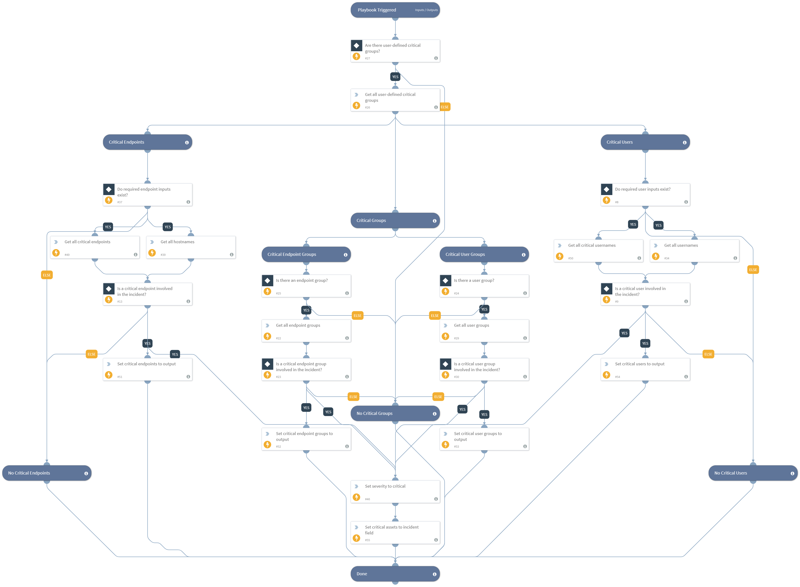

Determines if a critical assest is associated with the invesigation. The playbook returns a severity level of "Critical" if at least one critical asset is associated with the investigation.  

Critical assets refer to: users, user groups, endpoints and endpoint groups.

## Dependencies
This playbook uses the following sub-playbooks, integrations, and scripts.

## Sub-playbooks
This playbook does not use any sub-playbooks.

## Integrations
This playbook does not use any integrations.

## Scripts
* PopulateCriticalAssets
* Set

## Commands
This playbook does not use any commands.

## Playbook Inputs
---

| **Name** | **Description** | **Default Value** | **Source** | **Required** |
| --- | --- | --- | --- | --- |
| CriticalUsers | The CSV of critical users. | admin,administrator | - | Optional |
| CriticalEndpoints | The CSV of critical endpoints. | AdminPC | - | Optional |
| CriticalGroups | The CSV of DN names of critical AD groups. | Administrators, Domain Admins, Enterprise Admins, Schema Admins | - | Optional |
| Account | The user accounts to check against the critical lists. | None | Account | Optional |
| Endpoint | The endpoints to check against the CriticalEndpoints list. | None | Endpoint | Optional |

## Playbook Outputs
---

| **Path** | **Description** | **Type** |
| --- | --- | --- |
| Severities.CriticalAssetsSeverity | The score returned by the `Calculate Severity - Critical Assets v2` playbook. | number |
| CriticalAssets | All critical assets involved in the incident. | unknown |
| CriticalAssets.CriticalEndpoints | The critical endpoints involved in the incident. | unknown |
| CriticalAssets.CriticalEndpointGroups | The critical endpoint-groups involved in the incident. | unknown |
| CriticalAssets.CriticalUsers | The critical users involved in the incident. | unknown |
| CriticalAssets.CriticalUserGroups | The critical user-groups involved in the incident. | unknown |

## Playbook Image
---

