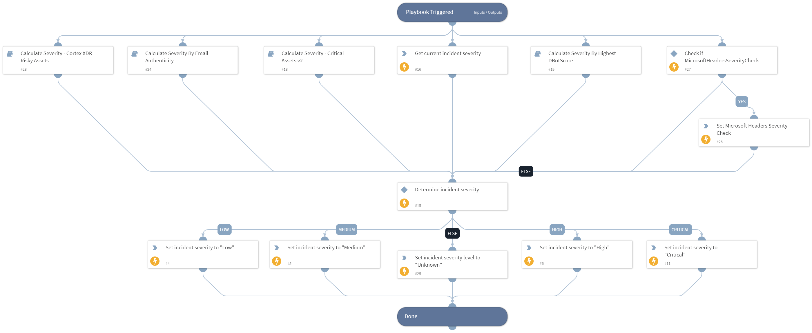

Calculate and assign the incident severity based on the highest returned severity level from the following calculations:

- DBotScores of indicators
- Critical assets
- Email authenticity
- Current incident severity
- Microsoft Headers
- Risky users (XDR)
- Risky hosts (XDR).

## Dependencies

This playbook uses the following sub-playbooks, integrations, and scripts.

### Sub-playbooks

* Calculate Severity By Highest DBotScore
* Calculate Severity - Cortex XDR Risky Assets
* Calculate Severity - Critical Assets v2
* Calculate Severity By Email Authenticity

### Integrations

This playbook does not use any integrations.

### Scripts

* Set

### Commands

* setIncident

## Playbook Inputs

---

| **Name** | **Description** | **Default Value** | **Required** |
| --- | --- | --- | --- |
| DBotScoreIndicators | Array of all indicator values associated with the incident.  | DBotScore.Indicator | Optional |
| CriticalUsers | CSV of usernames of critical users. | admin,administrator | Optional |
| CriticalEndpoints | CSV of hostnames of critical endpoints. | admin | Optional |
| CriticalGroups | CSV of DN names of critical AD groups. | admins,administrators | Optional |
| Account | User accounts to check against the critical lists. | Account | Optional |
| Endpoint | Endpoints to check against the CriticalEndpoints list. | Endpoint | Optional |
| EmailAuthenticityCheck | Indicates the email authenticity resulting from the EmailAuthenticityCheck script. Possible values are: Pass, Fail, Suspicious, and Undetermined. | Email.AuthenticityCheck | Optional |
| MicrosoftHeadersSeverityCheck | The value is set by the "Process Microsoft's Anti-Spam Headers" Playbook, which calculates the severity after processing the PCL, BCL and PCL values inside Microsoft's headers. | ${Email.MicrosoftHeadersSeverityCheck} | Optional |
| XDRRiskyUsers | An object of risky users and their corresponding scores, as outputted by the "xdr-list-risky-users" command. | PaloAltoNetworksXDR.RiskyUser | Optional |
| XDRRiskyHosts | An object of risky hosts and their corresponding scores, as outputted by the "xdr-list-risky-hosts" command. | PaloAltoNetworksXDR.RiskyHost | Optional |
| DBotScoreMaxScore | The highest score (number) that was given to a DBotScore indicatorr. | DBotScore.Score | Optional |

## Playbook Outputs

---

| **Path** | **Description** | **Type** |
| --- | --- | --- |
| CriticalAssets | All critical assets involved in the incident. | unknown |
| CriticalAssets.CriticalEndpoints | Critical endpoints involved in the incident. | unknown |
| CriticalAssets.CriticalEndpointGroups | Critical endpoint-groups involved in the incident. | unknown |
| CriticalAssets.CriticalUsers | Critical users involved in the incident. | unknown |
| CriticalAssets.CriticalUserGroups | Critical user-groups involved in the incident. | unknown |

## Playbook Image

---

