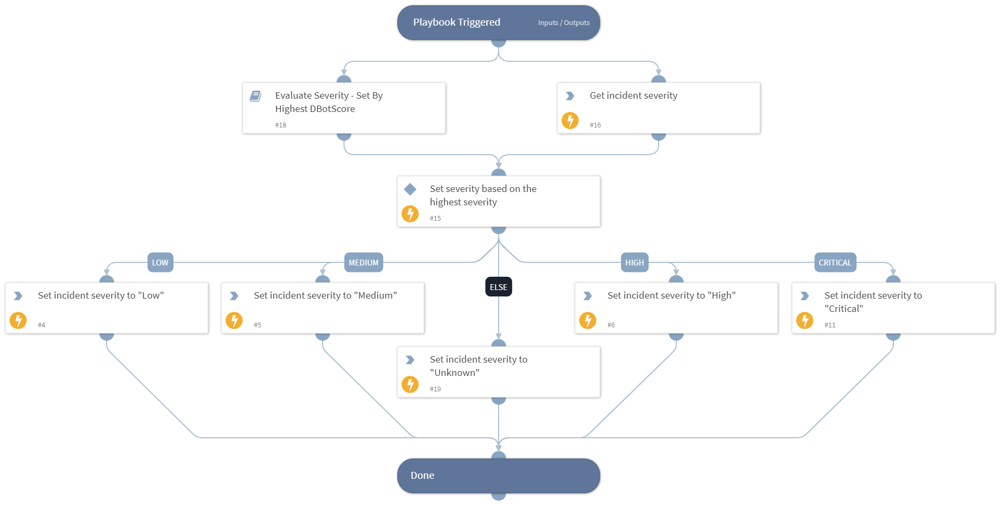

Calculates and sets the incident severity based on the combination of the current incident severity, and the severity returned from the **Calculate Severity By Highest DBotScore** playbook.

## Dependencies

This playbook uses the following sub-playbooks, integrations, and scripts.

### Sub-playbooks

Calculate Severity By Highest DBotScore

### Integrations

This playbook does not use any integrations.

### Scripts

Set

### Commands

* setIncident

## Playbook Inputs

---

| **Name** | **Description** | **Default Value** | **Required** |
| --- | --- | --- | --- |
| DBotScoreIndicators | A list of DBotScore indicator values. | DBotScore.Indicator | Optional |
| DBotScoreMaxScore | The highest score \(number\) that was given to a DBotScore indicator. | DBotScore.Score | Optional |

## Playbook Outputs

---
There are no outputs for this playbook.

## Playbook Image

---

