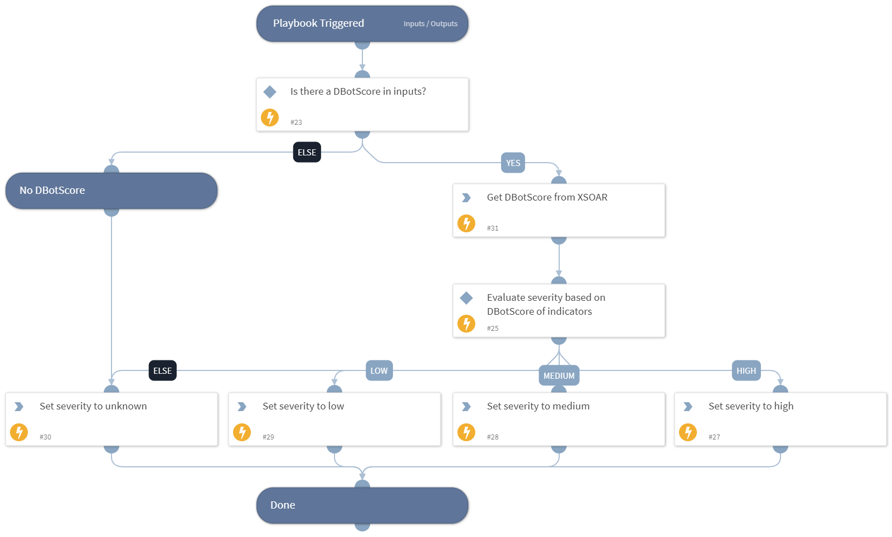

Calculates the incident severity level according to the highest indicator DBotScore.

## Dependencies
This playbook uses the following sub-playbooks, integrations, and scripts.

### Sub-playbooks
This playbook does not use any sub-playbooks.

### Integrations
This playbook does not use any integrations.

### Scripts
* GetIndicatorDBotScoreFromCache
* Set

### Commands
This playbook does not use any commands.

## Playbook Inputs
---

| **Name** | **Description** | **Default Value** | **Required** |
| --- | --- | --- | --- |
| DBotScore | Array of all indicators associated with the incident.  | DBotScore.None | Optional |

## Playbook Outputs
---

| **Path** | **Description** | **Type** |
| --- | --- | --- |
| Severities.DBotScoreSeverity | The severity level of the incident identified and set in the Calculate Severity By Highest DBotScore playbook. | string |

## Playbook Image
---
