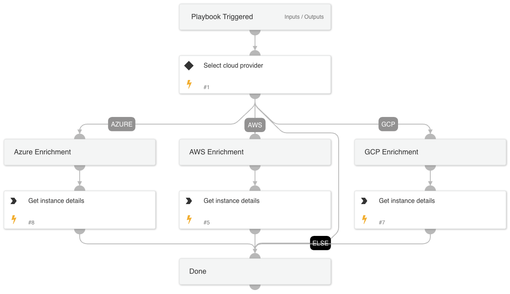

This playbook provides a generic enrichment of AWS, GCP, and Azure compute resources.

## Dependencies

This playbook uses the following sub-playbooks, integrations, and scripts.

### Sub-playbooks

This playbook does not use any sub-playbooks.

### Integrations

This playbook does not use any integrations.

### Scripts

This playbook does not use any scripts.

### Commands

* aws-ec2-describe-instances
* gcp-compute-get-instance
* azure-vm-get-instance-details

## Playbook Inputs

---

| **Name** | **Description** | **Default Value** | **Required** |
| --- | --- | --- | --- |
| cloudProvider | The cloud provider involved. |  | Optional |
| instanceName | The instance name. |  | Optional |
| instanceID | The instance ID. |  | Optional |
| zone | The zone holding the instance. |  | Optional |
| region | The region holding the instance. |  | Optional |
| azureResourceGroup | The instance's resource group. |  | Optional |

## Playbook Outputs

---

| **Path** | **Description** | **Type** |
| --- | --- | --- |
| AWS.EC2.Instances | The instances. | unknown |
| AWS.EC2.Instances.Monitoring | The monitoring for the instance. | unknown |
| AWS.EC2.Instances.State | The current state of the instance. | unknown |
| AWS.EC2.Instances.IamInstanceProfile | The IAM instance profile associated with the instance, if applicable. | unknown |
| AWS.EC2.Instances.NetworkInterfaces | The network interfaces for the instance. | unknown |
| AWS.EC2.Instances.NetworkInterfaces.PrivateIpAddresses | The private IPv4 addresses associated with the network interface. | unknown |
| AWS.EC2.Instances.SecurityGroups | The security groups for the instance. | unknown |
| AWS.EC2.Instances.StateReason | The reason for the most recent state transition. | unknown |
| AWS.EC2.Instances.Tags | Any tags assigned to the instance. | unknown |
| GoogleCloudCompute.Instances | The instances. | unknown |
| GoogleCloudCompute.Instances.tags | Tags to apply to this instance. Tags are used to identify valid sources or targets for network firewalls and are specified by the client during instance creation. The tags can be later modified by the setTags method. Each tag within the list must comply with RFC1035. Multiple tags can be specified via the tags.items field. | unknown |
| GoogleCloudCompute.Instances.networkInterfaces | An array of network configurations for this instance. These specify how interfaces are configured to interact with other network services, such as connecting to the internet. Multiple interfaces are supported per instance. | unknown |
| GoogleCloudCompute.Instances.networkInterfaces.aliasIpRanges | An array of alias IP ranges for this network interface. Can only be specified for network interfaces on subnet-mode networks. | unknown |
| GoogleCloudCompute.Instances.disks | Array of disks associated with this instance. Persistent disks must be created before you can assign them. | unknown |
| GoogleCloudCompute.Instances.disks.initializeParams | Specifies the parameters for a new disk that will be created alongside the new instance. Use initialization parameters to create boot disks or local SSDs attached to the new instance. | unknown |
| GoogleCloudCompute.Instances.disks.initializeParams.sourceImageEncryptionKey | The customer-supplied encryption key of the source image. Required if the source image is protected by a customer-supplied encryption key. | unknown |
| GoogleCloudCompute.Instances.disks.initializeParams.labels | Labels to apply to this disk. These can be later modified by the disks.setLabels method. This field is only applicable for persistent disks. | unknown |
| GoogleCloudCompute.Instances.disks.guestOsFeatures | A list of features to enable on the guest operating system. Applicable only for bootable images. Read Enabling guest operating system features to see a list of available options. | unknown |
| GoogleCloudCompute.Instances.disks.diskEncryptionKey | Encrypts or decrypts a disk using a customer-supplied encryption key. | unknown |
| GoogleCloudCompute.Instances.metadata | The metadata key/value pairs assigned to this instance. This includes custom metadata and predefined keys. | unknown |
| GoogleCloudCompute.Instances.metadata.items | Array of key/value pairs. The total size of all keys and values must be less than 512 KB. | unknown |
| GoogleCloudCompute.Instances.serviceAccounts | A list of service accounts, with their specified scopes, authorized for this instance. Only one service account per VM instance is supported. | unknown |
| GoogleCloudCompute.Instances.scheduling | Sets the scheduling options for this instance. | unknown |
| GoogleCloudCompute.Instances.scheduling.nodeAffinities | A set of node affinity and anti-affinity. | unknown |
| GoogleCloudCompute.Instances.labels | Labels to apply to this instance. These can be later modified by the setLabels method. | unknown |
| GoogleCloudCompute.Instances.guestAccelerators | A list of the type and count of accelerator cards attached to the instance. | unknown |
| Azure.Compute | The VMs. | unknown |

## Playbook Image

---

