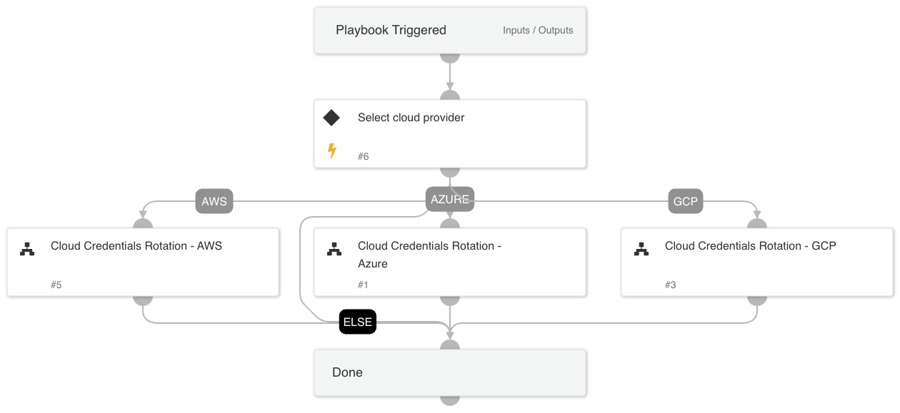

## **Cloud Credentials Rotation - Generic**

This comprehensive playbook combines the remediation steps from AWS, Azure, and GCP sub-playbooks into a single, cohesive guide. Regardless of which Cloud Service Provider (CSP) you're working with, this playbook will direct you to the relevant steps, ensuring swift and effective response.

The primary objective is to offer an efficient way to address compromised credentials across different cloud platforms. By consolidating the key steps from AWS, Azure, and GCP, it minimizes the time spent searching for platform-specific procedures and accelerates the remediation process, ensuring the highest level of security for your cloud environments.

## **Integrations for Each Sub-Playbook**

In order to seamlessly execute the actions mentioned in each sub-playbook, specific integrations are essential. These integrations facilitate the automated tasks and processes that the playbook carries out. Here are the required integrations for each sub-playbook:

### **AWS Sub-Playbook:**
1. [**AWS - IAM**](https://xsoar.pan.dev/docs/reference/integrations/aws---iam): Used to manage AWS Identity and Access Management.
2. [**AWS - EC2**](https://xsoar.pan.dev/docs/reference/integrations/aws---ec2): Essential for managing Amazon Elastic Compute Cloud (EC2) instances.

### **GCP Sub-Playbook:**
1. [**Google Workspace Admin**](https://xsoar.pan.dev/docs/reference/integrations/g-suite-admin): Manages users, groups, and other entities within Google Workspace.
2. [**GCP-IAM**](https://xsoar.pan.dev/docs/reference/integrations/gcp-iam): Ensures management and control of GCP's Identity and Access Management.

### **Azure Sub-Playbook:**
1. [**Microsoft Graph Users**](https://xsoar.pan.dev/docs/reference/integrations/microsoft-graph-user): Manages users and related entities in Microsoft Graph.
2. [**Microsoft Graph Applications**](https://xsoar.pan.dev/docs/reference/integrations/microsoft-graph-applications): Manages applications within Microsoft Graph.

## Dependencies

This playbook uses the following sub-playbooks, integrations, and scripts.

### Sub-playbooks

* Cloud Credentials Rotation - GCP
* Cloud Credentials Rotation - AWS
* Cloud Credentials Rotation - Azure

### Integrations

This playbook does not use any integrations.

### Scripts

This playbook does not use any scripts.

### Commands

This playbook does not use any commands.

## Playbook Inputs

---

| **Name** | **Description** | **Default Value** | **Required** |
| --- | --- | --- | --- |
| RemediationType | The response playbook provides the following remediation actions using AWS, MSGraph Users, GCP and GSuite Admin:  Reset: By entering "Reset" in the input, the playbook will execute password reset. Supports: AWS, MSGraph Users, GCP and GSuite Admin.  Revoke: By entering "Revoke" in the input, the GCP will revoke the access key, GSuite Admin will revoke the access token and the MSGraph Users will revoke the session. Supports: GCP, GSuite Admin and MSGraph Users.  Deactivate - By entering "Deactivate" in the input, the playbook will execute access key deactivation. Supports: AWS.  ALL: By entering "ALL" in the input, the playbook will execute the all remediation actions provided for each CSP. |  | Optional |
| shouldCloneSA | Whether to clone the compromised SA before putting a deny policy to it. Supports: AWS. True/False | True | Optional |
| GCP-userID | Identifies the user in the API request. The value can be the user's primary email address, alias email address, or unique user ID. |  | Optional |
| GCP-clientID | The client ID. |  | Optional |
| GCP-zone | The name of the zone. e.g. us-central1-c us-central1-b |  | Optional |
| GCP-SAEmail | The service account email. |  | Optional |
| Azure-AppID | This is the unique application \(client\) ID of the application. |  | Optional |
| Azure-ObjectID | This is the unique ID of the service principal object associated with the application. |  | Optional |
| Azure-userID | The user ID or user principal name. |  | Optional |
| AWS-instanceID | The instance ID. |  | Optional |
| AWS-userID | The user name. |  | Optional |
| AWS-accessKeyID | The access key ID. |  | Optional |
| AWS-newRoleName | The name of the new role to create if the analyst decides to clone the service account. |  | Optional |
| AWS-newInstanceProfileName | The name of the new instance profile to create if the analyst decides to clone the service account. |  | Optional |
| AWS-roleNameToRestrict | If provided, the role will be attached with a deny policy without the compute instance analysis flow. |  | Optional |
| cloudProvider | The CSP that triggered the alert. Usually mapped to incident field named 'cloudprovider'. e.g. AWS, AZURE, GCP |  | Optional |
| identityType | The type of identity involved. Usually mapped to incident field named 'cloudidentitytype'. e.g. IAM,SERVICE_ACCOUNT,APPLICATION |  | Optional |
| GCP-cloudProject | The project that the alert was triggered on. |  | Optional |

## Playbook Outputs

---

| **Path** | **Description** | **Type** |
| --- | --- | --- |
| MSGraphUser | The Microsoft Graph Users information. | unknown |
| MSGraphApplication | The Microsoft Graph Application information. | unknown |
| GoogleCloudCompute.Instances | Google Cloud Compute instance information. | unknown |
| GCPIAM.ServiceAccountKey | The service account keys. | unknown |
| GCPIAM.ServiceAccount | The service account information. | unknown |
| AWS.EC2.Instances | AWS EC2 instance information. | unknown |
| AWS.IAM.InstanceProfiles | AWS IAM instance profile information. | unknown |
| AWS.IAM.Roles.AttachedPolicies.Policies | A list of managed policy names. | unknown |
| AWS.IAM.Roles.RoleName.Policies | A list of policy names. | unknown |

## Playbook Image

---

