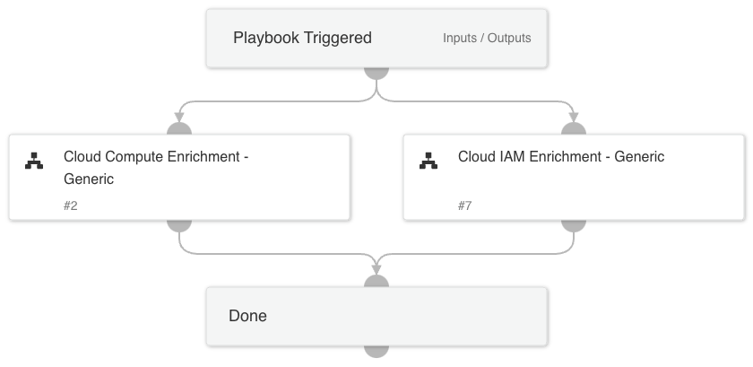

## Generic Cloud Enrichment Playbook

The **Cloud Enrichment - Generic Playbook** is designed to unify all the relevant playbooks concerning the enrichment of information in the cloud. It provides a standardized approach to enriching information in cloud environments.

### Supported Blocks

1. **Cloud IAM Enrichment - Generic**
   - Enriches information related to Identity and Access Management (IAM) in the cloud.

2. **Cloud Compute Enrichment - Generic**
   - Enriches information related to cloud compute resources.

The playbook supports a single CSP enrichment at a time.

## Dependencies

This playbook uses the following sub-playbooks, integrations, and scripts.

### Sub-playbooks

* Cloud IAM Enrichment - Generic
* Cloud Compute Enrichment - Generic

### Integrations

This playbook does not use any integrations.

### Scripts

This playbook does not use any scripts.

### Commands

This playbook does not use any commands.

## Playbook Inputs

---

| **Name** | **Description** | **Default Value** | **Required** |
| --- | --- | --- | --- |
| cloudProvider | The cloud provider involved. The supported CSPs are AWS, Azure and GCP. |  | Optional |
| instanceName | The instance name. |  | Optional |
| instanceID | The instance ID. |  | Optional |
| zone | The zone holding the instance. |  | Optional |
| region | The region holding the instance. |  | Optional |
| azureResourceGroup | The instance's resource group. |  | Optional |
| username | The username involved. |  | Optional |
| GCPProjectName | The GCP project name. |  | Optional |
| cloudIdentityType | The type of the GCP identity. Can be either Service Account or a user. |  | Optional |

## Playbook Outputs

---

| **Path** | **Description** | **Type** |
| --- | --- | --- |
| AWS.EC2.Instances | The instances. | unknown |
| AWS.EC2.Instances.NetworkInterfaces | The network interfaces for the instance. | unknown |
| GoogleCloudCompute.Instances | The instances. | unknown |
| GoogleCloudCompute.Instances.networkInterfaces | An array of network configurations for this instance. These specify how interfaces are configured to interact with other network services, such as connecting to the internet. Multiple interfaces are supported per instance. | unknown |
| GoogleCloudCompute.Instances.disks | Array of disks associated with this instance. Persistent disks must be created before you can assign them. | unknown |
| GoogleCloudCompute.Instances.metadata | The metadata key/value pairs assigned to this instance. This includes custom metadata and predefined keys. | unknown |
| GoogleCloudCompute.Instances.scheduling | Sets the scheduling options for this instance. | unknown |
| Azure.Compute | The VMs. | unknown |
| AWS.IAM.Users | AWS AM Users include: UserId Arn CreateDate Path PasswordLastUsed | unknown |
| AWS.IAM.UserPolicies | AWS IAM - user inline policies. | unknown |
| AWS.IAM.AttachedUserPolicies | AWS IAM - User attached policies. | unknown |
| AWS.IAM.Users.AccessKeys | AWS IAM Users Access Keys include: AccessKeyId Status CreateDate UserName | unknown |
| AWS.IAM.Users.Groups | AWS IAM - User groups. | unknown |
| GCPIAM | GCP IAM information. | unknown |
| GSuite | GSuite user information. | unknown |
| MSGraphUser | MSGraph user information. | unknown |
| MSGraphGroups | MSGraph groups information. | unknown |
| MSGraphGroup | MSGraph group information. | unknown |
| GSuite.PageToken | Token to specify the next page in the list. | unknown |
| MSGraph.identityProtection | MSGraph identity protection - risky user history. | unknown |
| AWS.IAM.Users.AccessKeys.CreateDate | The date when the access key was created. | unknown |
| AWS.IAM.Users.AccessKeys.UserName | The name of the IAM user that the key is associated with. | unknown |

## Playbook Image

---

