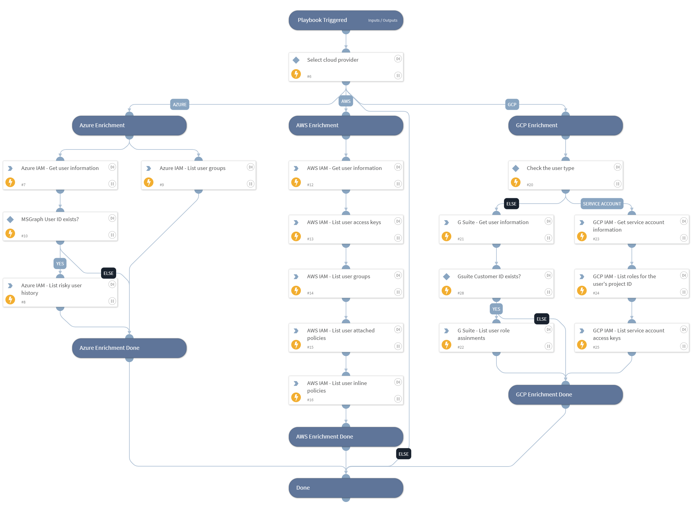

This playbook is responsible for collecting and enriching data on Identity Access Management (IAM) in cloud environments (AWS, Azure, and GCP).

## Dependencies

This playbook uses the following sub-playbooks, integrations, and scripts.

### Sub-playbooks

This playbook does not use any sub-playbooks.

### Integrations

* AWS - IAM

### Scripts

This playbook does not use any scripts.

### Commands

* msgraph-identity-protection-risky-user-history-list
* aws-iam-list-access-keys-for-user
* gsuite-user-get
* aws-iam-get-user
* gsuite-role-assignment-list
* aws-iam-list-groups-for-user
* aws-iam-list-attached-user-policies
* gcp-iam-service-account-keys-get
* gcp-iam-service-accounts-get
* aws-iam-list-user-policies
* msgraph-groups-list-groups
* gcp-iam-project-role-list
* msgraph-user-get

## Playbook Inputs

---

| **Name** | **Description** | **Default Value** | **Required** |
| --- | --- | --- | --- |
| username | User name. |  | Optional |
| GCPProjectName | The GCP project name. |  | Optional |
| cloudProvider | The cloud service provider involved. |  | Optional |
| cloudIdentityType | The cloud identity type. |  | Optional |

## Playbook Outputs

---

| **Path** | **Description** | **Type** |
| --- | --- | --- |
| AWS.IAM.Users | AWS AM Users include: UserId Arn CreateDate Path PasswordLastUsed. | unknown |
| AWS.IAM.Users.AccessKeys | AWS IAM Users Access Keys include: AccessKeyId Status CreateDate UserName. | unknown |
| GCPIAM | GCP IAM information. | unknown |
| GSuite | GSuite user information. | unknown |
| GSuite.PageToken | Token to specify the next page in the list. | unknown |
| MSGraphUser | MSGraph user information. | unknown |
| MSGraphGroups | MSGraph groups information. | unknown |
| MSGraph.identityProtection | MSGraph identity protection - risky user history. | unknown |
| AWS.IAM.Users.AccessKeys.CreateDate | The date when the access key was created. | unknown |
| AWS.IAM.Users.AccessKeys.UserName | The name of the IAM user that the key is associated with. | unknown |
| AWS.IAM.Users.Groups | AWS IAM - User groups. | unknown |
| AWS.IAM.UserPolicies | AWS IAM - user inline policies. | unknown |
| AWS.IAM.AttachedUserPolicies | AWS IAM - User attached policies. | unknown |
| MSGraphGroup | MSGraph group information. | unknown |
| MSGraph.identityProtection.RiskyUserHistory | Risky user history. | unknown |
| MSGraph.identityProtection.RiskyUserHistory.userPrincipalName | Risky user principal name. | unknown |
| MSGraph.identityProtection.RiskyUserHistory.userDisplayName | Risky user display name. | unknown |
| MSGraph.identityProtection.RiskyUserHistory.riskDetail | Reason why the user is considered a risky user. The possible values are limited to none, adminGeneratedTemporaryPassword, userPerformedSecuredPasswordChange, userPerformedSecuredPasswordReset, adminConfirmedSigninSafe, aiConfirmedSigninSafe, userPassedMFADrivenByRiskBasedPolicy, adminDismissedAllRiskForUser, adminConfirmedSigninCompromised, hidden, adminConfirmedUserCompromised, and unknownFutureValue. | unknown |
| MSGraph.identityProtection.RiskyUserHistory.riskstate | State of the user's risk. The possible values are none, confirmedSafe, remediated, dismissed, atRisk, confirmedCompromised, and unknownFutureValue. | unknown |
| MSGraph.identityProtection.RiskyUserHistory.riskLevel | Risk level of the detected risky user. The possible values are low, medium, high, hidden, none, and unknownFutureValue. | unknown |
| MSGraph.identityProtection.RiskyUserHistory.riskLastUpdatedDateTime | The date and time that the risky user was last updated. The DateTimeOffset type represents date and time information using the ISO 8601 format and is always in UTC time. | unknown |
| MSGraph.identityProtection.RiskyUserHistory.isProcessing | Indicates whether a user's risky state is being processed by the backend. | unknown |
| MSGraph.identityProtection.RiskyUserHistory.isDeleted | Indicates whether the user is deleted. | unknown |
| MSGraph.identityProtection.RiskyUserHistory.id | Unique ID of the risky user. | unknown |

## Playbook Image

---

