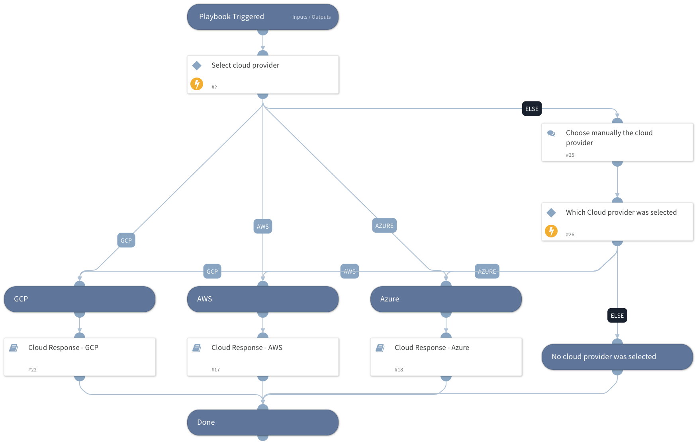

This playbook provides response playbooks for:
- AWS
- Azure
- GCP

The response actions available are:
- Terminate/Shut down/Power off an instance
- Delete/Disable a user
- Delete/Revoke/Disable credentials
- Block indicators

## Dependencies
This playbook uses the following sub-playbooks, integrations, and scripts.

### Sub-playbooks
* Cloud Response - GCP
* Cloud Response - AWS
* Cloud Response - Azure

### Integrations
This playbook does not use any integrations.

### Scripts
This playbook does not use any scripts.

### Commands
This playbook does not use any commands.

## Playbook Inputs
---

| **Name** | **Description** | **Default Value** | **Required** |
| --- | --- | --- | --- |
| cloudProvider | The cloud service provider involved. |  | Optional |
| autoResourceRemediation | Whether to execute the resource remediation flow automatically. |  | Optional |
| AWS-resourceRemediationType | Choose the remediation type for the instances created.  AWS available types: Stop - for stopping the instances. Terminate - for terminating the instances. |  | Optional |
| Azure-resourceRemediationType | Choose the remediation type for the instances created.  Azure available types: Poweroff - for shutting down the instances. Delete - for deleting the instances. |  | Optional |
| GCP-resourceRemediationType | Choose the remediation type for the instances created.  GCP available types: Stop - For stopping the instances. Delete - For deleting the instances. |  | Optional |
| autoAccessKeyRemediation | Whether to execute the user remediation flow automatically. |  | Optional |
| AWS-accessKeyRemediationType | Choose the remediation type for the user's access key.  AWS available types: Disable - for disabling the user's access key. Delete - for the user's access key deletion. |  | Optional |
| GCP-accessKeyRemediationType | Choose the remediation type for the user's access key.  GCP available types: Disable - For disabling the user's access key. Delete - For the deleting user's access key. |  | Optional |
| autoUserRemediation | Whether to execute the user remediation flow automatically. |  | Optional |
| AWS-userRemediationType | Choose the remediation type for the user involved.  AWS available types: Delete - for the user deletion. Revoke - for revoking the user's credentials. |  | Optional |
| Azure-userRemediationType | Choose the remediation type for the user involved.  Azure available types: Disable - for disabling the user. Delete - for deleting the user. |  | Optional |
| GCP-userRemediationType | Choose the remediation type for the user involved.  GCP available types: Delete - For deleting the user. Disable - For disabling the user. |  | Optional |
| autoBlockIndicators | Whether to block the indicators automatically. |  | Optional |
| resourceName | The resource name to take action on.  Supports: AWS, GCP and Azure |  | Optional |
| resourceZone | The resource's zone to take action on.  Supports: GCP |  | Optional |
| resourceGroup | Supports: Azure The resource group to take action on. |  | Optional |
| accessKeyName | The access key name in the following format: projects/\{PROJECT_ID\}/serviceAccounts/\{ACCOUNT\}/keys/\{key\}.  Supports: GCP |  | Optional |
| accessKeyId | The user's access key ID.  Supports: AWS |  | Optional |
| region | The resource's region.  Supports: AWS |  | Optional |
| username | The username to take action on.  Supports: AWS, GCP and Azure |  | Optional |

## Playbook Outputs
---
There are no outputs for this playbook.

## Playbook Image
---
