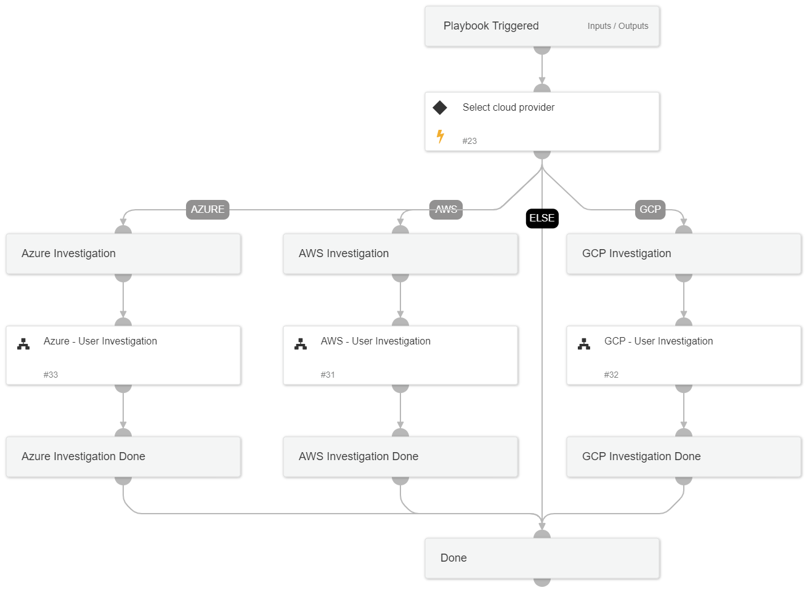

This playbook performs an investigation on a specific user in cloud environments, using queries and logs from Azure Log Analytics, AWS CloudTrail, G Suite Auditor, and GCP Logging.

## Dependencies

This playbook uses the following sub-playbooks, integrations, and scripts.

### Sub-playbooks

* Azure - User Investigation
* GCP - User Investigation
* AWS - User Investigation

### Integrations

This playbook does not use any integrations.

### Scripts

This playbook does not use any scripts.

### Commands

This playbook does not use any commands.

## Playbook Inputs

---

| **Name** | **Description** | **Default Value** | **Required** |
| --- | --- | --- | --- |
| Username | The username to investigate. |  | Optional |
| AzureSearchTime | The Search Time for the Azure Log Analytics search query. Default value: ago\(1d\) | ago(1d) | Optional |
| failedLogonThreshold | The threshold number of failed logons by the user. Required to determine how many failed logon events count as suspicious events. | 20 | Optional |
| MfaAttemptThreshold | The threshold number of MFA failed logon by the user. Required to determine how many MFA failed logon events count as suspicious events. | 10 | Optional |
| AwsTimeSearchFrom | The Search Time for the \`GetTime\` task used by the Aws Cloud Trail search query.  This value represents the number of days to include in the search. Default value: 1.  \(1 Day\) | 1 | Optional |
| GcpProjectName | The GCP project name. This is a mandatory field for GCP queries. |  | Optional |
| GcpTimeSearchFrom | The Search Time for the \`GetTime\` task used by the GCP Logging search query.  This value represents the number of days to include in the search. Default value: 1.  \(1 Day\) | 1 | Optional |
| cloudProvider | The cloud service provider involved. |  | Optional |

## Playbook Outputs

---

| **Path** | **Description** | **Type** |
| --- | --- | --- |
| AwsMFAConfigCount | The number of MFA configurations performed by the user in the AWS environment. | unknown |
| AwsUserRoleChangesCount | The number of user roles that were changed by the user in the AWS environment. | unknown |
| AwsSuspiciousActivitiesCount | The number of suspicious activities performed by the user in the AWS environment. | unknown |
| AwsScriptBasedUserAgentCount | The number of script-based user agent usages by the user in the AWS environment. | unknown |
| AwsAccessKeyActivitiesCount | The number of access key activities performed by the user in the AWS environment. | unknown |
| AwsSecurityChangesCount | The number of security rules that were changed by the user in the AWS environment. | unknown |
| AwsAdminActivitiesCount | The number of administrative activities performed by the user in the AWS environment. | unknown |
| AwsApiAccessDeniedCount | The number of API accesses denied by the user in the AWS environment. | unknown |
| AwsFailedLogonCount | The number of failed logins by the user in the AWS environment. | unknown |
| GcpAnomalousNetworkTraffic | Determines whether there are events of anomalous network traffic performed by the user in the GCP environment. | unknown |
| GcpSuspiciousApiUsage | Determines whether there are events of suspicious API usage by the user in the GCP environment. | unknown |
| GcpFailLogonCount | The number of failed logins by the user in the GCP environment. | unknown |
| GsuiteFailLogonCount | The number of failed logins by the user in the G Suite environment. | unknown |
| GsuiteUnusualLoginAllowedCount | The number of unusual logins performed by the user and allowed in the G Suite environment. | unknown |
| GsuiteUnusualLoginBlockedCount | The number of unusual logins performed by the user and blocked in the G Suite environment. | unknown |
| GsuiteSuspiciousLoginCount | The number of suspicious logins performed by the user in the G Suite environment. | unknown |
| GsuiteUserPasswordLeaked | Determines whether user's password was leaked in the G Suite environment. | unknown |
| AzureScriptBasedUserAgentEvents | Script-based user agent events used by the user in the Azure environment. | unknown |
| AzureAdminActivitiesEvents | Administrative activities performed by the user in the Azure environment. | unknown |
| AzureSecurityRulesChangeEvents | Security rules that were changed by the user in the Azure environment. | unknown |
| AzureUnsuccessSecurityRulesChangeEvents | Unsuccessful attempts to change security rules by the user in the Azure environment. | unknown |
| AzureFailLoginCount | The number of failed logins by the user in the Azure environment. | unknown |
| AzureFailLoginMFACount | The number of failed logins by the user using MFA in the Azure environment. | unknown |
| AzureAnomaliesEvents | Anomaly events on the user in the Azure environment. | unknown |
| AzureRiskyUserCount | The number of events where the user was defined as a risky user in the Azure environment. | unknown |
| AzureUncommonCountryLogonEvents | Uncommon country logon events by the user in the Azure environment. | unknown |
| AzureUncommonVolumeEvents | Uncommon volume events by the user in the Azure environment. | unknown |
| AzureUncommonActivitiesEvents | Uncommon activity events by the user in the Azure environment. | unknown |
| CountAzureEvents.AzureScriptBasedUserAgentCount | The number of script-based user agent usages by the user in the Azure environment. | unknown |
| CountAzureEvents.AzureAdminActivitiesCount | The number of administrative activities performed by the user in the Azure environment. | unknown |
| CountAzureEvents.AzureSecurityRulesChangeCount | The number of security rules that were changed by the user in the Azure environment. | unknown |
| CountAzureEvents.AzureUnsuccessSecurityRulesChangeCount | The number of unsuccessful attempts to change security rules by the user in the Azure environment. | unknown |
| CountAzureEvents.AzureAnomaliesCount | The number of anomaly events on the user in the Azure environment. | unknown |
| CountAzureEvents.AzureUncommonCountryLogonCount | The number of uncommon country logon events by the user in the Azure environment. | unknown |
| CountAzureEvents.AzureUncommonVolumeCount | The number of uncommon volume events by the user in the Azure environment. | unknown |
| CountAzureEvents.AzureUncommonActivitiesCount | The number of uncommon activity events by the user in the Azure environment. | unknown |

## Playbook Image

---

