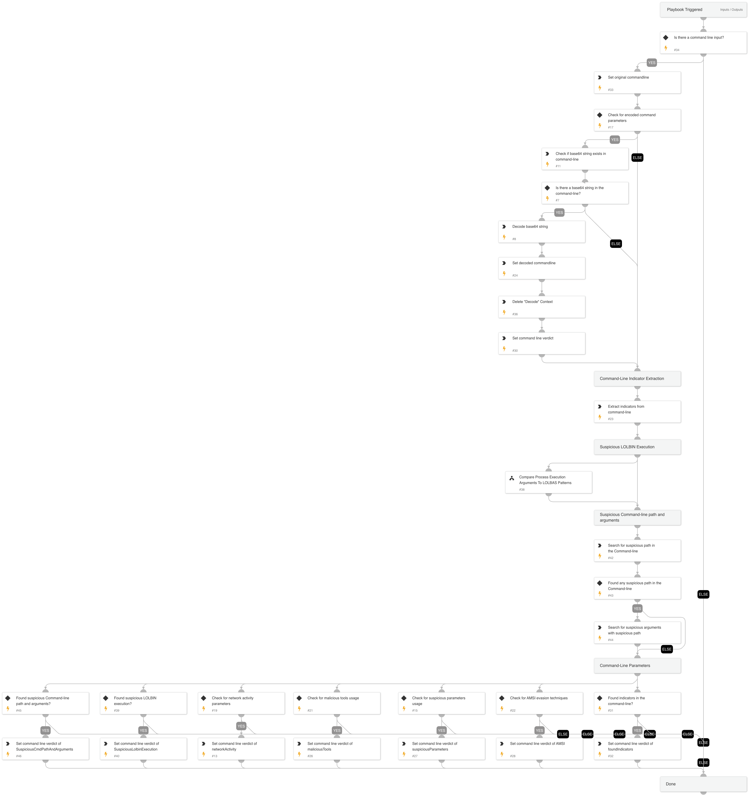

This playbook takes a command line from the alert and performs the following actions:
- Checks for base64 string and decodes if exists
- Extracts and enriches indicators from the command line
- Checks specific arguments for malicious usage 

At the end of the playbook, it sets a possible verdict for the command line, based on the finding:
1. Indicators found in the command line
2. Found AMSI techniques
3. Found suspicious parameters
4. Usage of malicious tools
5. Indication of network activity
6. Indication of suspicious LOLBIN execution
7. Suspicious path and arguments in the command line

Note: To run this playbook with a list of command lines, set this playbook to run in a loop. To do so, navigate to 'Loop'  and check "For Each Input".

## Dependencies

This playbook uses the following sub-playbooks, integrations, and scripts.

### Sub-playbooks

* Compare Process Execution Arguments To LOLBAS Patterns

### Integrations

This playbook does not use any integrations.

### Scripts

* Base64Decode
* DeleteContext
* MatchRegexV2
* Set

### Commands

* extractIndicators

## Playbook Inputs

---

| **Name** | **Description** | **Default Value** | **Required** |
| --- | --- | --- | --- |
| Commandline | The command line. |  | Optional |
| StringSimilarityThreshold | StringSimilarity automation threshold. Used by the Compare "Process Execution Arguments To LOLBAS Patterns" sub-playbook. This input controls the StringSimilarity automation threshold. | 0.5 | Optional |

## Playbook Outputs

---

| **Path** | **Description** | **Type** |
| --- | --- | --- |
| MatchRegex | The regex found in the command line. | unknown |
| Indicators | Indicators extracted from the command line. | unknown |
| commandline.original | The original command line. | unknown |
| commandline.decoded | The decoded command line. | unknown |
| IP | The IP object. | unknown |
| URL | The URL object. | uknown |
| File | The file object. | unknown |
| Domain | The domain object. | unknown |
| CommandlineVerdict.base64 | Command line verdict base64 was found. True/False | unknown |
| CommandlineVerdict.suspiciousParameters | Command line verdict suspicious parameters found. True/False | unknown |
| CommandlineVerdict.AMSI | Command line verdict AMSI found. True/False | unknown |
| CommandlineVerdict.foundIndicators | Command line verdict foundIndicators found. True/False | unknown |
| CommandlineVerdict.maliciousTools | Command line verdict maliciousTools found. True/False | unknown |
| CommandlineVerdict.networkActivity | Command line verdict networkActivity found. True/False | unknown |
| CommandlineVerdict.SuspiciousLolbinExecution | Command line verdict SuspiciousLolbinExecution found. True/False | unknown |
| CommandlineVerdict.SuspiciousCmdPathAndArguments | Command line verdict SuspiciousCmdPathAndArguments found. True/False | unknown |

## Playbook Image

---

