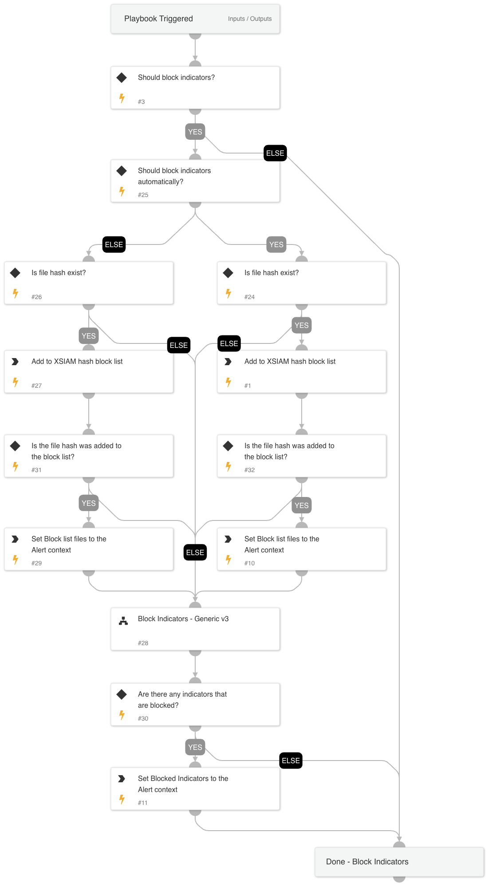

This playbook is one of the sub-playbooks in the containment plan. 
This playbook handles blocking of indicators as a crucial step in the containment action.

## Dependencies

This playbook uses the following sub-playbooks, integrations, and scripts.

### Sub-playbooks

* Block Indicators - Generic v3

### Integrations

This playbook does not use any integrations.

### Scripts

* CompareLists

### Commands

* core-blocklist-files
* setParentIncidentContext

## Playbook Inputs

---

| **Name** | **Description** | **Default Value** | **Required** |
| --- | --- | --- | --- |
| BlockIndicators | Set to 'True' to block the indicators. | True | Optional |
| UserVerification | Possible values: True/False. Whether to provide user verification for blocking those IPs.   False - No prompt will be displayed to the user. True - The server will ask the user for blocking verification and will display the blocking list. | False | Optional |
| AutoBlockIndicators | Possible values: True/False.  Default: True. Should the given indicators be automatically blocked, or should the user be given the option to choose?  If set to False - no prompt will appear, and all provided indicators will be blocked automatically. If set to True - the user will be prompted to select which indicators to block. | True | Optional |
| FileHash | The file hash to block. |  | Optional |
| IP | The IP indicators. |  | Optional |
| Domain | The domain indicators. |  | Optional |
| URL | The URL indicator. |  | Optional |
| Username | The username to disable. |  | Optional |
| FilePath | The path of the file to block. |  | Optional |

## Playbook Outputs

---
There are no outputs for this playbook.

## Playbook Image

---

