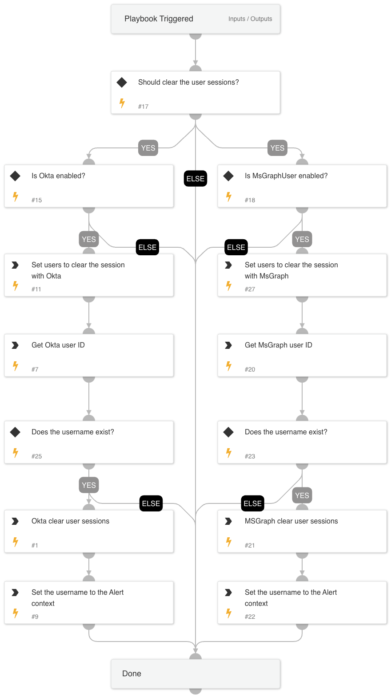

## Containment Plan - Clear User Sessions

This playbook is a sub-playbook within the containment plan playbook.
The playbook uses the 'Okta v2' and 'MSGraph User' integrations to clear user sessions.

## Dependencies

This playbook uses the following sub-playbooks, integrations, and scripts.

### Sub-playbooks

This playbook does not use any sub-playbooks.

### Integrations

This playbook does not use any integrations.

### Scripts

* IsIntegrationAvailable
* Set

### Commands

* msgraph-user-get
* okta-clear-user-sessions
* okta-get-user
* setParentIncidentContext
* msgraph-user-session-revoke

## Playbook Inputs

---

| **Name** | **Description** | **Default Value** | **Required** |
| --- | --- | --- | --- |
| ClearUserSessions | Set to 'True' to clear the user active sessions. | True | Optional |
| Username | The username to disable. |  | Optional |
| IAMUserDomain | The Okta IAM users domain. The domain will be appended to the username. E.g., username@IAMUserDomain. |  | Optional |

## Playbook Outputs

---
There are no outputs for this playbook.

## Playbook Image

---

