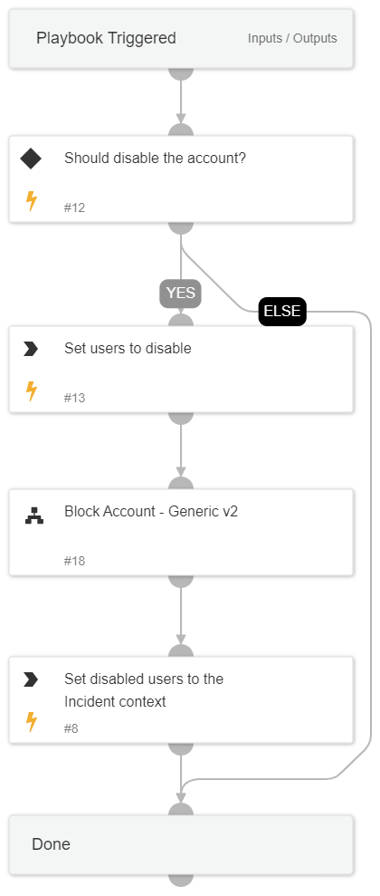

## Containment Plan - Disable Account

This playbook is a sub-playbook within the containment plan playbook.
The playbook disables users by utilizing the sub-playbook "Block Account - Generic v2"

## Dependencies

This playbook uses the following sub-playbooks, integrations, and scripts.

### Sub-playbooks

* Block Account - Generic v2

### Integrations

This playbook does not use any integrations.

### Scripts

* SetAndHandleEmpty

### Commands

* setParentIncidentContext

## Playbook Inputs

---

| **Name** | **Description** | **Default Value** | **Required** |
| --- | --- | --- | --- |
| UserContainment | Set to 'True' to disable the user account. | True | Optional |
| Username | The username to disable. |  | Optional |
| UserVerification | Possible values:True/False. Default:True. Specify if User Verification is required to disable users. | True | Optional |

## Playbook Outputs

---

| **Path** | **Description** | **Type** |
| --- | --- | --- |
| Blocklist.Final | Blocked accounts | unknown |

## Playbook Image

---

