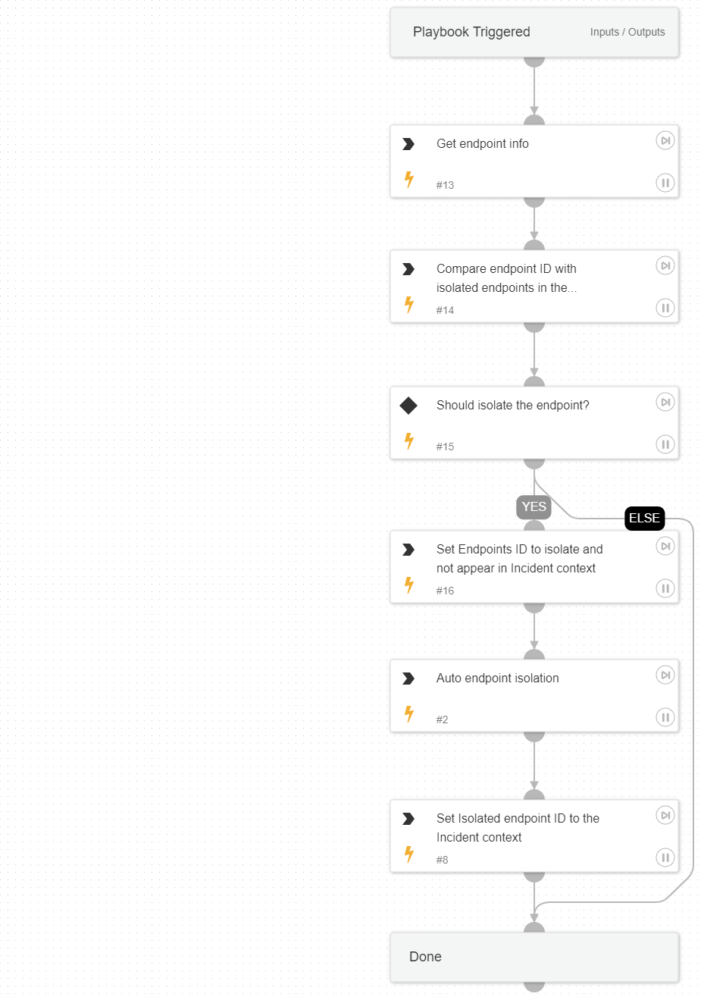

This playbook is one of the sub-playbooks in the containment plan. 
This playbook handles isolating the Endpoint as a crucial step in the containment action.

## Dependencies

This playbook uses the following sub-playbooks, integrations, and scripts.

### Sub-playbooks

This playbook does not use any sub-playbooks.

### Integrations

This playbook does not use any integrations.

### Scripts

* CompareLists
* SetAndHandleEmpty

### Commands

* setParentIncidentContext
* core-get-endpoints
* core-isolate-endpoint

## Playbook Inputs

---

| **Name** | **Description** | **Default Value** | **Required** |
| --- | --- | --- | --- |
| HostContainment | Whether to execute endpoint isolation. | True | Optional |
| EndpointID | The endpoint ID to run commands over. |  | Optional |
| EndpointHostName | The endpoint Hostname. |  | Optional |

## Playbook Outputs

---
There are no outputs for this playbook.

## Playbook Image

---

