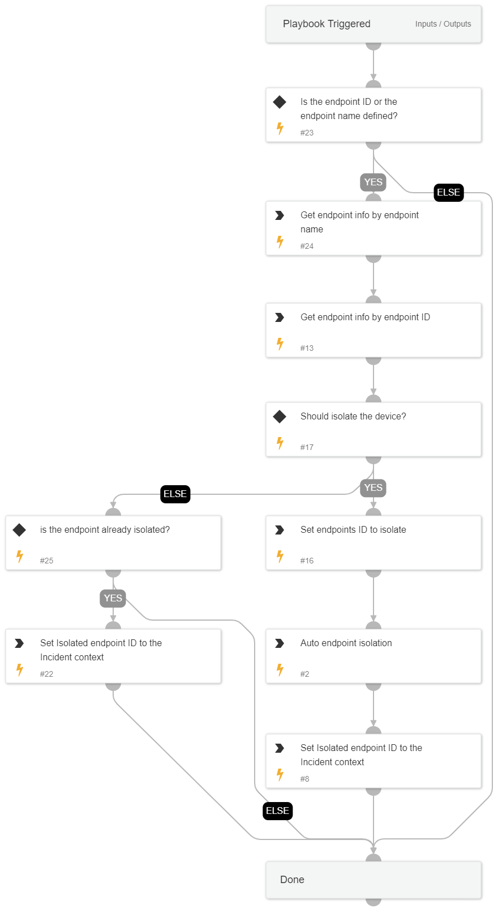

This playbook is one of the sub-playbooks in the containment plan. 
This playbook handles isolating the endpoint as a crucial step in the containment action.

## Dependencies

This playbook uses the following sub-playbooks, integrations, and scripts.

### Sub-playbooks

This playbook does not use any sub-playbooks.

### Integrations

This playbook does not use any integrations.

### Scripts

* SetAndHandleEmpty
* CompareLists

### Commands

* core-get-endpoints
* core-isolate-endpoint
* setParentIncidentContext

## Playbook Inputs

---

| **Name** | **Description** | **Default Value** | **Required** |
| --- | --- | --- | --- |
| HostContainment | Whether to execute endpoint isolation. | True | Optional |
| EndpointID | The endpoint ID to run commands over. |  | Optional |
| EndpointHostName | The endpoint hostname. |  | Optional |

## Playbook Outputs

---

| **Path** | **Description** | **Type** |
| --- | --- | --- |
| Core.Isolation.endpoint_id | The isolated endpoint ID. | unknown |

## Playbook Image

---

