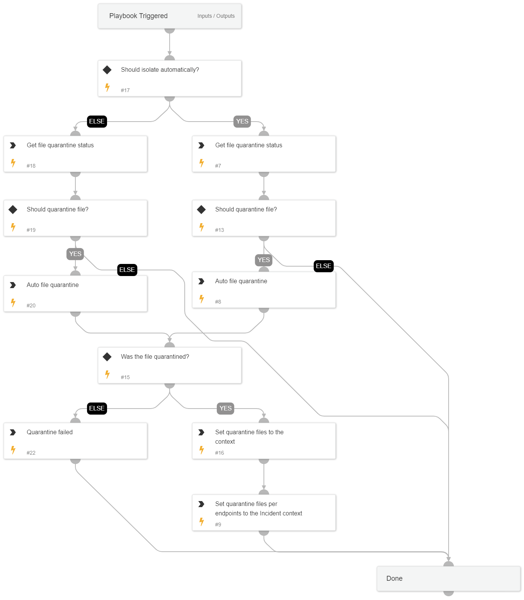

## Containment Plan - Quarantine File

This playbook is a sub-playbook within the containment plan playbook.
The playbook quarantines files using core commands.

## Dependencies

This playbook uses the following sub-playbooks, integrations, and scripts.

### Sub-playbooks

This playbook does not use any sub-playbooks.

### Integrations

This playbook does not use any integrations.

### Scripts

* Set
* PrintErrorEntry

### Commands

* core-get-quarantine-status
* setParentIncidentContext
* core-quarantine-files

## Playbook Inputs

---

| **Name** | **Description** | **Default Value** | **Required** |
| --- | --- | --- | --- |
| FileContainment | Set to 'True' to quarantine the identified file. | True | Optional |
| FileRemediation | Choose 'Quarantine' or 'Delete'  to avoid file remediation conflicts.  For example, choosing 'Quarantine' ignores the 'Delete file' task under the eradication playbook and will execute only file quarantine. | Quarantine | Optional |
| FilePath | The path of the file to block. |  | Optional |
| FileHash | The file hash to block. |  | Optional |
| EndpointID | The endpoint ID to run commands over. |  | Optional |
| AutoContainment | Whether to execute containment plan automatically. |  | Optional |

## Playbook Outputs

---

| **Path** | **Description** | **Type** |
| --- | --- | --- |
| QuarantinedFilesFromEndpoints | The quarantined files from endpoint. | unknown |

## Playbook Image

---

