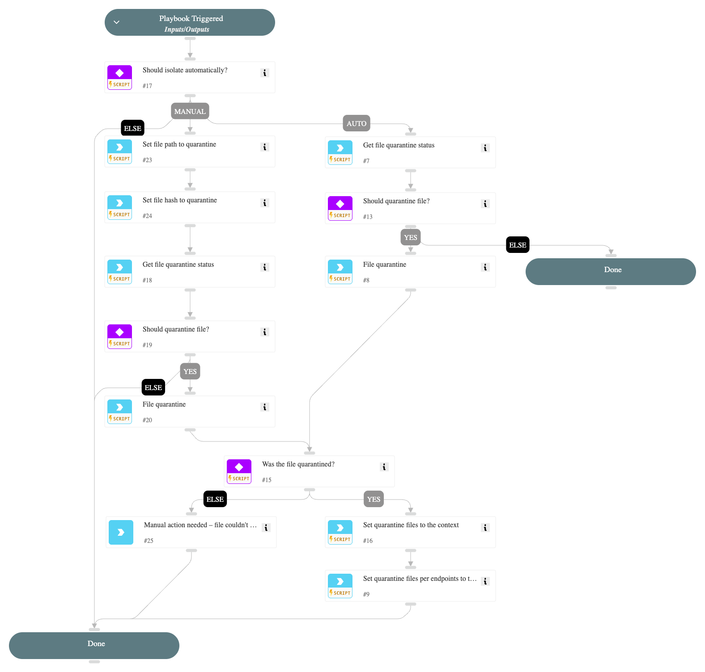

This playbook is one of the sub-playbooks in the containment plan.
This playbook handles the quarantining of files as a crucial step in the containment action.

## Dependencies

This playbook uses the following sub-playbooks, integrations, and scripts.

### Sub-playbooks

This playbook does not use any sub-playbooks.

### Integrations

This playbook does not use any integrations.

### Scripts

This playbook does not use any scripts.

### Commands

* core-get-quarantine-status
* core-quarantine-files
* setParentIncidentContext

## Playbook Inputs

---

| **Name** | **Description** | **Default Value** | **Required** |
| --- | --- | --- | --- |
| FileContainment | Set to 'True' to quarantine the identified file. | True | Optional |
| FileRemediation | Choose 'Quarantine' or 'Delete'  to avoid file remediation conflicts.  For example, choosing 'Quarantine' ignores the 'Delete file' task under the eradication playbook and will execute only file quarantine. | Quarantine | Optional |
| FilePath | The path of the file to block. |  | Optional |
| FileHash | The file hash to block. |  | Optional |
| EndpointID | The endpoint ID to run commands over. |  | Optional |

## Playbook Outputs

---
There are no outputs for this playbook.

## Playbook Image

---

