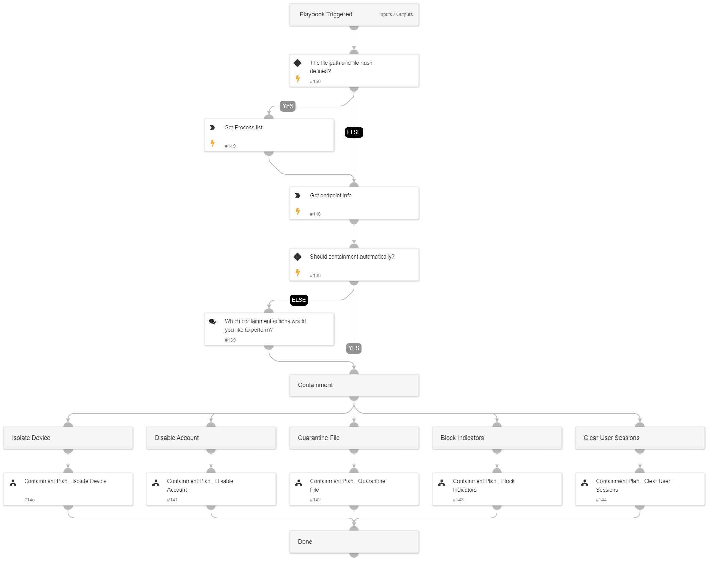

This playbook handles the main containment actions available with Cortex XSIAM, including the following sub-playbooks:  
* Containment Plan - Isolate endpoint
* Containment Plan - Disable account
* Containment Plan - Quarantine file
* Containment Plan - Block indicators
* Containment Plan - Clear user session (currently, the playbook supports only Okta)

Note: The playbook inputs enable manipulating the execution flow. Read the input descriptions for details.

## Dependencies

This playbook uses the following sub-playbooks, integrations, and scripts.

### Sub-playbooks

* Containment Plan - Block Indicators
* Containment Plan - Isolate Device
* Containment Plan - Clear User Sessions
* Containment Plan - Disable Account
* Containment Plan - Quarantine File

### Integrations

This playbook does not use any integrations.

### Scripts

* Set

### Commands

* core-get-endpoints

## Playbook Inputs

---

| **Name** | **Description** | **Default Value** | **Required** |
| --- | --- | --- | --- |
| AutoContainment | Whether to execute containment plan \(except isolation\) automatically. The specific containment playbook inputs should also be set to 'True'. | False | Optional |
| HostContainment | Whether to execute endpoint isolation. | True | Optional |
| UserContainment | Set to 'True' to disable the user account. | True | Optional |
| BlockIndicators | Set to 'True' to block the indicators. | True | Optional |
| FileContainment | Set to 'True' to quarantine the identified file. | True | Optional |
| ClearUserSessions | Set to 'True' to clear the user active Okta sessions. | True | Optional |
| EndpointID | The endpoint ID to run commands over. |  | Optional |
| Username | The username to disable. |  | Optional |
| FileHash | The file hash to block. |  | Optional |
| FilePath | The path of the file to block. |  | Optional |
| IP | The IP indicators. |  | Optional |
| Domain | The domain indicators. |  | Optional |
| URL | The URL indicator. |  | Optional |
| FileRemediation | Choose 'Quarantine' or 'Delete'  to avoid file remediation conflicts.  For example, choosing 'Quarantine' ignores the 'Delete file' task under the eradication playbook and will execute only file quarantine. | Quarantine | Optional |
| IAMUserDomain | The Okta IAM users domain. The domain will be appended to the username. e.g. username@IAMUserDomain. |  | Optional |
| UserVerification | Possible values: True/False. Whether to provide user verification for blocking those IPs and disabling the users.   False - No prompt will be displayed to the user. True - The server will ask the user for blocking verification and will display the blocking list. | False | Optional |
| AutoBlockIndicators | Possible values: True/False.  Default: True. Should the given indicators be automatically blocked, or should the user be given the option to choose?  If set to False - no prompt will appear, and all provided indicators will be blocked automatically. If set to True - the user will be prompted to select which indicators to block. | True | Optional |

## Playbook Outputs

---

| **Path** | **Description** | **Type** |
| --- | --- | --- |
| Blocklist.Final | The blocked accounts. | unknown |
| QuarantinedFilesFromEndpoints | The quarantined files from endpoint. | unknown |
| Core.blocklist.added_hashes | The file Hash that was added to the blocklist. | unknown |
| Core.Isolation.endpoint_id | The isolated endpoint ID. | unknown |

## Playbook Image

---

