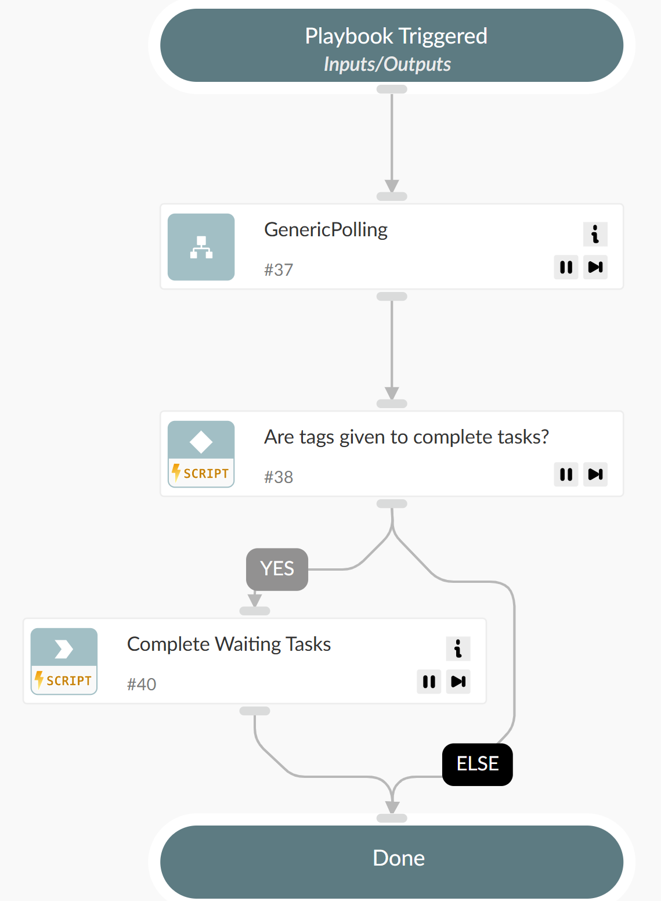

This playbook polls a context value until a specific condition, defined by a DT expression, is met.

## Dependencies

This playbook uses the following sub-playbooks, integrations, and scripts.

### Sub-playbooks

* GenericPolling

### Integrations

This playbook does not use any integrations.

### Scripts

* EvaluateContextValue

### Commands

* taskComplete

## Playbook Inputs

---

| **Name** | **Description** | **Default Value** | **Required** |
| --- | --- | --- | --- |
| value_dt | The DT expression for retrieving a value from the context data. |  | Required |
| eval_dt | The DT expression for retrieving data for the evaluation from the data returned by \`value_dt\`. |  | Optional |
| playbook_id | The sub-playbook ID for retrieving its local context from the context data. Use $\{currentPlaybookID\} to specify the current sub-playbook ID. |  | Optional |
| frequency | How often to check \(in minutes\). | 1 | Required |
| timeout | When to timeout \(in minutes\). | 10 | Required |
| tags | Tags of waiting tasks to be completed upon polling completion. |  | Optional |
| extract_mode | Indicator Extraction mode for the command sequence. \(In XSOAR 8 and above, for first run command set manually the RunPollingCommand task in the playbook, Advanced -> Indicator Extraction mode\). |  | Optional |

## Playbook Outputs

---
There are no outputs for this playbook.

## Playbook Image

---

