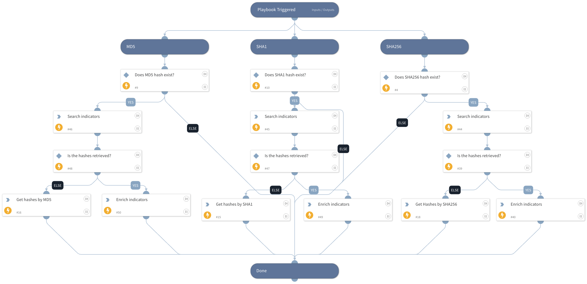

The playbook enables you to get all of the corresponding file hashes for a file even if there is only one hash type available.
For example, if we have only the SHA256 hash, the playbook will get the SHA1 and MD5 hashes as long as the
original searched hash is recognized by any our the threat intelligence integrations.

## Dependencies

This playbook uses the following sub-playbooks, integrations, and scripts.

### Sub-playbooks

This playbook does not use any sub-playbooks.

### Integrations

This playbook does not use any integrations.

### Scripts

* SearchIndicator

### Commands

* enrichIndicators
* file

## Playbook Inputs

---

| **Name** | **Description** | **Default Value** | **Required** |
| --- | --- | --- | --- |
| SHA256 | The SHA256 hash on which to search. | File.SHA256 | Optional |
| SHA1 | The SHA1 hash on which to search. | File.SHA1 | Optional |
| MD5 | The MD5 hash on which to search. | File.MD5 | Optional |

## Playbook Outputs

---

| **Path** | **Description** | **Type** |
| --- | --- | --- |
| File.SHA256 | Output for detected SHA256 hash. | string |
| File.SHA1 | Output for detected SHA1 hash. | string |
| File.MD5 | Output for detected MD5 hash. | string |
| Indicators.Value | Output for detected hashes. | unknown |

## Playbook Image

---

