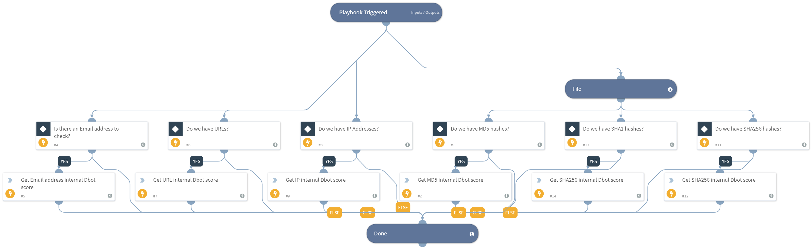

Gets indicator's internal Dbot score.

## Dependencies
This playbook uses the following sub-playbooks, integrations, and scripts.

## Sub-playbooks
This playbook does not use any sub-playbooks.

## Integrations
This playbook does not use any integrations.

## Scripts
* GetIndicatorDBotScore

## Commands
This playbook does not use any commands.

## Playbook Inputs
---

| **Name** | **Description** | **Default Value** | **Required** |
| --- | --- | --- | --- |
| Email | The email address to enrich with Dbot ccore. | ${Account.Email.Address} | Optional |
| URL | The URL to enrich with Dbot score. | ${URL.Data} | Optional |
| IP | The IP address to enrich with Dbot score. | ${IP.Address} | Optional |
| MD5 | The MD5 hash of the file to enrich with Dbot score. | ${File.MD5} | Optional |
| SHA1 | The SHA1 hash of the file to enrich with Dbot score. | ${File.SHA1} | Optional |
| SHA256 | The SHA256 hash of the file to enrich with Dbot score. | ${File.SHA256} | Optional |

## Playbook Outputs
---

| **Path** | **Description** | **Type** |
| --- | --- | --- |
| DBotScore | The indicator's object. | unknown |
| DBotScore.Indicator | The indicator. | string |
| DBotScore.Type | The indicator type. | string |
| DBotScore.Vendor | The DBot score vendor. | string |
| DBotScore.Score | The DBot score. | number |

## Playbook Image
---

