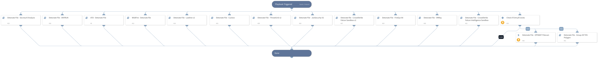

Detonate files through one or more active integrations that support file detonation.
Supported integrations:
- SecneurX Analysis
- ANY.RUN
- McAfee Advanced Threat Defense
- WildFire
- Lastline
- Cuckoo Sandbox
- Cisco Secure Malware Analytics (ThreatGrid)
- JoeSecurity
- CrowdStrike Falcon Sandbox
- FireEye AX
- VMRay Analyzer
- Polygon
- CrowdStrike Falcon Intelligence Sandbox
- OPSWAT Filescan.

## Dependencies

This playbook uses the following sub-playbooks, integrations, and scripts.

### Sub-playbooks

* ATD - Detonate File
* Detonate File - ANYRUN
* Detonate File - SecneurX Analysis
* Detonate file - CrowdStrike Falcon Sandbox v2
* Detonate File - CrowdStrike Falcon Intelligence Sandbox v2
* Detonate File - FireEye AX
* Detonate File - Group-IB TDS Polygon
* WildFire - Detonate file v2
* Detonate File - VMRay
* Detonate File - Cuckoo
* Detonate File - Lastline v2
* Detonate File - JoeSecurity V2
* Detonate File - ThreatGrid v2

### Integrations

* OPSWAT Filescan

### Scripts

This playbook does not use any scripts.

### Commands

* opswat-filescan-scan-file

## Playbook Inputs

---

| **Name** | **Description** | **Default Value** | **Required** |
| --- | --- | --- | --- |
| EntryID | Entry ID of file to be detonated | File.EntryID | Optional |
| File | File object of file to be detonated | File | Optional |

## Playbook Outputs

---

| **Path** | **Description** | **Type** |
| --- | --- | --- |
| Joe.Analysis.Status | Analysis Status. | string |
| File.Name | The file's name \(only in case of report type=json\). | string |
| File.SHA1 | SHA1 hash of the file. | string |
| File.SHA256 | SHA256 hash of the file. | string |
| File.Size | File size \(only in case of report type=json\). | number |
| File.Type | File type e.g. "PE" \(only in case of report type=json\). | string |
| File.Malicious | The File malicious description. | unknown |
| File.Malicious.Description | For malicious files, the reason for the vendor to make the decision. | string |
| File.Malicious.Vendor | For malicious files, the vendor that made the decision. | string |
| DBotScore | The Indicator's object. | unknown |
| DBotScore.Indicator | The indicator that was tested. | string |
| DBotScore.Score | The actual score. | number |
| DBotScore.Type | The type of the indicator. | string |
| DBotScore.Vendor | Vendor used to calculate the score. | string |
| IP.Address | IP's relevant to the sample. | string |
| DBotScore.Malicious.Vendor | Vendor used to calculate the score. | string |
| DBotScore.Malicious.Detections | The sub analysis detection statuses. | string |
| DBotScore.Malicious.SHA1 | The SHA1 of the file. | string |
| File | The File's object. | unknown |
| File.MD5 | MD5 hash of the file. | string |
| Joe.Analysis.SampleName | Sample Data, could be a file name or URL. | string |
| Joe.Analysis.Comments | Analysis Comments. | string |
| Joe.Analysis.Time | Submitted Time. | date |
| Joe.Analysis.Runs | Sub-Analysis Information. | unknown |
| Joe.Analysis.Result | Analysis Results. | string |
| Joe.Analysis.Errors | Raised errors during sampling. | unknown |
| Joe.Analysis.Systems | Analysis OS. | unknown |
| Joe.Analysis.MD5 | MD5 of analysis sample. | string |
| Joe.Analysis.SHA1 | SHA1 of analysis sample. | string |
| Joe.Analysis.SHA256 | SHA256 of analysis sample. | string |
| InfoFile.Name | FileName of the report file. | string |
| InfoFile.EntryID | The EntryID of the report file. | string |
| InfoFile.Size | File Size. | number |
| InfoFile.Type | File type e.g. "PE". | string |
| InfoFile.Info | Basic information of the file. | string |
| File.Extension | The extension of the file. | string |
| InfoFile | The report file's object. | unknown |
| WildFire.Report | The submission object. | unknown |
| WildFire.Report.Status | The status of the submission. | string |
| WildFire.Report.SHA256 | SHA256 of the submission. | string |
| WildFire.Report.MD5 | MD5 of the submission. | string |
| WildFire.Report.FileType | The type of the submission. | string |
| WildFire.Report.Size | The size of the submission. | number |
| Joe.Analysis | The Analysis object. | string |
| Cuckoo.Task.Category | Category of task. | string |
| Cuckoo.Task.Machine | Machine of task. | string |
| Cuckoo.Task.Errors | Errors of task. | string |
| Cuckoo.Task.Target | Target of task. | string |
| Cuckoo.Task.Package | Package of task. | string |
| Cuckoo.Task.SampleID | Sample ID of task. | string |
| Cuckoo.Task.Guest | Task guest. | string |
| Cuckoo.Task.Custom | Custom values of task. | string |
| Cuckoo.Task.Owner | Task owner. | string |
| Cuckoo.Task.Priority | Priority of task. | string |
| Cuckoo.Task.Platform | Platform of task. | string |
| Cuckoo.Task.Options | Task options. | string |
| Cuckoo.Task.Status | Task status. | string |
| Cuckoo.Task.EnforceTimeout | Is timeout of task enforced. | string |
| Cuckoo.Task.Timeout | Task timeout. | string |
| Cuckoo.Task.Memory | Task memory. | string |
| Cuckoo.Task.Tags | Task tags. | string |
| Cuckoo.Task.ID | ID of task. | string |
| Cuckoo.Task.AddedOn | Date on which the task was added. | string |
| Cuckoo.Task.CompletedOn | Date on which the task was completed. | string |
| Cuckoo.Task.Score | Reported score of the the task. | string |
| Cuckoo.Task.Monitor | Monitor of the reported task. | string |
| ANYRUN.Task.AnalysisDate | Date and time the analysis was executed. | String |
| ANYRUN.Task.Behavior.Category | Category of a process behavior. | String |
| ANYRUN.Task.Behavior.Action | Actions performed by a process. | String |
| ANYRUN.Task.Behavior.ThreatLevel | Threat score associated with a process behavior. | Number |
| ANYRUN.Task.Behavior.ProcessUUID | Unique ID of the process whose behaviors are being profiled. | String |
| ANYRUN.Task.Connection.Reputation | Connection reputation. | String |
| ANYRUN.Task.Connection.ProcessUUID | ID of the process that created the connection. | String |
| ANYRUN.Task.Connection.ASN | Connection autonomous system network. | String |
| ANYRUN.Task.Connection.Country | Connection country. | String |
| ANYRUN.Task.Connection.Protocol | Connection protocol. | String |
| ANYRUN.Task.Connection.Port | Connection port number. | Number |
| ANYRUN.Task.Connection.IP | Connection IP number. | String |
| ANYRUN.Task.DnsRequest.Reputation | Reputation of the DNS request. | String |
| ANYRUN.Task.DnsRequest.IP | IP addresses associated with a DNS request. | Unknown |
| ANYRUN.Task.DnsRequest.Domain | Domain resolution of a DNS request. | String |
| ANYRUN.Task.Threat.ProcessUUID | Unique process ID from where the threat originated. | String |
| ANYRUN.Task.Threat.Msg | Threat message. | String |
| ANYRUN.Task.Threat.Class | Class of the threat. | String |
| ANYRUN.Task.Threat.SrcPort | Port on which the threat originated. | Number |
| ANYRUN.Task.Threat.DstPort | Destination port of the threat. | Number |
| ANYRUN.Task.Threat.SrcIP | Source IP address where the threat originated. | String |
| ANYRUN.Task.Threat.DstIP | Destination IP address of the threat. | String |
| ANYRUN.Task.HttpRequest.Reputation | Reputation of the HTTP request. | String |
| ANYRUN.Task.HttpRequest.Country | HTTP request country. | String |
| ANYRUN.Task.HttpRequest.ProcessUUID | ID of the process making the HTTP request. | String |
| ANYRUN.Task.HttpRequest.Body | HTTP request body parameters and details. | Unknown |
| ANYRUN.Task.HttpRequest.HttpCode | HTTP request response code. | Number |
| ANYRUN.Task.HttpRequest.Status | Status of the HTTP request. | String |
| ANYRUN.Task.HttpRequest.ProxyDetected | Whether the HTTP request was made through a proxy. | Boolean |
| ANYRUN.Task.HttpRequest.Port | HTTP request port. | Number |
| ANYRUN.Task.HttpRequest.IP | HTTP request IP address. | String |
| ANYRUN.Task.HttpRequest.URL | HTTP request URL. | String |
| ANYRUN.Task.HttpRequest.Host | HTTP request host. | String |
| ANYRUN.Task.HttpRequest.Method | HTTP request method type. | String |
| ANYRUN.Task.FileInfo | Details of the submitted file. | String |
| ANYRUN.Task.OS | OS of the sandbox in which the file was analyzed. | String |
| ANYRUN.Task.ID | The unique ID of the task. | String |
| ANYRUN.Task.MIME | The MIME of the file submitted for analysis. | String |
| ANYRUN.Task.MD5 | The MD5 hash of the file submitted for analysis. | String |
| ANYRUN.Task.SHA1 | The SHA1 hash of the file submitted for analysis. | String |
| ANYRUN.Task.SHA256 | The SHA256 hash of the file submitted for analysis. | String |
| ANYRUN.Task.SSDeep | SSDeep hash of the file submitted for analysis. | String |
| ANYRUN.Task.Verdict | ANY.RUN verdict for the maliciousness of the submitted file or URL. | String |
| ANYRUN.Task.Process.FileName | File name of the process. | String |
| ANYRUN.Task.Process.PID | Process identification number. | Number |
| ANYRUN.Task.Process.PPID | Parent process identification number. | Number |
| ANYRUN.Task.Process.ProcessUUID | Unique process ID \(used by ANY.RUN\). | String |
| ANYRUN.Task.Process.CMD | Process command. | String |
| ANYRUN.Task.Process.Path | Path of the executed command. | String |
| ANYRUN.Task.Process.User | User who executed the command. | String |
| ANYRUN.Task.Process.IntegrityLevel | The process integrity level. | String |
| ANYRUN.Task.Process.ExitCode | Process exit code. | Number |
| ANYRUN.Task.Process.MainProcess | Whether the process is the main process. | Boolean |
| ANYRUN.Task.Process.Version.Company | Company responsible for the program executed. | String |
| ANYRUN.Task.Process.Version.Description | Description of the type of program. | String |
| ANYRUN.Task.Process.Version.Version | Version of the program executed. | String |
| File.SSDeep | SSDeep hash of the file submitted for analysis. | String |
| ANYRUN.Task.Status | Task analysis status. | String |
| VMRay.Job | The Job Object. | unknown |
| VMRay.Job.JobID | The ID of a new job. | number |
| VMRay.Job.SampleID | The ID of sample. | number |
| VMRay.Job.Created | The timestamp of the created job. | date |
| VMRay.Job.VMName | The name of virtual machine. | string |
| VMRay.Job.VMID | The ID of virtual machine. | number |
| VMRay.Sample | The Sample For Analysis. | unknown |
| VMRay.Sample.SampleID | The sample ID of the task. | number |
| VMRay.Sample.Created | The timestamp of the created sample. | date |
| VMRay.Sample.FileName | The file name of the sample. | string |
| VMRay.Sample.MD5 | The MD5 hash of the sample. | string |
| VMRay.Sample.SHA1 | The SHA1 hash of the sample. | string |
| VMRay.Sample.SHA256 | The SHA256 hash of the sample. | string |
| VMRay.Sample.SSDeep | The SSDeep of the sample. | string |
| VMRay.Sample.Verdict | Verdict for the sample \(Malicious, Suspicious, Clean, Not Available\). | String |
| VMRay.Sample.VerdictReason | Description of the Verdict Reason. | String |
| VMRay.Sample.Severity | Severity of the sample \(Malicious, Suspicious, Good, Blacklisted, Whitelisted, Unknown\). Deprecated. | string |
| VMRay.Sample.Type | The file type. | string |
| VMRay.Sample.Classifications | The classifications of the sample. | string |
| VMRay.Submission | Submission Object. | unknown |
| VMRay.Submission.SubmissionID | The submission ID. | number |
| VMRay.Submission.HadErrors | Whether there are any errors in the submission. | boolean |
| VMRay.Submission.IsFinished | The status of submission. Can be, "true" or "false". | boolean |
| VMRay.Submission.MD5 | The MD5 hash of the sample in submission. | string |
| VMRay.Submission.SHA1 | The SHA1 hash of the sample in submission. | string |
| VMRay.Submission.SHA256 | The SHA256 hash of the sample in submission. | string |
| VMRay.Submission.Verdict | Verdict for the sample \(Malicious, Suspicious, Clean, Not Available\). | String |
| VMRay.Submission.VerdictReason | Description of the Verdict Reason. | String |
| VMRay.Submission.Severity | Severity of the sample \(Malicious, Suspicious, Good, Blacklisted, Whitelisted, Unknown\). Deprecated. | string |
| VMRay.Submission.SSDeep | The SSDeep hash of the sample in submission. | string |
| VMRay.Submission.SampleID | The ID of the sample in submission. | number |
| VMRay.Sample.IOC.File | File Object. | unknown |
| VMRay.Sample.IOC.File.AnalysisID | The IDs of other analyses that contain the given file. | number |
| VMRay.Sample.IOC.File.Name | The name of the file. | string |
| VMRay.Sample.IOC.File.Operation | The operation of the given file. | string |
| VMRay.Sample.IOC.File.ID | The ID of the file. | number |
| VMRay.Sample.IOC.File.Type | The type of the file. | string |
| VMRay.Sample.IOC.File.Hashes | File Hashes Object. | unknown |
| VMRay.Sample.IOC.File.Hashes.MD5 | The MD5 hash of the given file. | string |
| VMRay.Sample.IOC.File.Hashes.SSDeep | The SSDeep hash of the given file. | string |
| VMRay.Sample.IOC.File.Hashes.SHA256 | The SHA256 hash of the given file. | string |
| VMRay.Sample.IOC.File.Hashes.SHA1 | The SHA1 hash of the given file. | string |
| VMRay.Sample.IOC.URL | URL Object. | unknown |
| VMRay.Sample.IOC.URL.AnalysisID | The IDs of the other analyses that contain the given URL. | number |
| VMRay.Sample.IOC.URL.URL | The URL. | string |
| VMRay.Sample.IOC.URL.Operation | The operation of the specified URL. | string |
| VMRay.Sample.IOC.URL.ID | The ID of the URL. | number |
| VMRay.Sample.IOC.URL.Type | The type of the URL. | string |
| VMRay.Sample.IOC.Domain | Domain Object. | unknown |
| VMRay.Sample.IOC.Domain.AnalysisID | The IDs of the other analyses that contain the given domain. | number |
| VMRay.Sample.IOC.Domain.Domain | The domain. | string |
| VMRay.Sample.IOC.Domain.ID | The ID of the domain. | number |
| VMRay.Sample.IOC.Domain.Type | The type of the domain. | string |
| VMRay.Sample.IOC.IP | IP Object. | unknown |
| VMRay.Sample.IOC.IP.AnalysisID | The IDs of the other analyses that contain the given IP address. | number |
| VMRay.Sample.IOC.IP.IP | The IP address. | string |
| VMRay.Sample.IOC.IP.Operation | The operation of the given IP address. | string |
| VMRay.Sample.IOC.IP.ID | The ID of the IP address. | number |
| VMRay.Sample.IOC.IP.Type | The type of the IP address. | string |
| VMRay.Sample.IOC.Mutex | Mutex Object. | unknown |
| VMRay.Sample.IOC.Mutex.AnalysisID | The IDs of other analyses that contain the given IP address. | number |
| VMRay.Sample.IOC.Mutex.Name | The name of the mutex. | string |
| VMRay.Sample.IOC.Mutex.Operation | The operation of the given mutex. | string |
| VMRay.Sample.IOC.Mutex.ID | The ID of the mutex. | number |
| VMRay.Sample.IOC.Mutex.Type | The type of the mutex. | string |
| VMRay.ThreatIndicator | Indicator Object. | unknown |
| VMRay.ThreatIndicator.AnalysisID | The list of connected analysis IDs. | number |
| VMRay.ThreatIndicator.Category | The category of threat indicators. | string |
| VMRay.ThreatIndicator.Classification | The classifications of threat indicators. | string |
| VMRay.ThreatIndicator.ID | The ID of the threat indicator. | number |
| VMRay.ThreatIndicator.Operation | The operation that caused the indicators. | string |
| SecneurXAnalysis.Report.SHA256 | SHA256 value of the analyzed sample. | string |
| SecneurXAnalysis.Report.Verdict | Summary result of the analyzed sample. | string |
| SecneurXAnalysis.Report.Tags | More details of the analyzed sample. | string |
| SecneurXAnalysis.Report.IOC | List of IOC's observed in the analyzed sample. | string |
| SecneurXAnalysis.Report.Status | Analysis queued sample state. | String |
| SecneurXAnalysis.Report.DnsRequests | List of DNS data observed in the analyzed sample. | string |
| SecneurXAnalysis.Report.HttpRequests | List of HTTP data observed in the analyzed sample. | string |
| SecneurXAnalysis.Report.JA3Digests | List of JA3 data observed in the analyzed sample. | string |
| SecneurXAnalysis.Report.ProcessCreated | Process behaviour data observed in the analyzed sample. | string |
| SecneurXAnalysis.Report.RegistrySet | List of Registry creations observed in the analyzed sample. | string |
| SecneurXAnalysis.Report.RegistryDeleted | List of Registry deletions observed in the analyzed sample. | string |
| SecneurXAnalysis.Report.FileCreated | List of File creations observed in the analyzed sample. | string |
| SecneurXAnalysis.Report.FileDropped | List of File drops observed in the analyzed sample. | string |
| SecneurXAnalysis.Report.FileDeleted | List of File deletions observed in the analyzed sample. | string |
| SecneurXAnalysis.Report.FileModified | List of File changes observed in the analyzed sample. | string |
| SecneurXAnalysis.Report.Platform | Platform of the analyzed sample. | String |
| ATD.Task.taskId | The task ID of the sample uploaded. | string |
| ATD.Task.jobId | The job ID of the sample uploaded. | string |
| ATD.Task.messageId | The message Id relevant to the sample uploaded. | string |
| ATD.Task.srcIp | Source IPv4 address. | string |
| ATD.Task.destIp | Destination IPv4 address. | string |
| ATD.Task.MD5 | MD5 of the sample uploaded. | string |
| ATD.Task.SHA1 | SHA1 of the sample uploaded. | string |
| ATD.Task.SHA256 | SHA256 of the sample uploaded. | string |
| InfoFile.Extension | The extension of the report file. | string |
| File.EntryID | The Entry ID of the sample. | string |
| URL.Data | List of malicious URLs identified by Lastline analysis. | string |
| URL.Malicious.Vendor | For malicious URLs, the vendor that made the decision. | string |
| URL.Malicious.Description | For malicious URLs, the reason for the vendor to make the decision. | string |
| URL.Malicious.Score | For malicious URLs, the score from the vendor. | number |
| Lastline.Submission.Status | Status of the submission. | string |
| Lastline.Submission.DNSqueries | List of DNS queries done by the analysis subject. | string |
| Lastline.Submission.NetworkConnections | ist of network connections done by the analysis subject. | string |
| Lastline.Submission.DownloadedFiles | List of files that were downloaded using the Microsoft Windows file-download API functions. Each element is a tuple of file-origin URL and a File element. | string |
| Lastline.Submission.UUID | Task UUID of submitted sample. | number |
| Lastline.Submission.YaraSignatures.name | Yara signatures name. | string |
| Lastline.Submission.YaraSignatures.score | The score according to the yara signatures. from 0 to 100. | number |
| Lastline.Submission.YaraSignatures.internal | True if the signature is only for internal usage. | boolean |
| Lastline.Submission.Process.arguments | Argument of the process. | string |
| Lastline.Submission.Process.process_id | The process ID. | string |
| Lastline.Submission.Process.executable.abs_path | Absolute path of the executable of the process. | string |
| Lastline.Submission.Process.executable.filename | Filename of the executable. | string |
| Lastline.Submission.Process.executable.yara_signature_hits | Yara signature of the executable of the process. | string |
| Lastline.Submission.Process.executable.ext_info | Executable info of the process. | string |
| Joe.Analysis.ID | Web ID. | string |
| Domain.Name | The Domain name. | string |
| Domain.DNS | A list of IP objects resolved by DNS. | string |
| RegistryKey.Path | The path to the registry key. | string |
| RegistryKey.Value | The value at the given RegistryKey. | string |
| Process.Name | Process name. | string |
| Process.PID | Process PID. | number |
| Process.CommandLine | Process Command Line. | string |
| Process.Path | Process path. | string |
| Process.StartTime | Process start time. | date |
| Process.EndTime | Process end time. | date |
| Polygon.Analysis.ID | Analysis ID in THF. | number |
| Polygon.Analysis.Name | File Name. | string |
| Polygon.Analysis.Size | File Size. | number |
| Polygon.Analysis.Started | Analysis start timestamp. | date |
| Polygon.Analysis.Analyzed | Analysis finish timestamp. | date |
| Polygon.Analysis.MD5 | Analyzed file MD5 hash. | string |
| Polygon.Analysis.SHA1 | Analyzed file SHA1 hash. | string |
| Polygon.Analysis.SHA256 | Analyzed file SHA256. | string |
| Polygon.Analysis.Result | Analysis verdict. | string |
| Polygon.Analysis.Status | The analysis status. | string |
| Polygon.Analysis.Verdict | Analysis verdict. | boolean |
| Polygon.Analysis.Probability | Verdict probability. | string |
| Polygon.Analysis.Families | Malware families. | string |
| Polygon.Analysis.Score | Polygon score. | number |
| Polygon.Analysis.Internet-connection | Internet availability. | string |
| Polygon.Analysis.Type | File type. | string |
| Polygon.Analysis.DumpExists | Network activity dump exists. | boolean |
| Polygon.Analysis.File | The information about files in analysis. | string |
| Polygon.Analysis.URL | The information about URL indicators. | string |
| Polygon.Analysis.IP | The information about IP indicators. | string |
| Polygon.Analysis.Domain | The information about Domain indicators. | string |
| Polygon.Analysis.RegistryKey | The information about registry keys which were modified during the analysis. | string |
| Polygon.Analysis.Process | The information about processes started during the analysis. | string |
| csfalconx.resource.id | Analysis ID. | String |
| csfalconx.resource.verdict | Analysis verdict. | String |
| csfalconx.resource.created_timestamp | Analysis start time. | String |
| csfalconx.resource.environment_id | Environment ID. | String |
| csfalconx.resource.threat_score | Score of the threat. | Int |
| csfalconx.resource.submit_url | URL submitted for analysis. | String |
| csfalconx.resource.submission_type | Type of submitted artifact, for example file, URL, etc. | String |
| csfalconx.resource.filetype | File type. | String |
| csfalconx.resource.filesize | File size. | Int |
| csfalconx.resource.sha256 | SHA256 hash of the submitted file. | String |
| csfalconx.resource.ioc_report_strict_csv_artifact_id | ID of the IOC pack to download \(CSV\). | String |
| csfalconx.resource.ioc_report_broad_csv_artifact_id | ID of the IOC pack to download \(CSV\). | String |
| csfalconx.resource.ioc_report_strict_json_artifact_id | ID of the IOC pack to download \(JSON\). | Int |
| csfalconx.resource.ioc_report_broad_json_artifact_id | ID of the IOC pack to download \(JSON\). | String |
| csfalconx.resource.ioc_report_strict_stix_artifact_id | ID of the IOC pack to download \(STIX\). | String |
| csfalconx.resource.ioc_report_broad_stix_artifact_id | ID of the IOC pack to download \(STIX\). | Int |
| csfalconx.resource.ioc_report_strict_maec_artifact_id | ID of the IOC pack to download \(MAEC\). | String |
| csfalconx.resource.ioc_report_broad_maec_artifact_id | ID of the IOC pack to download \(MAEC\). | String |
| csfalconx.resource.snadbox.environment_description | Environment description. | String |
| OPSWAT.Filescan.Submission.flow_id | The flow ID. | string |
| OPSWAT.Filescan.Analysis.finalVerdict.verdict | The final verdict. | string |
| OPSWAT.Filescan.Analysis.allTags | All tags. | string |
| OPSWAT.Filescan.Analysis.overallState | Overall state of the scan. | string |
| OPSWAT.Filescan.Analysis.subtaskReferences | Status of scan subtasks. | string |
| OPSWAT.Filescan.Analysis.allSignalGroups | All signal groups. | string |
| OPSWAT.Filescan.Analysis.resources | Resources. | string |
| OPSWAT.Filescan.Analysis.taskReference.name | Name of the main scan task. | string |
| OPSWAT.Filescan.Analysis.taskReference.additionalInfo | Additional informations about the main scan task. | string |
| OPSWAT.Filescan.Analysis.taskReference.ID | ID of the main scan task. | string |
| OPSWAT.Filescan.Analysis.taskReference.state | State of the main scan task. | string |
| OPSWAT.Filescan.Analysis.taskReference.resourceReference | Resource reference of the main scan task. | string |
| OPSWAT.Filescan.Analysis.taskReference.opcount | Counter. | string |
| OPSWAT.Filescan.Analysis.taskReference.processTime | processTime. | string |
| OPSWAT.Filescan.Analysis.file.name | The name of the file. | unknown |
| OPSWAT.Filescan.Analysis.file.hash | The SHA256 of the file. | unknown |
| OPSWAT.Filescan.Analysis.file.type | The type of the submission. | unknown |

## Playbook Image

---

