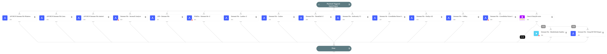

Detonate files through one or more active integrations that support file detonation.
Supported integrations:
- SecneurX Analysis
- ANY.RUN Cloud Sandbox
- McAfee Advanced Threat Defense
- WildFire
- Lastline
- Cuckoo Sandbox
- Cisco Secure Malware Analytics (ThreatGrid)
- JoeSecurity
- CrowdStrike Falcon Sandbox
- FireEye AX
- VMRay Analyzer
- Polygon
- CrowdStrike Falcon Intelligence Sandbox
- OPSWAT Filescan.

## Dependencies

This playbook uses the following sub-playbooks, integrations, and scripts.

### Sub-playbooks

* ATD - Detonate File
* Detonate File - SecneurX Analysis
* Detonate file - CrowdStrike Falcon Sandbox v2
* Detonate File - CrowdStrike Falcon Intelligence Sandbox v2
* Detonate File - FireEye AX
* Detonate File - Group-IB TDS Polygon
* WildFire - Detonate file v2
* Detonate File - VMRay
* Detonate File - Cuckoo
* Detonate File - Lastline v2
* Detonate File - JoeSecurity V2
* Detonate File - ThreatGrid v2
* ANYRUN Detonate File Android
* ANYRUN Detonate File Linux
* ANYRUN Detonate File Windows

### Integrations

* OPSWAT Filescan

### Scripts

This playbook does not use any scripts.

### Commands

* opswat-filescan-scan-file

## Playbook Inputs

---

| **Name** | **Description** | **Default Value** | **Required** |
| --- | --- | --- | --- |
| EntryID | Entry ID of file to be detonated | File.EntryID | Optional |
| File | File object of file to be detonated | File | Optional |

## Playbook Outputs

---

| **Path** | **Description** | **Type** |
| --- | --- | --- |
| Joe.Analysis.Status | Analysis Status. | string |
| File.Name | The file's name \(only in case of report type=json\). | string |
| File.SHA1 | SHA1 hash of the file. | string |
| File.SHA256 | SHA256 hash of the file. | string |
| File.Size | File size \(only in case of report type=json\). | number |
| File.Type | File type e.g. "PE" \(only in case of report type=json\). | string |
| File.Malicious | The File malicious description. | unknown |
| File.Malicious.Description | For malicious files, the reason for the vendor to make the decision. | string |
| File.Malicious.Vendor | For malicious files, the vendor that made the decision. | string |
| DBotScore | The Indicator's object. | unknown |
| DBotScore.Indicator | The indicator that was tested. | string |
| DBotScore.Score | The actual score. | number |
| DBotScore.Type | The type of the indicator. | string |
| DBotScore.Vendor | Vendor used to calculate the score. | string |
| IP.Address | IP's relevant to the sample. | string |
| DBotScore.Malicious.Vendor | Vendor used to calculate the score. | string |
| DBotScore.Malicious.Detections | The sub analysis detection statuses. | string |
| DBotScore.Malicious.SHA1 | The SHA1 of the file. | string |
| File | The File's object. | unknown |
| File.MD5 | MD5 hash of the file. | string |
| Joe.Analysis.SampleName | Sample Data, could be a file name or URL. | string |
| Joe.Analysis.Comments | Analysis Comments. | string |
| Joe.Analysis.Time | Submitted Time. | date |
| Joe.Analysis.Runs | Sub-Analysis Information. | unknown |
| Joe.Analysis.Result | Analysis Results. | string |
| Joe.Analysis.Errors | Raised errors during sampling. | unknown |
| Joe.Analysis.Systems | Analysis OS. | unknown |
| Joe.Analysis.MD5 | MD5 of analysis sample. | string |
| Joe.Analysis.SHA1 | SHA1 of analysis sample. | string |
| Joe.Analysis.SHA256 | SHA256 of analysis sample. | string |
| InfoFile.Name | FileName of the report file. | string |
| InfoFile.EntryID | The EntryID of the report file. | string |
| InfoFile.Size | File Size. | number |
| InfoFile.Type | File type e.g. "PE". | string |
| InfoFile.Info | Basic information of the file. | string |
| File.Extension | The extension of the file. | string |
| InfoFile | The report file's object. | unknown |
| WildFire.Report | The submission object. | unknown |
| WildFire.Report.Status | The status of the submission. | string |
| WildFire.Report.SHA256 | SHA256 of the submission. | string |
| WildFire.Report.MD5 | MD5 of the submission. | string |
| WildFire.Report.FileType | The type of the submission. | string |
| WildFire.Report.Size | The size of the submission. | number |
| Joe.Analysis | The Analysis object. | string |
| Cuckoo.Task.Category | Category of task. | string |
| Cuckoo.Task.Machine | Machine of task. | string |
| Cuckoo.Task.Errors | Errors of task. | string |
| Cuckoo.Task.Target | Target of task. | string |
| Cuckoo.Task.Package | Package of task. | string |
| Cuckoo.Task.SampleID | Sample ID of task. | string |
| Cuckoo.Task.Guest | Task guest. | string |
| Cuckoo.Task.Custom | Custom values of task. | string |
| Cuckoo.Task.Owner | Task owner. | string |
| Cuckoo.Task.Priority | Priority of task. | string |
| Cuckoo.Task.Platform | Platform of task. | string |
| Cuckoo.Task.Options | Task options. | string |
| Cuckoo.Task.Status | Task status. | string |
| Cuckoo.Task.EnforceTimeout | Is timeout of task enforced. | string |
| Cuckoo.Task.Timeout | Task timeout. | string |
| Cuckoo.Task.Memory | Task memory. | string |
| Cuckoo.Task.Tags | Task tags. | string |
| Cuckoo.Task.ID | ID of task. | string |
| Cuckoo.Task.AddedOn | Date on which the task was added. | string |
| Cuckoo.Task.CompletedOn | Date on which the task was completed. | string |
| Cuckoo.Task.Score | Reported score of the the task. | string |
| Cuckoo.Task.Monitor | Monitor of the reported task. | string |
| File.SSDeep | SSDeep hash of the file submitted for analysis. | String |
| VMRay.Job | The Job Object. | unknown |
| VMRay.Job.JobID | The ID of a new job. | number |
| VMRay.Job.SampleID | The ID of sample. | number |
| VMRay.Job.Created | The timestamp of the created job. | date |
| VMRay.Job.VMName | The name of virtual machine. | string |
| VMRay.Job.VMID | The ID of virtual machine. | number |
| VMRay.Sample | The Sample For Analysis. | unknown |
| VMRay.Sample.SampleID | The sample ID of the task. | number |
| VMRay.Sample.Created | The timestamp of the created sample. | date |
| VMRay.Sample.FileName | The file name of the sample. | string |
| VMRay.Sample.MD5 | The MD5 hash of the sample. | string |
| VMRay.Sample.SHA1 | The SHA1 hash of the sample. | string |
| VMRay.Sample.SHA256 | The SHA256 hash of the sample. | string |
| VMRay.Sample.SSDeep | The SSDeep of the sample. | string |
| VMRay.Sample.Verdict | Verdict for the sample \(Malicious, Suspicious, Clean, Not Available\). | String |
| VMRay.Sample.VerdictReason | Description of the Verdict Reason. | String |
| VMRay.Sample.Severity | Severity of the sample \(Malicious, Suspicious, Good, Blacklisted, Whitelisted, Unknown\). Deprecated. | string |
| VMRay.Sample.Type | The file type. | string |
| VMRay.Sample.Classifications | The classifications of the sample. | string |
| VMRay.Submission | Submission Object. | unknown |
| VMRay.Submission.SubmissionID | The submission ID. | number |
| VMRay.Submission.HadErrors | Whether there are any errors in the submission. | boolean |
| VMRay.Submission.IsFinished | The status of submission. Can be, "true" or "false". | boolean |
| VMRay.Submission.MD5 | The MD5 hash of the sample in submission. | string |
| VMRay.Submission.SHA1 | The SHA1 hash of the sample in submission. | string |
| VMRay.Submission.SHA256 | The SHA256 hash of the sample in submission. | string |
| VMRay.Submission.Verdict | Verdict for the sample \(Malicious, Suspicious, Clean, Not Available\). | String |
| VMRay.Submission.VerdictReason | Description of the Verdict Reason. | String |
| VMRay.Submission.Severity | Severity of the sample \(Malicious, Suspicious, Good, Blacklisted, Whitelisted, Unknown\). Deprecated. | string |
| VMRay.Submission.SSDeep | The SSDeep hash of the sample in submission. | string |
| VMRay.Submission.SampleID | The ID of the sample in submission. | number |
| VMRay.Sample.IOC.File | File Object. | unknown |
| VMRay.Sample.IOC.File.AnalysisID | The IDs of other analyses that contain the given file. | number |
| VMRay.Sample.IOC.File.Name | The name of the file. | string |
| VMRay.Sample.IOC.File.Operation | The operation of the given file. | string |
| VMRay.Sample.IOC.File.ID | The ID of the file. | number |
| VMRay.Sample.IOC.File.Type | The type of the file. | string |
| VMRay.Sample.IOC.File.Hashes | File Hashes Object. | unknown |
| VMRay.Sample.IOC.File.Hashes.MD5 | The MD5 hash of the given file. | string |
| VMRay.Sample.IOC.File.Hashes.SSDeep | The SSDeep hash of the given file. | string |
| VMRay.Sample.IOC.File.Hashes.SHA256 | The SHA256 hash of the given file. | string |
| VMRay.Sample.IOC.File.Hashes.SHA1 | The SHA1 hash of the given file. | string |
| VMRay.Sample.IOC.URL | URL Object. | unknown |
| VMRay.Sample.IOC.URL.AnalysisID | The IDs of the other analyses that contain the given URL. | number |
| VMRay.Sample.IOC.URL.URL | The URL. | string |
| VMRay.Sample.IOC.URL.Operation | The operation of the specified URL. | string |
| VMRay.Sample.IOC.URL.ID | The ID of the URL. | number |
| VMRay.Sample.IOC.URL.Type | The type of the URL. | string |
| VMRay.Sample.IOC.Domain | Domain Object. | unknown |
| VMRay.Sample.IOC.Domain.AnalysisID | The IDs of the other analyses that contain the given domain. | number |
| VMRay.Sample.IOC.Domain.Domain | The domain. | string |
| VMRay.Sample.IOC.Domain.ID | The ID of the domain. | number |
| VMRay.Sample.IOC.Domain.Type | The type of the domain. | string |
| VMRay.Sample.IOC.IP | IP Object. | unknown |
| VMRay.Sample.IOC.IP.AnalysisID | The IDs of the other analyses that contain the given IP address. | number |
| VMRay.Sample.IOC.IP.IP | The IP address. | string |
| VMRay.Sample.IOC.IP.Operation | The operation of the given IP address. | string |
| VMRay.Sample.IOC.IP.ID | The ID of the IP address. | number |
| VMRay.Sample.IOC.IP.Type | The type of the IP address. | string |
| VMRay.Sample.IOC.Mutex | Mutex Object. | unknown |
| VMRay.Sample.IOC.Mutex.AnalysisID | The IDs of other analyses that contain the given IP address. | number |
| VMRay.Sample.IOC.Mutex.Name | The name of the mutex. | string |
| VMRay.Sample.IOC.Mutex.Operation | The operation of the given mutex. | string |
| VMRay.Sample.IOC.Mutex.ID | The ID of the mutex. | number |
| VMRay.Sample.IOC.Mutex.Type | The type of the mutex. | string |
| VMRay.ThreatIndicator | Indicator Object. | unknown |
| VMRay.ThreatIndicator.AnalysisID | The list of connected analysis IDs. | number |
| VMRay.ThreatIndicator.Category | The category of threat indicators. | string |
| VMRay.ThreatIndicator.Classification | The classifications of threat indicators. | string |
| VMRay.ThreatIndicator.ID | The ID of the threat indicator. | number |
| VMRay.ThreatIndicator.Operation | The operation that caused the indicators. | string |
| SecneurXAnalysis.Report.SHA256 | SHA256 value of the analyzed sample. | string |
| SecneurXAnalysis.Report.Verdict | Summary result of the analyzed sample. | string |
| SecneurXAnalysis.Report.Tags | More details of the analyzed sample. | string |
| SecneurXAnalysis.Report.IOC | List of IOC's observed in the analyzed sample. | string |
| SecneurXAnalysis.Report.Status | Analysis queued sample state. | String |
| SecneurXAnalysis.Report.DnsRequests | List of DNS data observed in the analyzed sample. | string |
| SecneurXAnalysis.Report.HttpRequests | List of HTTP data observed in the analyzed sample. | string |
| SecneurXAnalysis.Report.JA3Digests | List of JA3 data observed in the analyzed sample. | string |
| SecneurXAnalysis.Report.ProcessCreated | Process behaviour data observed in the analyzed sample. | string |
| SecneurXAnalysis.Report.RegistrySet | List of Registry creations observed in the analyzed sample. | string |
| SecneurXAnalysis.Report.RegistryDeleted | List of Registry deletions observed in the analyzed sample. | string |
| SecneurXAnalysis.Report.FileCreated | List of File creations observed in the analyzed sample. | string |
| SecneurXAnalysis.Report.FileDropped | List of File drops observed in the analyzed sample. | string |
| SecneurXAnalysis.Report.FileDeleted | List of File deletions observed in the analyzed sample. | string |
| SecneurXAnalysis.Report.FileModified | List of File changes observed in the analyzed sample. | string |
| SecneurXAnalysis.Report.Platform | Platform of the analyzed sample. | String |
| ATD.Task.taskId | The task ID of the sample uploaded. | string |
| ATD.Task.jobId | The job ID of the sample uploaded. | string |
| ATD.Task.messageId | The message Id relevant to the sample uploaded. | string |
| ATD.Task.srcIp | Source IPv4 address. | string |
| ATD.Task.destIp | Destination IPv4 address. | string |
| ATD.Task.MD5 | MD5 of the sample uploaded. | string |
| ATD.Task.SHA1 | SHA1 of the sample uploaded. | string |
| ATD.Task.SHA256 | SHA256 of the sample uploaded. | string |
| InfoFile.Extension | The extension of the report file. | string |
| File.EntryID | The Entry ID of the sample. | string |
| URL.Data | List of malicious URLs identified by Lastline analysis. | string |
| URL.Malicious.Vendor | For malicious URLs, the vendor that made the decision. | string |
| URL.Malicious.Description | For malicious URLs, the reason for the vendor to make the decision. | string |
| URL.Malicious.Score | For malicious URLs, the score from the vendor. | number |
| Lastline.Submission.Status | Status of the submission. | string |
| Lastline.Submission.DNSqueries | List of DNS queries done by the analysis subject. | string |
| Lastline.Submission.NetworkConnections | ist of network connections done by the analysis subject. | string |
| Lastline.Submission.DownloadedFiles | List of files that were downloaded using the Microsoft Windows file-download API functions. Each element is a tuple of file-origin URL and a File element. | string |
| Lastline.Submission.UUID | Task UUID of submitted sample. | number |
| Lastline.Submission.YaraSignatures.name | Yara signatures name. | string |
| Lastline.Submission.YaraSignatures.score | The score according to the yara signatures. from 0 to 100. | number |
| Lastline.Submission.YaraSignatures.internal | True if the signature is only for internal usage. | boolean |
| Lastline.Submission.Process.arguments | Argument of the process. | string |
| Lastline.Submission.Process.process_id | The process ID. | string |
| Lastline.Submission.Process.executable.abs_path | Absolute path of the executable of the process. | string |
| Lastline.Submission.Process.executable.filename | Filename of the executable. | string |
| Lastline.Submission.Process.executable.yara_signature_hits | Yara signature of the executable of the process. | string |
| Lastline.Submission.Process.executable.ext_info | Executable info of the process. | string |
| Joe.Analysis.ID | Web ID. | string |
| Domain.Name | The Domain name. | string |
| Domain.DNS | A list of IP objects resolved by DNS. | string |
| RegistryKey.Path | The path to the registry key. | string |
| RegistryKey.Value | The value at the given RegistryKey. | string |
| Process.Name | Process name. | string |
| Process.PID | Process PID. | number |
| Process.CommandLine | Process Command Line. | string |
| Process.Path | Process path. | string |
| Process.StartTime | Process start time. | date |
| Process.EndTime | Process end time. | date |
| Polygon.Analysis.ID | Analysis ID in THF. | number |
| Polygon.Analysis.Name | File Name. | string |
| Polygon.Analysis.Size | File Size. | number |
| Polygon.Analysis.Started | Analysis start timestamp. | date |
| Polygon.Analysis.Analyzed | Analysis finish timestamp. | date |
| Polygon.Analysis.MD5 | Analyzed file MD5 hash. | string |
| Polygon.Analysis.SHA1 | Analyzed file SHA1 hash. | string |
| Polygon.Analysis.SHA256 | Analyzed file SHA256. | string |
| Polygon.Analysis.Result | Analysis verdict. | string |
| Polygon.Analysis.Status | The analysis status. | string |
| Polygon.Analysis.Verdict | Analysis verdict. | boolean |
| Polygon.Analysis.Probability | Verdict probability. | string |
| Polygon.Analysis.Families | Malware families. | string |
| Polygon.Analysis.Score | Polygon score. | number |
| Polygon.Analysis.Internet-connection | Internet availability. | string |
| Polygon.Analysis.Type | File type. | string |
| Polygon.Analysis.DumpExists | Network activity dump exists. | boolean |
| Polygon.Analysis.File | The information about files in analysis. | string |
| Polygon.Analysis.URL | The information about URL indicators. | string |
| Polygon.Analysis.IP | The information about IP indicators. | string |
| Polygon.Analysis.Domain | The information about Domain indicators. | string |
| Polygon.Analysis.RegistryKey | The information about registry keys which were modified during the analysis. | string |
| Polygon.Analysis.Process | The information about processes started during the analysis. | string |
| csfalconx.resource.id | Analysis ID. | String |
| csfalconx.resource.verdict | Analysis verdict. | String |
| csfalconx.resource.created_timestamp | Analysis start time. | String |
| csfalconx.resource.environment_id | Environment ID. | String |
| csfalconx.resource.threat_score | Score of the threat. | Int |
| csfalconx.resource.submit_url | URL submitted for analysis. | String |
| csfalconx.resource.submission_type | Type of submitted artifact, for example file, URL, etc. | String |
| csfalconx.resource.filetype | File type. | String |
| csfalconx.resource.filesize | File size. | Int |
| csfalconx.resource.sha256 | SHA256 hash of the submitted file. | String |
| csfalconx.resource.ioc_report_strict_csv_artifact_id | ID of the IOC pack to download \(CSV\). | String |
| csfalconx.resource.ioc_report_broad_csv_artifact_id | ID of the IOC pack to download \(CSV\). | String |
| csfalconx.resource.ioc_report_strict_json_artifact_id | ID of the IOC pack to download \(JSON\). | Int |
| csfalconx.resource.ioc_report_broad_json_artifact_id | ID of the IOC pack to download \(JSON\). | String |
| csfalconx.resource.ioc_report_strict_stix_artifact_id | ID of the IOC pack to download \(STIX\). | String |
| csfalconx.resource.ioc_report_broad_stix_artifact_id | ID of the IOC pack to download \(STIX\). | Int |
| csfalconx.resource.ioc_report_strict_maec_artifact_id | ID of the IOC pack to download \(MAEC\). | String |
| csfalconx.resource.ioc_report_broad_maec_artifact_id | ID of the IOC pack to download \(MAEC\). | String |
| csfalconx.resource.snadbox.environment_description | Environment description. | String |
| OPSWAT.Filescan.Submission.flow_id | The flow ID. | string |
| OPSWAT.Filescan.Analysis.finalVerdict.verdict | The final verdict. | string |
| OPSWAT.Filescan.Analysis.allTags | All tags. | string |
| OPSWAT.Filescan.Analysis.overallState | Overall state of the scan. | string |
| OPSWAT.Filescan.Analysis.subtaskReferences | Status of scan subtasks. | string |
| OPSWAT.Filescan.Analysis.allSignalGroups | All signal groups. | string |
| OPSWAT.Filescan.Analysis.resources | Resources. | string |
| OPSWAT.Filescan.Analysis.taskReference.name | Name of the main scan task. | string |
| OPSWAT.Filescan.Analysis.taskReference.additionalInfo | Additional informations about the main scan task. | string |
| OPSWAT.Filescan.Analysis.taskReference.ID | ID of the main scan task. | string |
| OPSWAT.Filescan.Analysis.taskReference.state | State of the main scan task. | string |
| OPSWAT.Filescan.Analysis.taskReference.resourceReference | Resource reference of the main scan task. | string |
| OPSWAT.Filescan.Analysis.taskReference.opcount | Counter. | string |
| OPSWAT.Filescan.Analysis.taskReference.processTime | processTime. | string |
| OPSWAT.Filescan.Analysis.file.name | The name of the file. | unknown |
| OPSWAT.Filescan.Analysis.file.hash | The SHA256 of the file. | unknown |
| OPSWAT.Filescan.Analysis.file.type | The type of the submission. | unknown |
| ANYRUN.SandboxAnalysis.mitre.name | String | MITRE Technic text description. | 
| ANYRUN.SandboxAnalysis.mitre.phases | String | MITRE Technic phases. | 
| ANYRUN.SandboxAnalysis.mitre.id | String | MITRE Technic identifier. | 
| ANYRUN.SandboxAnalysis.debugStrings | Unknown | Analysis debug information. | 
| ANYRUN.SandboxAnalysis.incidents.process | String | Analysis process. | 
| ANYRUN.SandboxAnalysis.incidents.events.time | Date | Event time. | 
| ANYRUN.SandboxAnalysis.incidents.events.cmdline | String | Event command line. | 
| ANYRUN.SandboxAnalysis.incidents.events.image | String | Event image. | 
| ANYRUN.SandboxAnalysis.incidents.mitre.v | String | MITRE version. | 
| ANYRUN.SandboxAnalysis.incidents.mitre.sid | String | SID. | 
| ANYRUN.SandboxAnalysis.incidents.mitre.tid | String | TID. | 
| ANYRUN.SandboxAnalysis.incidents.count | String | Count of related incidents. | 
| ANYRUN.SandboxAnalysis.incidents.firstSeen | Date | Incident first seen date. | 
| ANYRUN.SandboxAnalysis.incidents.source | String | Incident source. | 
| ANYRUN.SandboxAnalysis.incidents.desc | String | Incident description. | 
| ANYRUN.SandboxAnalysis.incidents.title | String | Incident title. | 
| ANYRUN.SandboxAnalysis.incidents.threatLevel | String | Incident threat level. | 
| ANYRUN.SandboxAnalysis.incidents.events.typeValue | String | Event type value. | 
| ANYRUN.SandboxAnalysis.incidents.events.key | String | Event key. | 
| ANYRUN.SandboxAnalysis.incidents.events.value | String | Event value. | 
| ANYRUN.SandboxAnalysis.incidents.events.name | String | Event name. | 
| ANYRUN.SandboxAnalysis.incidents.events.operation | String | Even operation. | 
| ANYRUN.SandboxAnalysis.incidents.events.cmdParent | String | Event parent cmd. | 
| ANYRUN.SandboxAnalysis.incidents.events.cmdChild | String | Event child cmd. | 
| ANYRUN.SandboxAnalysis.modified.registry.time | Date | Registry time. | 
| ANYRUN.SandboxAnalysis.modified.registry.process | String | Registry process. | 
| ANYRUN.SandboxAnalysis.modified.registry.operation | String | Registry operation. | 
| ANYRUN.SandboxAnalysis.modified.registry.value | String | Registry value. | 
| ANYRUN.SandboxAnalysis.modified.registry.name | String | Registry name. | 
| ANYRUN.SandboxAnalysis.modified.registry.key | String | Registry key. | 
| ANYRUN.SandboxAnalysis.modified.files.process | String | File process. | 
| ANYRUN.SandboxAnalysis.modified.files.size | String | File size. | 
| ANYRUN.SandboxAnalysis.modified.files.filename | String | Filename. | 
| ANYRUN.SandboxAnalysis.modified.files.time | Date | File creating time. | 
| ANYRUN.SandboxAnalysis.modified.files.info.mime | String | File MIME type. | 
| ANYRUN.SandboxAnalysis.modified.files.info.file | String | File content. | 
| ANYRUN.SandboxAnalysis.modified.files.permanentUrl | String | File url. | 
| ANYRUN.SandboxAnalysis.modified.files.hashes.ssdeep | String | File SSDeep. | 
| ANYRUN.SandboxAnalysis.modified.files.hashes.sha256 | String | File sha256 hash. | 
| ANYRUN.SandboxAnalysis.modified.files.hashes.sha1 | String | File sha1 hash. | 
| ANYRUN.SandboxAnalysis.modified.files.hashes.md5 | String | File md5 hash. | 
| ANYRUN.SandboxAnalysis.modified.files.threatLevel | String | File threat level. | 
| ANYRUN.SandboxAnalysis.modified.files.type | String | File type. | 
| ANYRUN.SandboxAnalysis.network.threats | Unknown | Analysis network threats. | 
| ANYRUN.SandboxAnalysis.network.connections.reputation | String | Network connection reputation. | 
| ANYRUN.SandboxAnalysis.network.connections.tlsFingerprint.ja3SFullstring | String | Network connection ja3S. | 
| ANYRUN.SandboxAnalysis.network.connections.tlsFingerprint.ja3S | String | Network connection ja3S. | 
| ANYRUN.SandboxAnalysis.network.connections.tlsFingerprint.ja3Fullstring | String | Network connection ja3F. | 
| ANYRUN.SandboxAnalysis.network.connections.tlsFingerprint.ja3 | String | Network connection ja3F. | 
| ANYRUN.SandboxAnalysis.network.connections.time | Date | Network connection time. | 
| ANYRUN.SandboxAnalysis.network.connections.asn | String | Network connection ASN. | 
| ANYRUN.SandboxAnalysis.network.connections.country | String | Network connection country. | 
| ANYRUN.SandboxAnalysis.network.connections.protocol | String | Network connection protocol. | 
| ANYRUN.SandboxAnalysis.network.connections.port | String | Network connection port. | 
| ANYRUN.SandboxAnalysis.network.connections.ip | String | Network connection ip. | 
| ANYRUN.SandboxAnalysis.network.connections.process | String | Network connection processes. | 
| ANYRUN.SandboxAnalysis.network.connections.tlsFingerprint.jarm | String | Network connection jarm. | 
| ANYRUN.SandboxAnalysis.network.httpRequests.country | String | HTTP Request country. | 
| ANYRUN.SandboxAnalysis.network.httpRequests.reputation | String | HTTP Request reputation. | 
| ANYRUN.SandboxAnalysis.network.httpRequests.process | String | HTTP Request related process. | 
| ANYRUN.SandboxAnalysis.network.httpRequests.httpCode | String | HTTP Request status code. | 
| ANYRUN.SandboxAnalysis.network.httpRequests.status | String | HTTP Request status. | 
| ANYRUN.SandboxAnalysis.network.httpRequests.user-agent | String | HTTP Request User-Agent header value. | 
| ANYRUN.SandboxAnalysis.network.httpRequests.proxyDetected | String | HTTP Request is proxy detected. | 
| ANYRUN.SandboxAnalysis.network.httpRequests.port | String | HTTP Request port. | 
| ANYRUN.SandboxAnalysis.network.httpRequests.ip | String | HTTP Request ip. | 
| ANYRUN.SandboxAnalysis.network.httpRequests.url | String | HTTP Request url. | 
| ANYRUN.SandboxAnalysis.network.httpRequests.host | String | HTTP Request host. | 
| ANYRUN.SandboxAnalysis.network.httpRequests.method | String | HTTP Request method. | 
| ANYRUN.SandboxAnalysis.network.httpRequests.time | Date | HTTP Request time estimate. | 
| ANYRUN.SandboxAnalysis.network.dnsRequests.reputationNumber | String | DNS Request reputation number. | 
| ANYRUN.SandboxAnalysis.network.dnsRequests.reputation | String | DNS Request reputation. | 
| ANYRUN.SandboxAnalysis.network.dnsRequests.ips | String | DNS Request IPs. | 
| ANYRUN.SandboxAnalysis.network.dnsRequests.domain | String | DNS Request domain. | 
| ANYRUN.SandboxAnalysis.network.dnsRequests.time | Date | DNS Request time estimate. | 
| ANYRUN.SandboxAnalysis.malconf | Unknown | Analysis malconf. | 
| ANYRUN.SandboxAnalysis.processes.synchronization | Unknown | Analysis processes synchronization. | 
| ANYRUN.SandboxAnalysis.processes.modules | Unknown | Analysis processes modules. | 
| ANYRUN.SandboxAnalysis.processes.hasMalwareConfig | String | Process has malware config. | 
| ANYRUN.SandboxAnalysis.processes.parentUUID | String | Process parent UUID. | 
| ANYRUN.SandboxAnalysis.processes.status | String | Process status. | 
| ANYRUN.SandboxAnalysis.processes.scores.specs.malwareConfig | String | Process malware config. | 
| ANYRUN.SandboxAnalysis.processes.scores.specs.privEscalation | String | Process priv escalation. | 
| ANYRUN.SandboxAnalysis.processes.scores.specs.stealing | String | Process stealing. | 
| ANYRUN.SandboxAnalysis.processes.scores.specs.networkLoader | String | Process network loader. | 
| ANYRUN.SandboxAnalysis.processes.scores.specs.network | String | Process network. | 
| ANYRUN.SandboxAnalysis.processes.scores.specs.lowAccess | String | Process low access. | 
| ANYRUN.SandboxAnalysis.processes.scores.specs.knownThreat | String | Process known threat. | 
| ANYRUN.SandboxAnalysis.processes.scores.specs.injects | String | Process inject. | 
| ANYRUN.SandboxAnalysis.processes.scores.specs.exploitable | String | Process exploitable. | 
| ANYRUN.SandboxAnalysis.processes.scores.specs.executableDropped | String | Process executable dropped. | 
| ANYRUN.SandboxAnalysis.processes.scores.specs.debugOutput | String | Process debug output. | 
| ANYRUN.SandboxAnalysis.processes.scores.specs.crashedApps | String | Process crashed apps. | 
| ANYRUN.SandboxAnalysis.processes.scores.specs.autoStart | String | Process auto start. | 
| ANYRUN.SandboxAnalysis.processes.scores.loadsSusp | String | Process loads susp. | 
| ANYRUN.SandboxAnalysis.processes.scores.injected | String | Process injected. | 
| ANYRUN.SandboxAnalysis.processes.scores.dropped | String | Process dropped. | 
| ANYRUN.SandboxAnalysis.processes.scores.verdict.threatLevelText | String | Process threat level text. | 
| ANYRUN.SandboxAnalysis.processes.scores.verdict.threatLevel | String | Process threat level. | 
| ANYRUN.SandboxAnalysis.processes.scores.verdict.score | String | Process score. | 
| ANYRUN.SandboxAnalysis.processes.context.userName | String | Process context username. | 
| ANYRUN.SandboxAnalysis.processes.context.integrityLevel | String | Process context integrity level. | 
| ANYRUN.SandboxAnalysis.processes.context.rebootNumber | String | Process context reboot number. | 
| ANYRUN.SandboxAnalysis.processes.versionInfo.version | String | Process version. | 
| ANYRUN.SandboxAnalysis.processes.versionInfo.description | String | Process description. | 
| ANYRUN.SandboxAnalysis.processes.versionInfo.company | String | Process company. | 
| ANYRUN.SandboxAnalysis.processes.mainProcess | String | Process main process. | 
| ANYRUN.SandboxAnalysis.processes.fileType | String | Process file type. | 
| ANYRUN.SandboxAnalysis.processes.fileName | String | Process filename. | 
| ANYRUN.SandboxAnalysis.processes.commandLine | String | Process cmd. | 
| ANYRUN.SandboxAnalysis.processes.image | String | Process image. | 
| ANYRUN.SandboxAnalysis.processes.uuid | String | Process uuid. | 
| ANYRUN.SandboxAnalysis.processes.ppid | String | Process PPID. | 
| ANYRUN.SandboxAnalysis.processes.important | String | Process important. | 
| ANYRUN.SandboxAnalysis.processes.pid | String | Process PID. | 
| ANYRUN.SandboxAnalysis.processes.exitCode | String | Process exit code. | 
| ANYRUN.SandboxAnalysis.processes.times.terminate | Date | Process time terminate. | 
| ANYRUN.SandboxAnalysis.processes.times.start | Date | Process time start. | 
| ANYRUN.SandboxAnalysis.processes.resolvedCOM.title | String | Process resolved COM title. | 
| ANYRUN.SandboxAnalysis.processes.synchronization.operation | String | Process sync operation. | 
| ANYRUN.SandboxAnalysis.processes.synchronization.type | String | Process sync type. | 
| ANYRUN.SandboxAnalysis.processes.synchronization.name | String | Process sync name. | 
| ANYRUN.SandboxAnalysis.processes.synchronization.time | Date | Process sync time. | 
| ANYRUN.SandboxAnalysis.processes.modules.image | String | Process module image. | 
| ANYRUN.SandboxAnalysis.processes.modules.time | Date | Process module time. | 
| ANYRUN.SandboxAnalysis.processes.scores.monitoringReason | String | Process monitoring reason. | 
| ANYRUN.SandboxAnalysis.processes.times.monitoringSince | Date | Process monitoring since. | 
| ANYRUN.SandboxAnalysis.counters.synchronization.type.event | String | Process sync event. | 
| ANYRUN.SandboxAnalysis.counters.synchronization.type.mutex | String | Process sync mutex. | 
| ANYRUN.SandboxAnalysis.counters.synchronization.operation.create | String | Process sync operation create. | 
| ANYRUN.SandboxAnalysis.counters.synchronization.operation.open | String | Process sync operation open. | 
| ANYRUN.SandboxAnalysis.counters.synchronization.total | String | Process sync total. | 
| ANYRUN.SandboxAnalysis.counters.registry.delete | String | Registry delete. | 
| ANYRUN.SandboxAnalysis.counters.registry.write | String | Registry write. | 
| ANYRUN.SandboxAnalysis.counters.registry.read | String | Registry reed. | 
| ANYRUN.SandboxAnalysis.counters.registry.total | String | Registry total. | 
| ANYRUN.SandboxAnalysis.counters.files.malicious | String | File malicious count. | 
| ANYRUN.SandboxAnalysis.counters.files.suspicious | String | File suspicious count. | 
| ANYRUN.SandboxAnalysis.counters.files.text | String | File text. | 
| ANYRUN.SandboxAnalysis.counters.files.unknown | String | File unknown count. | 
| ANYRUN.SandboxAnalysis.counters.network.threats | String | Network threats count. | 
| ANYRUN.SandboxAnalysis.counters.network.dns | String | Network dns count. | 
| ANYRUN.SandboxAnalysis.counters.network.connections | String | Network connections count. | 
| ANYRUN.SandboxAnalysis.counters.network.http | String | Network networks count. | 
| ANYRUN.SandboxAnalysis.counters.processes.malicious | String | Malicious processes count. | 
| ANYRUN.SandboxAnalysis.counters.processes.suspicious | String | Suspicious processes count. | 
| ANYRUN.SandboxAnalysis.counters.processes.monitored | String | Monitored processes count. | 
| ANYRUN.SandboxAnalysis.counters.processes.total | String | Total processes count. | 
| ANYRUN.SandboxAnalysis.environments.hotfixes.title | String | Environment hotfixes title. | 
| ANYRUN.SandboxAnalysis.environments.software.version | String | Environment software version. | 
| ANYRUN.SandboxAnalysis.environments.software.title | String | Environment software title. | 
| ANYRUN.SandboxAnalysis.environments.internetExplorer.kbnum | String | Environment Internet Explorer KBNUM. | 
| ANYRUN.SandboxAnalysis.environments.internetExplorer.version | String | Environment Internet Explorer version. | 
| ANYRUN.SandboxAnalysis.environments.os.bitness | String | Environment OS version. | 
| ANYRUN.SandboxAnalysis.environments.os.softSet | String | Environment OS software set. | 
| ANYRUN.SandboxAnalysis.environments.os.servicePack | String | Environment OS service pack. | 
| ANYRUN.SandboxAnalysis.environments.os.major | String | Environment OS major version. | 
| ANYRUN.SandboxAnalysis.environments.os.productType | String | Environment OS product type. | 
| ANYRUN.SandboxAnalysis.environments.os.variant | String | Environment OS variant. | 
| ANYRUN.SandboxAnalysis.environments.os.product | String | Environment OS product. | 
| ANYRUN.SandboxAnalysis.environments.os.build | String | Environment OS build. | 
| ANYRUN.SandboxAnalysis.environments.os.title | String | Environment OS title. | 
| ANYRUN.SandboxAnalysis.analysis.content.dumps | Unknown | Content dumps. | 
| ANYRUN.SandboxAnalysis.analysis.content.screenshots.thumbnailUrl | String | Screenshots thumbnail url. | 
| ANYRUN.SandboxAnalysis.analysis.content.screenshots.permanentUrl | String | Screenshots permanent url. | 
| ANYRUN.SandboxAnalysis.analysis.content.screenshots.time | String | Screenshots time. | 
| ANYRUN.SandboxAnalysis.analysis.content.screenshots.uuid | String | Screenshots uuid. | 
| ANYRUN.SandboxAnalysis.analysis.content.sslkeys.present | String | SSL keys present. | 
| ANYRUN.SandboxAnalysis.analysis.content.pcap.permanentUrl | String | Pcap dump permanent url. | 
| ANYRUN.SandboxAnalysis.analysis.content.pcap.present | String | Pcap present. | 
| ANYRUN.SandboxAnalysis.analysis.content.video.permanentUrl | String | Video permanent url. | 
| ANYRUN.SandboxAnalysis.analysis.content.video.present | String | Video present. | 
| ANYRUN.SandboxAnalysis.analysis.content.mainObject.hashes.ssdeep | String | Main object ssdeep. | 
| ANYRUN.SandboxAnalysis.analysis.content.mainObject.hashes.sha256 | String | Main object sha256. | 
| ANYRUN.SandboxAnalysis.analysis.content.mainObject.hashes.sha1 | String | Main object sha1. | 
| ANYRUN.SandboxAnalysis.analysis.content.mainObject.hashes.md5 | String | Main object md5. | 
| ANYRUN.SandboxAnalysis.analysis.content.mainObject.url | String | Main object url. | 
| ANYRUN.SandboxAnalysis.analysis.content.mainObject.type | String | Main object type. | 
| ANYRUN.SandboxAnalysis.analysis.scores.specs.knownThreat | String | Specs known threat. | 
| ANYRUN.SandboxAnalysis.analysis.scores.specs.malwareConfig | String | Specs malware Config. | 
| ANYRUN.SandboxAnalysis.analysis.scores.specs.notStarted | String | Specs not started. | 
| ANYRUN.SandboxAnalysis.analysis.scores.specs.privEscalation | String | Specs priv escalation. | 
| ANYRUN.SandboxAnalysis.analysis.scores.specs.torUsed | String | Specs TOR used. | 
| ANYRUN.SandboxAnalysis.analysis.scores.specs.suspStruct | String | Specs susp structure. | 
| ANYRUN.SandboxAnalysis.analysis.scores.specs.stealing | String | Specs stealing. | 
| ANYRUN.SandboxAnalysis.analysis.scores.specs.staticDetections | String | Specs static detections. | 
| ANYRUN.SandboxAnalysis.analysis.scores.specs.spam | String | Specs spam. | 
| ANYRUN.SandboxAnalysis.analysis.scores.specs.serviceLauncher | String | Specs service launcher. | 
| ANYRUN.SandboxAnalysis.analysis.scores.specs.rebooted | String | Specs rebooted. | 
| ANYRUN.SandboxAnalysis.analysis.scores.specs.networkThreats | String | Specs network threats. | 
| ANYRUN.SandboxAnalysis.analysis.scores.specs.networkLoader | String | Specs network loader. | 
| ANYRUN.SandboxAnalysis.analysis.scores.specs.multiprocessing | String | Specs multiprocessing. | 
| ANYRUN.SandboxAnalysis.analysis.scores.specs.memOverrun | String | Specs memory overrun. | 
| ANYRUN.SandboxAnalysis.analysis.scores.specs.lowAccess | String | Specs low access. | 
| ANYRUN.SandboxAnalysis.analysis.scores.specs.exploitable | String | Specs exploitable. | 
| ANYRUN.SandboxAnalysis.analysis.scores.specs.executableDropped | String | Specs executable dropped. | 
| ANYRUN.SandboxAnalysis.analysis.scores.specs.debugOutput | String | Specs debug output. | 
| ANYRUN.SandboxAnalysis.analysis.scores.specs.crashedTask | String | Specs crashed task. | 
| ANYRUN.SandboxAnalysis.analysis.scores.specs.crashedApps | String | Specs crashed apps. | 
| ANYRUN.SandboxAnalysis.analysis.scores.specs.cpuOverrun | String | Specs CPU overrun. | 
| ANYRUN.SandboxAnalysis.analysis.scores.specs.autoStart | String | Specs suto start. | 
| ANYRUN.SandboxAnalysis.analysis.scores.specs.injects | String | Specs injects. | 
| ANYRUN.SandboxAnalysis.analysis.scores.verdict.threatLevelText | String | Verdict threat level text. | 
| ANYRUN.SandboxAnalysis.analysis.scores.verdict.threatLevel | String | Verdict threat level. | 
| ANYRUN.SandboxAnalysis.analysis.scores.verdict.score | String | Verdict score. | 
| ANYRUN.SandboxAnalysis.analysis.options.automatization.uac | String | Options automatization UAC. | 
| ANYRUN.SandboxAnalysis.analysis.options.privateSample | String | Options private sample. | 
| ANYRUN.SandboxAnalysis.analysis.options.privacy | String | Options privacy. | 
| ANYRUN.SandboxAnalysis.analysis.options.network | String | Options network. | 
| ANYRUN.SandboxAnalysis.analysis.options.hideSource | String | Options hide source. | 
| ANYRUN.SandboxAnalysis.analysis.options.video | String | Options video. | 
| ANYRUN.SandboxAnalysis.analysis.options.presentation | String | Options presentation. | 
| ANYRUN.SandboxAnalysis.analysis.options.tor.used | String | Options tor used. | 
| ANYRUN.SandboxAnalysis.analysis.options.mitm | String | Options MITM proxy. | 
| ANYRUN.SandboxAnalysis.analysis.options.heavyEvasion | String | Options kernel heavy evasion. | 
| ANYRUN.SandboxAnalysis.analysis.options.fakeNet | String | Options fake network. | 
| ANYRUN.SandboxAnalysis.analysis.options.additionalTime | String | Options additions time. | 
| ANYRUN.SandboxAnalysis.analysis.options.timeout | String | Options timeout. | 
| ANYRUN.SandboxAnalysis.analysis.tags | Unknown | Analysis tags. | 
| ANYRUN.SandboxAnalysis.analysis.stopExecText | Date | Analysis stopExecText. | 
| ANYRUN.SandboxAnalysis.analysis.stopExec | Date | Analysis creation stopExec. | 
| ANYRUN.SandboxAnalysis.analysis.creationText | Date | Analysis creation creation text. | 
| ANYRUN.SandboxAnalysis.analysis.creation | Date | Analysis creation date. | 
| ANYRUN.SandboxAnalysis.analysis.duration | String | Analysis duration. | 
| ANYRUN.SandboxAnalysis.analysis.sandbox.plan.name | String | Analysis sandbox user plan name. | 
| ANYRUN.SandboxAnalysis.analysis.sandbox.name | String | Analysis sandbox name. | 
| ANYRUN.SandboxAnalysis.analysis.reports.graph | String | Analysis reports graph. | 
| ANYRUN.SandboxAnalysis.analysis.reports.STIX | String | Analysis STIX report url. | 
| ANYRUN.SandboxAnalysis.analysis.reports.HTML | String | Analysis HTML report url. | 
| ANYRUN.SandboxAnalysis.analysis.reports.MISP | String | Analysis MISP report url. | 
| ANYRUN.SandboxAnalysis.analysis.reports.IOC | String | Analysis IOC report url. | 
| ANYRUN.SandboxAnalysis.analysis.permanentUrl | String | Analysis permanent url. | 
| ANYRUN.SandboxAnalysis.analysis.uuid | String | Analysis uuid. | 
| ANYRUN.SandboxAnalysis.status | String | Analysis status. | 
| ANYRUN.SandboxAnalysisReportVerdict | String | The analysis verdict. | 
| ANYRUN_DetonateFileAndroid.TaskID | String | Task UUID. | 
| ANYRUN_DetonateFileLinux.TaskID | String | Task UUID. | 
| ANYRUN_DetonateFileWindows.TaskID | String | Task UUID. | 

## Playbook Image

---

