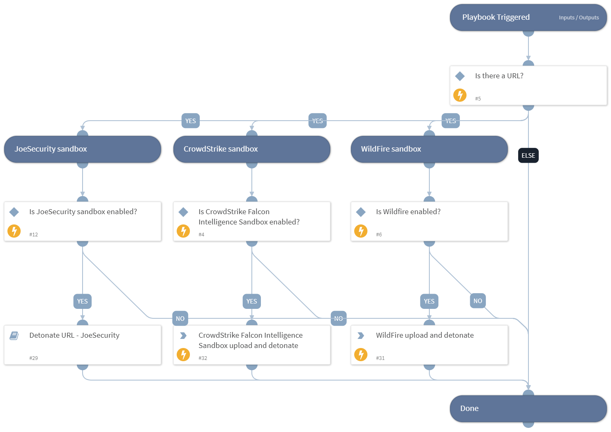

Detonate URL through active integrations that support URL detonation.

## Dependencies
This playbook uses the following sub-playbooks, integrations, and scripts.

### Sub-playbooks
* Detonate URL - ThreatGrid
* Detonate URL - Group-IB TDS Polygon
* Detonate URL - JoeSecurity
* Detonate URL - CrowdStrike
* Detonate URL - Cuckoo
* Detonate URL - McAfee ATD
* Detonate URL - CrowdStrike Falcon X
* Detonate URL - Lastline v2
* Detonate URL - ANYRUN

### Integrations
This playbook does not use any integrations.

### Scripts
This playbook does not use any scripts.

### Commands
This playbook does not use any commands.

## Playbook Inputs
---

| **Name** | **Description** | **Default Value** | **Required** |
| --- | --- | --- | --- |
| URL | The URL object of the URL to be detonated. | URL.None | Optional |

## Playbook Outputs
---

| **Path** | **Description** | **Type** |
| --- | --- | --- |
| File | The file's object. | string |
| File.Name | The file name. | string |
| File.Size | The file size. | number |
| File.Type | The file type, for example "PE" \(only for report type=json\). | string |
| File.SHA256 | The SHA256 hash of the file. | string |
| File.SHA1 | The SHA1 hash of the file. | string |
| File.MD5 | The MD5 hash of the file. | string |
| File.Malicious.Vendor | The vendor that decides the file is malicious. | string |
| File.Malicious.Description | The reason the vendor decides the file is malicious. | string |
| DBotScore | The indicator's object. | string |
| DBotScore.Type | The indicator type. | string |
| DBotScore.Indicator | The indicator that was tested. | string |
| DBotScore.Vendor | The vendor used to calculate the score. | string |
| DBotScore.Score | The actual score. | number |
| Joe.Analysis.WebID | The  Joe Analysis-related Web ID. | string |
| Joe.Analysis.Status | The Joe Analysis-related status. | string |
| Joe.Analysis.Comments | The Joe Analysis-related comments. | string |
| Joe.Analysis.Time | The Joe Analysis-related submitted time. | date |
| Joe.Analysis.Runs | The Joe Analysis-related sub-analysis information. | string |
| Joe.Analysis.Result | The Joe Analysis-related results. | string |
| Joe.Analysis.Errors | The Joe Analysis-related errors raised during sampling. | string |
| Joe.Analysis.Systems | The Joe Analysis-related OS. | string |
| Joe.Analysis.MD5 | The MD5 hash of the Joe Analysis-related sample. | string |
| Joe.Analysis.SHA1 | The SHA1 hash of the Joe Analysis-related sample. | string |
| Joe.Analysis.SHA256 | The SHA256 hash of the Joe Analysis-related sample. | string |
| Joe.Analysis.SampleName | The Joe Analysis-related sample data name, can be a file name or a URL. | string |
| InfoFile.Name | The file name. | string |
| InfoFile.EntryID | The EntryID of the sample. | string |
| InfoFile.Size | The file size. | number |
| InfoFile.Type | The file type, for example "PE". | string |
| InfoFile.Info | The file basic information. | string |
| Sample.State | The sample state. | string |
| Sample.ID | The sample ID. | string |
| IP.Address | The IPs relevant to the sample. | string |
| InfoFile | The report file's object. | string |
| Cuckoo.Task.Category | The Cuckoo-related task category. | unknown |
| Cuckoo.Task.Machine | The Cuckoo-related task machine. | unknown |
| Cuckoo.Task.Errors | The Cuckoo-related task errors. | unknown |
| Cuckoo.Task.Target | The Cuckoo-related task target. | unknown |
| Cuckoo.Task.Package | The Cuckoo-related task package. | unknown |
| Cuckoo.Task.SampleID | The Cuckoo-related task sample ID. | unknown |
| Cuckoo.Task.Guest | The Cuckoo-related task guest. | unknown |
| Cuckoo.Task.Custom | The Cuckoo-related task custom values. | unknown |
| Cuckoo.Task.Owner | The Cuckoo-related task owner. | unknown |
| Cuckoo.Task.Priority | The Cuckoo-related task priority. | unknown |
| Cuckoo.Task.Platform | The Cuckoo-related task platform. | unknown |
| Cuckoo.Task.Options | The Cuckoo-related task options. | unknown |
| Cuckoo.Task.Status | The Cuckoo-related task status. | unknown |
| Cuckoo.Task.EnforceTimeout | Whether the Cuckoo-related task timeout is enforced. | unknown |
| Cuckoo.Task.Timeout | The Cuckoo-related task timeout. | unknown |
| Cuckoo.Task.Memory | The Cuckoo-related task memory. | unknown |
| Cuckoo.Task.Tags | The Cuckoo-related task tags. | unknown |
| Cuckoo.Task.ID | The Cuckoo-related task ID. | unknown |
| Cuckoo.Task.AddedOn | The date the Cuckoo-related task was added. | unknown |
| Cuckoo.Task.CompletedOn | The date the Cuckoo-related task was completed. | unknown |
| Cuckoo.Task.Score | The reported Cuckoo-related task score. | unknown |
| Cuckoo.Task.Monitor | The reported Cuckoo-related task monitor. | unknown |
| ANYRUN.Task.AnalysisDate | The date and time the ANY.RUN analysis was executed. | String |
| ANYRUN.Task.Behavior.Category | The ANY.RUN behavior category. | String |
| ANYRUN.Task.Behavior.Action | The actions performed by an ANY.RUN behavior. | String |
| ANYRUN.Task.Behavior.ThreatLevel | The threat score associated with an ANY.RUN behavior. | Number |
| ANYRUN.Task.Behavior.ProcessUUID | The ANY.RUN unique ID of the process whose behaviors are profiled. | String |
| ANYRUN.Task.Connection.Reputation | The ANY.RUN connection reputation. | String |
| ANYRUN.Task.Connection.ProcessUUID | The ANY.RUN UUID of the process that created the connection. | String |
| ANYRUN.Task.Connection.ASN | The ANY.RUN connection autonomous system network. | String |
| ANYRUN.Task.Connection.Country | The ANY.RUN connection country. | String |
| ANYRUN.Task.Connection.Protocol | The ANY.RUN connection protocol. | String |
| ANYRUN.Task.Connection.Port | The ANY.RUN connection port number. | Number |
| ANYRUN.Task.Connection.IP | The ANY.RUN connection IP number. | String |
| ANYRUN.Task.DnsRequest.Reputation | The ANY.RUN process reputation of the DNS request. | String |
| ANYRUN.Task.DnsRequest.IP | The ANY.RUN IP addresses associated with a DNS request. | string |
| ANYRUN.Task.DnsRequest.Domain | The ANY.RUN domain resolution of a DNS request. | String |
| ANYRUN.Task.Threat.ProcessUUID | The unique ANY.RUN UUID of the process that originated the threat. | String |
| ANYRUN.Task.Threat.Msg | The ANY.RUN threat message. | String |
| ANYRUN.Task.Threat.Class | The ANY.RUN threat class. | String |
| ANYRUN.Task.Threat.SrcPort | The ANY.RUN port on which the threat originated. | Number |
| ANYRUN.Task.Threat.DstPort | The ANY.RUN threat destination port. | Number |
| ANYRUN.Task.Threat.SrcIP | The ANY.RUN source IP address where the threat originated. | String |
| ANYRUN.Task.Threat.DstIP | The ANY.RUN threat destination IP address. | String |
| ANYRUN.Task.HttpRequest.Reputation | The ANY.RUN HTTP request reputation. | String |
| ANYRUN.Task.HttpRequest.Country | The ANY.RUN HTTP request country. | String |
| ANYRUN.Task.HttpRequest.ProcessUUID | The ANY.RUN UUID of the process making the HTTP request. | String |
| ANYRUN.Task.HttpRequest.Body | The ANY.RUN HTTP request body parameters and details. | string |
| ANYRUN.Task.HttpRequest.HttpCode | The ANY.RUN HTTP request response code. | Number |
| ANYRUN.Task.HttpRequest.Status | The ANY.RUN status of the HTTP request. | String |
| ANYRUN.Task.HttpRequest.ProxyDetected | Whether the ANY.RUN HTTP request was made through a proxy. | Boolean |
| ANYRUN.Task.HttpRequest.Port | The ANY.RUN HTTP request port. | Number |
| ANYRUN.Task.HttpRequest.IP | The ANY.RUN HTTP request IP address. | String |
| ANYRUN.Task.HttpRequest.URL | The ANY.RUN HTTP request URL. | String |
| ANYRUN.Task.HttpRequest.Host | The ANY.RUN HTTP request host. | String |
| ANYRUN.Task.HttpRequest.Method | The ANY.RUN HTTP request method type. | String |
| ANYRUN.Task.FileInfo | The ANY.RUN submitted file details. | String |
| ANYRUN.Task.OS | The ANY.RUN OS of the sandbox in which the file was analyzed. | String |
| ANYRUN.Task.ID | The unique ANY.RUN task ID. | String |
| ANYRUN.Task.MIME | The ANY.RUN MIME of the file submitted for analysis. | String |
| ANYRUN.Task.Verdict | The ANY.RUN verdict for the maliciousness of the submitted file or URL. | String |
| ANYRUN.Task.Process.FileName | The ANY.RUN process file name. | String |
| ANYRUN.Task.Process.PID | The ANY.RUN process identification number. | Number |
| ANYRUN.Task.Process.PPID | The ANY.RUN process parent process identification number. | Number |
| ANYRUN.Task.Process.ProcessUUID | The Unique ANY.RUN process UUID. | String |
| ANYRUN.Task.Process.CMD | The ANY.RUN process command. | String |
| ANYRUN.Task.Process.Path | The path of the executed ANY.RUN process command. | String |
| ANYRUN.Task.Process.User | The user who executed the ANY.RUN process command. | String |
| ANYRUN.Task.Process.IntegrityLevel | The ANY.RUN process integrity level. | String |
| ANYRUN.Task.Process.ExitCode | The ANY.RUN process exit code. | Number |
| ANYRUN.Task.Process.MainProcess | Whether the ANY.RUN process is the main process. | Boolean |
| ANYRUN.Task.Process.Version.Company | The company responsible for the executed ANY.RUN process program. | String |
| ANYRUN.Task.Process.Version.Description | The description of the ANY.RUN process program type. | String |
| ANYRUN.Task.Process.Version.Version | The version of the executed program. | String |
| URL.Data | The URL data. | String |
| URL.Malicious.Vendor | The vendor that decides the URL is malicious. | String |
| URL.Malicious.Description | The reason the vendor decides the URL is malicious. | String |
| ANYRUN.Task.Status | The task analysis status. | String |

## Playbook Image
---
