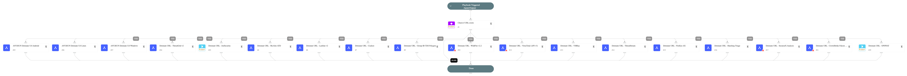

Detonate URL through one or more active integrations that support URL detonation.
Supported integrations:
- SecneurX Analysis
- ANY.RUN
- McAfee Advanced Threat Defense
- WildFire
- Lastline
- Cuckoo Sandbox
- Cisco Secure Malware Analytics (ThreatGrid)
- JoeSecurity
- CrowdStrike Falcon Sandbox
- FireEye AX
- VMRay Analyzer
- Polygon
- CrowdStrike Falcon Intelligence Sandbox
- OPSWAT Filescan
- ANYRUN
- VirusTotal
- Anomali ThreatStream
- Hatching Triage
- ThreatGrid 

## Dependencies

This playbook uses the following sub-playbooks, integrations, and scripts.

### Sub-playbooks

* Detonate URL - SecneurX Analysis
* Detonate URL - ThreatStream
* Detonate URL - VMRay
* Detonate URL - ANYRUN
* Detonate URL - Cuckoo
* Detonate URL - McAfee ATD
* Detonate URL - Group-IB TDS Polygon
* Detonate URL - ThreatGrid v2
* Detonate URL - WildFire v2.2
* Detonate URL - VirusTotal (API v3)
* Detonate URL - Hatching Triage
* Detonate URL - CrowdStrike Falcon Intelligence Sandbox v2
* Detonate URL - FireEye AX
* Detonate URL - Lastline v2

### Integrations

This playbook does not use any integrations.

### Scripts

This playbook does not use any scripts.

### Commands

* opswat-filescan-scan-url
* joe-submit-url

## Playbook Inputs

---

| **Name** | **Description** | **Default Value** | **Required** |
| --- | --- | --- | --- |
| URL | The URL object of the URL to be detonated. | URL.Data | Optional |

## Playbook Outputs

---

| **Path** | **Description** | **Type** |
| --- | --- | --- |
| ThreatGrid.Sample.id | The sample id. | string |
| ThreatGrid.Sample.filename | The sample filename. | string |
| ThreatGrid.Sample.state | The state of the sample, one of a stable set of strings "wait, prep, run, proc, succ, fail". | string |
| ThreatGrid.Sample.status | The sample status. | string |
| ThreatGrid.Sample.md5 | The sample md5. | string |
| ThreatGrid.Sample.sha1 | The sample sha1. | string |
| ThreatGrid.Sample.sha256 | The sample sha256. | string |
| ThreatGrid.Sample.os | The sample os. | string |
| ThreatGrid.Sample.submitted_at | The sample submission time. | string |
| ATD.Task.taskId | The task ID of the sample uploaded. | string |
| ATD.Task.jobId | The job ID of the sample uploaded. | string |
| ATD.Task.messageId | The message Id relevant to the sample uploaded. | string |
| ATD.Task.url | The URL detonated. | string |
| ATD.Task.srcIp | Source IPv4 address. | string |
| ATD.Task.destIp | Destination IPv4 address. | string |
| ATD.Task.MD5 | MD5 of the sample uploaded. | string |
| ATD.Task.SHA1 | SHA1 of the sample uploaded. | string |
| ATD.Task.SHA256 | SHA256 of the sample uploaded. | string |
| File.Name | Filename \(only in case of report type=json\). | string |
| File.Type | File type e.g. "PE" \(only in case of report type=json\). | string |
| File.MD5 | MD5 hash of the file \(only in case of report type=json\). | string |
| File.SHA1 | SHA1 hash of the file \(only in case of report type=json\). | string |
| File.SHA256 | SHA256 hash of the file \(only in case of report type=json\). | string |
| File.EntryID | The Entry ID of the sample. | string |
| File.Malicious | File Malicious object. | unknown |
| DBotScore.Indicator | The indicator we tested \(only in case of report type=json\). | string |
| DBotScore.Type | The type of the indicator \(only in case of report type=json\). | string |
| DBotScore.Vendor | Vendor used to calculate the score \(only in case of report type=json\). | string |
| DBotScore.Score | The actual score \(only in case of report type=json\). | number |
| IP.Address | IP's relevant to the sample. | string |
| InfoFile.EntryID | The EntryID of the report file. | string |
| InfoFile.Extension | The extension of the report file. | string |
| InfoFile.Name | The name of the report file. | string |
| InfoFile.Info | The info of the report file. | string |
| InfoFile.Size | The size of the report file. | number |
| InfoFile.Type | The type of the report file. | string |
| URL.Malicious | URL Malicious object. | string |
| DBotScore.Reliability | The reliability of the source providing the intelligence data. | string |
| URL.Data | The URL. | string |
| Joe.Analysis.AnalysisID | The analysis ID. | string |
| Joe.Analysis.Classification | The classification. | string |
| Joe.Analysis.Comments | The comments. | string |
| Joe.Analysis.detection | The detection. | string |
| Joe.Analysis.duration | The duration. | string |
| Joe.Analysis.encrypted | True if the analysis data is encrypted. | string |
| Joe.Analysis.filename | The filename. | string |
| Joe.Analysis.score | The score. | string |
| Joe.Analysis.scriptname | The script name. | string |
| Joe.Analysis.status | The status. | string |
| Joe.Analysis.threatname | The threat name. | string |
| Joe.Analysis.time | The time. | string |
| Joe.Analysis.webid | The web ID. | string |
| Joe.Analysis.runs.detection | The detection. | string |
| Joe.Analysis.runs.error | The error. | string |
| Joe.Analysis.runs.score | The score. | string |
| Joe.Analysis.runs.sigma | The sigma. | string |
| Joe.Analysis.runs.snort | The snort. | string |
| Joe.Analysis.runs.system | The system. | string |
| Joe.Analysis.runs.yara | The YARA. | string |
| Joe.Submission.most_relevant_analysis.detection | The detection. | string |
| Joe.Submission.most_relevant_analysis.score | The submission score. | string |
| Joe.Submission.most_relevant_analysis.webid | The submission web ID. | string |
| Joe.Submission.name | The submission name. | string |
| Joe.Submission.status | The submission status. | string |
| Joe.Submission.submission_id | The submission ID. | string |
| Joe.Submission.time | The submission time. | string |
| File.Size | File size \(only in case of report type=json\). | number |
| File.Malicious.Vendor | The vendor that determined that a file is malicious. | string |
| File.Malicious.Description | The reason that the vendor determined that the file is malicious. | string |
| File.Malicious.Score | The score that the malicious file received from the vendor. | number |
| URL.Malicious.Vendor | The vendor that determined that a URL is malicious. | string |
| URL.Malicious.Description | The reason that the vendor determined that the URL is malicious. | string |
| URL.Malicious.Score | The score that the malicious URL received from the vendor. | number |
| Lastline.Submission.Status | Status of the submission. | string |
| Lastline.Submission.DNSqueries | List of DNS queries done by the analysis subject. | string |
| Lastline.Submission.NetworkConnections | List of network connections done by the analysis subject. | string |
| Lastline.Submission.DownloadedFiles | List of files that were downloaded using the Microsoft Windows file-download API functions. Each element is a tuple of file-origin URL and a File element. | string |
| Lastline.Submission.UUID | ID of the submission. | string |
| Lastline.Submission.YaraSignatures.name | Yara signatures name. | string |
| Lastline.Submission.YaraSignatures.score | The score according to the yara signatures. from 0 to 100. | number |
| Lastline.Submission.YaraSignatures.internal | True if the signature is only for internal use. | boolean |
| Lastline.Submission.Process.arguments | Argument of the process. | string |
| Lastline.Submission.Process.process_id | The process ID. | string |
| Lastline.Submission.Process.executable.abs_path | Absolute path of the executable of the process. | string |
| Lastline.Submission.Process.executable.filename | Filename of the executable. | string |
| Lastline.Submission.Process.executable.yara_signature_hits | Yara signature of the executable of the process. | string |
| Cuckoo.Task.Category | Category of task. | string |
| Cuckoo.Task.Machine | Machine of task. | string |
| Cuckoo.Task.Errors | Errors of task. | string |
| Cuckoo.Task.Traget | Traget of task. | string |
| Cuckoo.Task.Package | Package of task. | string |
| Cuckoo.Task.SampleID | Sample ID of task. | string |
| Cuckoo.Task.Guest | Task guest. | string |
| Cuckoo.Task.Custom | Custom values of task. | string |
| Cuckoo.Task.Owner | Task owner. | string |
| Cuckoo.Task.Priority | Priority of task. | string |
| Cuckoo.Task.Platform | Platform of task. | string |
| Cuckoo.Task.Options | Task options. | string |
| Cuckoo.Task.Status | Task status. | string |
| Cuckoo.Task.EnforceTimeout | Is timeout of task enforced. | string |
| Cuckoo.Task.Timeout | Task timeout. | string |
| Cuckoo.Task.Memory | Task memory. | string |
| Cuckoo.Task.Tags | Task tags. | string |
| Cuckoo.Task.ID | ID of task. | string |
| Cuckoo.Task.AddedOn | Date on which the task was added. | string |
| Cuckoo.Task.CompletedOn | Date on which the task was completed. | string |
| Cuckoo.Task.Score | Reported score of the the task. | string |
| Cuckoo.Task.Monitor | Monitor of the reported task. | string |
| ANYRUN.Task.AnalysisDate | Date and time the analysis was executed. | String |
| ANYRUN.Task.FileInfo | Details of the submitted file. | String |
| ANYRUN.Task.OS | OS of the sandbox in which the file was analyzed. | String |
| ANYRUN.Task.ID | The unique ID of the task. | String |
| ANYRUN.Task.MIME | The MIME of the file submitted for analysis. | String |
| ANYRUN.Task.Verdict | ANY.RUN verdict for the maliciousness of the submitted file or URL. | String |
| ANYRUN.Task.Status | Task analysis status. | String |
| ANYRUN.Task.Behavior.Category | Category of a process behavior. | String |
| ANYRUN.Task.Behavior.Action | Actions performed by a process. | String |
| ANYRUN.Task.Behavior.ThreatLevel | Threat score associated with a process behavior. | Number |
| ANYRUN.Task.Behavior.ProcessUUID | Unique ID of the process whose behaviors are being profiled. | String |
| ANYRUN.Task.Connection.Reputation | Connection reputation. | String |
| ANYRUN.Task.Connection.ProcessUUID | ID of the process that created the connection. | String |
| ANYRUN.Task.Connection.ASN | Connection autonomous system network. | String |
| ANYRUN.Task.Connection.Country | Connection country. | String |
| ANYRUN.Task.Connection.Protocol | Connection protocol. | String |
| ANYRUN.Task.Connection.Port | Connection port number. | Number |
| ANYRUN.Task.Connection.IP | Connection IP number. | String |
| ANYRUN.Task.DnsRequest.Reputation | Reputation of the DNS request. | String |
| ANYRUN.Task.DnsRequest.IP | IP addresses associated with a DNS request. | Unknown |
| ANYRUN.Task.DnsRequest.Domain | Domain resolution of a DNS request. | String |
| ANYRUN.Task.Threat.ProcessUUID | Unique process ID from where the threat originated. | String |
| ANYRUN.Task.Threat.Msg | Threat message. | String |
| ANYRUN.Task.Threat.Class | Class of the threat. | String |
| ANYRUN.Task.Threat.SrcPort | Port on which the threat originated. | Number |
| ANYRUN.Task.Threat.DstPort | Destination port of the threat. | Number |
| ANYRUN.Task.Threat.SrcIP | Source IP address where the threat originated. | String |
| ANYRUN.Task.Threat.DstIP | Destination IP address of the threat. | String |
| ANYRUN.Task.HttpRequest.Reputation | Reputation of the HTTP request. | String |
| ANYRUN.Task.HttpRequest.Country | HTTP request country. | String |
| ANYRUN.Task.HttpRequest.ProcessUUID | ID of the process making the HTTP request. | String |
| ANYRUN.Task.HttpRequest.Body | HTTP request body parameters and details. | Unknown |
| ANYRUN.Task.HttpRequest.HttpCode | HTTP request response code. | Number |
| ANYRUN.Task.HttpRequest.Status | Status of the HTTP request. | String |
| ANYRUN.Task.HttpRequest.ProxyDetected | Whether the HTTP request was made through a proxy. | Boolean |
| ANYRUN.Task.HttpRequest.Port | HTTP request port. | Number |
| ANYRUN.Task.HttpRequest.IP | HTTP request IP address. | String |
| ANYRUN.Task.HttpRequest.URL | HTTP request URL. | String |
| ANYRUN.Task.HttpRequest.Host | HTTP request host. | String |
| ANYRUN.Task.HttpRequest.Method | HTTP request method type. | String |
| ANYRUN.Task.Process.FileName | File name of the process. | String |
| ANYRUN.Task.Process.PID | Process identification number. | Number |
| ANYRUN.Task.Process.PPID | Parent process identification number. | Number |
| ANYRUN.Task.Process.ProcessUUID | Unique process ID \(used by ANY.RUN\). | String |
| ANYRUN.Task.Process.CMD | Process command. | String |
| ANYRUN.Task.Process.Path | Path of the executed command. | String |
| ANYRUN.Task.Process.User | User who executed the command. | String |
| ANYRUN.Task.Process.IntegrityLevel | The process integrity level. | String |
| ANYRUN.Task.Process.ExitCode | Process exit code. | Number |
| ANYRUN.Task.Process.MainProcess | Whether the process is the main process. | Boolean |
| ANYRUN.Task.Process.Version.Company | Company responsible for the program executed. | String |
| ANYRUN.Task.Process.Version.Description | Description of the type of program. | String |
| ANYRUN.Task.Process.Version.Version | Version of the program executed. | String |
| Domain.Name | The Domain name. | string |
| Domain.DNS | A list of IP objects resolved by DNS. | string |
| RegistryKey.Path | The path to the registry key. | string |
| RegistryKey.Value | The value at the given RegistryKey. | string |
| Process.Name | Process name. | string |
| Process.PID | Process PID. | number |
| Process.CommandLine | Process Command Line. | string |
| Process.Path | Process path. | string |
| Process.StartTime | Process start time. | date |
| Process.EndTime | Process end time. | date |
| Polygon.Analysis.ID | Analysis ID in THF. | number |
| Polygon.Analysis.Name | File Name. | string |
| Polygon.Analysis.Size | File Size. | number |
| Polygon.Analysis.Started | Analysis start timestamp. | date |
| Polygon.Analysis.Analyzed | Analysis finish timestamp. | date |
| Polygon.Analysis.MD5 | Analyzed file MD5 hash. | string |
| Polygon.Analysis.SHA1 | Analyzed file SHA1 hash. | string |
| Polygon.Analysis.SHA256 | Analyzed file SHA256. | string |
| Polygon.Analysis.Result | Analysis verdict. | string |
| Polygon.Analysis.Status | The analysis status. | string |
| Polygon.Analysis.Verdict | Analysis verdict. | boolean |
| Polygon.Analysis.Probability | Verdict probability. | string |
| Polygon.Analysis.Families | Malware families. | string |
| Polygon.Analysis.Score | Polygon score. | number |
| Polygon.Analysis.Internet-connection | Internet availability. | string |
| Polygon.Analysis.Type | File type. | string |
| Polygon.Analysis.DumpExists | Network activity dump exists. | boolean |
| Polygon.Analysis.File | The information about files in analysis. | string |
| Polygon.Analysis.URL | The information about URL indicators. | string |
| Polygon.Analysis.IP | The information about IP indicators. | string |
| Polygon.Analysis.Domain | The information about Domain indicators. | string |
| Polygon.Analysis.RegistryKey | The information about registry keys which were modified during the analysis. | string |
| Polygon.Analysis.Process | The information about processes started during the analysis. | string |
| CrowdStrike.Submit.job_id | The The submitted report job ID. | string |
| CrowdStrike.Submit.submission_type | The type of the submission. | string |
| CrowdStrike.Submit.submission_id | The submission ID. | string |
| CrowdStrike.Submit.environment_id | The submission environment ID. | string |
| CrowdStrike.Submit.sha256 | The SHA256 hash of the file. | string |
| CrowdStrike.Report.job_id | The report job ID. | string |
| CrowdStrike.Report.environment_id | The report environment ID. | string |
| CrowdStrike.Report.environment_description | The environment description. | string |
| CrowdStrike.Report.size | The file size. | string |
| CrowdStrike.Report.type | The file type. | string |
| CrowdStrike.Report.type_short | The short description of the file type. | string |
| CrowdStrike.Report.target_url | The target url. | string |
| CrowdStrike.Report.state | The report state. | string |
| CrowdStrike.Report.error_type | The error type. | string |
| CrowdStrike.Report.error_origin | The error origin. | string |
| CrowdStrike.Report.submit_name | The file name when submitted. | string |
| CrowdStrike.Report.md5 | The MD5 hash of the file. | string |
| CrowdStrike.Report.sha1 | The SHA1 hash of the file. | string |
| CrowdStrike.Report.sha256 | The SHA256 hash of the file. | string |
| CrowdStrike.Report.sha512 | The SHA512 hash of the file. | string |
| CrowdStrike.Report.ssdeep | The SSDeep hash of the file. | string |
| CrowdStrike.Report.imphash | The imphash hash of the file. | string |
| CrowdStrike.Report.av_detect | The AV Multiscan range, for example 50-70 \(min 0, max 100\). | string |
| CrowdStrike.Report.vx_family | The file malware famil. | string |
| CrowdStrike.Report.url_analysis | Whether this report is url analysis. | string |
| CrowdStrike.Report.analysis_start_time | The start time of the analysis. | string |
| CrowdStrike.Report.threat_score | The file threat score. | string |
| CrowdStrike.Report.interesting | Whether the file was found to be interesting. | string |
| CrowdStrike.Report.threat_level | The file threat level. | string |
| CrowdStrike.Report.verdict | The file verdict. | string |
| CrowdStrike.Report.total_network_connections | The total number of network connections. | number |
| CrowdStrike.Report.total_processes | The total number of processes. | number |
| CrowdStrike.Report.total_signatures | The total number of signatures. | number |
| CrowdStrike.Report.file_metadata | The file metadata. | string |
| CrowdStrike.Report.network_mode | The network mode. | string |
| CrowdStrike.Report.submissions.submission_id | The submission ID. | string |
| CrowdStrike.Report.submissions.filename | The name of the file. | string |
| CrowdStrike.Report.submissions.url | The url. | string |
| CrowdStrike.Report.submissions.created_at | When the submission was created. | string |
| File.MalwareFamily | The file family classification. | string |
| WildFire.Report.MD5 | MD5 of the submission. | string |
| WildFire.Report.SHA256 | SHA256 of the report. | string |
| WildFire.Report.Status | The status of the submission. | string |
| WildFire.Report.URL | URL of the submission. | string |
| WildFire.Report.iocs | Associated IOCs. | string |
| WildFire.Report.verdict | The verdict of the report. | string |
| WildFire.Report.Platform | The platform of the report. | string |
| WildFire.Report.Software | The software of the report. | string |
| File.DigitalSignature.Publisher | The entity that signed the file for authenticity purposes. | string |
| WildFire.Report.NetworkInfo.URL.Host | The submission related hosts. | string |
| WildFire.Report.NetworkInfo.URL.Method | The submission related method. | string |
| WildFire.Report.NetworkInfo.URL.URI | The submission related URI. | string |
| WildFire.Report.NetworkInfo.URL.UserAgent | The submission related user agent. | string |
| WildFire.Report.NetworkInfo.UDP.IP | The submission related IPs, in UDP protocol. | string |
| WildFire.Report.NetworkInfo.UDP.Port | The submission related ports, in UDP protocol. | string |
| WildFire.Report.NetworkInfo.UDP.JA3 | The submission related JA3s, in UDP protocol. | string |
| WildFire.Report.NetworkInfo.UDP.JA3S | The submission related JA3Ss, in UDP protocol. | string |
| WildFire.Report.NetworkInfo.UDP.Country | The submission related countries, in UDP protocol. | string |
| WildFire.Report.NetworkInfo.TCP.IP | The submission related IPs, in TCP protocol. | string |
| WildFire.Report.NetworkInfo.TCP.JA3 | The submission related JA3s, in TCP protocol. | string |
| WildFire.Report.NetworkInfo.TCP.JA3S | The submission related JA3Ss, in TCP protocol. | string |
| WildFire.Report.NetworkInfo.TCP.Country | The submission related Countries, in TCP protocol. | string |
| WildFire.Report.NetworkInfo.TCP.Port | The submission related ports, in TCP protocol. | string |
| WildFire.Report.NetworkInfo.DNS.Query | The submission DNS queries. | string |
| WildFire.Report.NetworkInfo.DNS.Response | The submission DNS responses. | string |
| WildFire.Report.NetworkInfo.DNS.Type | The submission DNS Types. | string |
| WildFire.Report.Evidence.md5 | The submission evidence MD5 hash. | string |
| WildFire.Report.Evidence.Text | The submission evidence text. | string |
| WildFire.Report.detection_reasons.description | Reason for the detection verdict. | string |
| WildFire.Report.detection_reasons.name | Name of the detection. | string |
| WildFire.Report.detection_reasons.type | Type of the detection. | string |
| WildFire.Report.detection_reasons.verdict | Verdict of the detection. | string |
| WildFire.Report.detection_reasons.artifacts | Artifacts of the detection reasons. | string |
| WildFire.Report.ProcessList.Service | The process service. | string |
| WildFire.Report.ProcessList.ProcessCommand | The process command. | string |
| WildFire.Report.ProcessList.ProcessName | The process name. | string |
| WildFire.Report.ProcessList.ProcessPid | The process pid. | string |
| WildFire.Report.ProcessList.ProcessFile | Lists files that started a child processes, including the process name and the action the process performed. | string |
| WildFire.Report.ProcessTree.ProcessName | The process name. | string |
| WildFire.Report.ProcessTree.ProcessPid | The process pid. | string |
| WildFire.Report.ProcessTree.ProcessText | The action the process performed. | string |
| WildFire.Report.ProcessTree.Process.ChildName | The child process name. | string |
| WildFire.Report.ProcessTree.Process.ChildPid | The child process pid. | string |
| WildFire.Report.ProcessTree.Process.ChildText | The action the child process performed. | string |
| WildFire.Report.ExtractedURL.URL | The extracted URL. | string |
| WildFire.Report.ExtractedURL.Verdict | The extracted verdict. | string |
| WildFire.Report.Summary.Text | The summary of the report. | string |
| WildFire.Report.Summary.Details | The details summary of the report. | string |
| WildFire.Report.Summary.Behavior | The behavior summary of the report. | string |
| WildFire.Report.ELF.ShellCommands | The shell commands. | string |
| VirusTotal.Analysis.data.attributes.stats.harmless | Number of engines found the indicator harmless. | number |
| VirusTotal.Analysis.data.attributes.stats.malicious | Number of engines found the indicator malicious. | number |
| VirusTotal.Analysis.data.attributes.stats.suspicious | Number of engines found the indicator suspicious. | number |
| VirusTotal.Analysis.data.attributes.stats.timeout | Number of engines found the indicator timeout. | number |
| VirusTotal.Analysis.data.attributes.stats.undetected | Number of engines found the indicator undetected. | number |
| VirusTotal.Analysis.data.attributes.date | Date of the analysis in epoch. | number |
| VirusTotal.Analysis.data.attributes.status | Status of the analysis. | string |
| VirusTotal.Analysis.data.id | ID of the analysis. | string |
| VirusTotal.Analysis.data.type | Type of object \(analysis\). | string |
| VirusTotal.Analysis.meta.url_info.id | ID of the url. | string |
| VirusTotal.Analysis.meta.url_info.url | The URL. | string |
| VirusTotal.Analysis.id | The analysis ID. | string |
| VMRay.Job.JobID | The ID of a new job. | number |
| VMRay.Job.SampleID | The ID of sample. | number |
| VMRay.Job.Created | The timestamp of the created job. | date |
| VMRay.Job.VMName | The name of virtual machine. | string |
| VMRay.Job.VMID | The ID of virtual machine. | number |
| VMRay.Sample.SampleID | The sample ID of the task. | number |
| VMRay.Sample.Created | The timestamp of the created sample. | date |
| VMRay.Sample.FileName | The file name of the sample. | string |
| VMRay.Sample.MD5 | The MD5 hash of the sample. | string |
| VMRay.Sample.SHA1 | The SHA1 hash of the sample. | string |
| VMRay.Sample.SHA256 | The SHA256 hash of the sample. | string |
| VMRay.Sample.SSDeep | The SSDeep of the sample. | string |
| VMRay.Sample.Verdict | Verdict for the sample \(Malicious, Suspicious, Clean, Not Available\). | String |
| VMRay.Sample.VerdictReason | Description of the Verdict Reason. | String |
| VMRay.Sample.Severity | Severity of the sample \(Malicious, Suspicious, Good, Blacklisted, Whitelisted, Unknown\). Deprecated. | string |
| VMRay.Sample.Type | The file type. | string |
| VMRay.Sample.Classifications | The classifications of the sample. | string |
| VMRay.Submission.SubmissionID | The submission ID. | number |
| VMRay.Submission.HadErrors | Whether there are any errors in the submission. | boolean |
| VMRay.Submission.IsFinished | The status of submission. Can be, "true" or "false". | boolean |
| VMRay.Submission.MD5 | The MD5 hash of the sample in submission. | string |
| VMRay.Submission.SHA1 | The SHA1 hash of the sample in submission. | string |
| VMRay.Submission.SHA256 | The SHA256 hash of the sample in submission. | string |
| VMRay.Submission.Verdict | Verdict for the sample \(Malicious, Suspicious, Clean, Not Available\). | String |
| VMRay.Submission.VerdictReason | Description of the Verdict Reason. | String |
| VMRay.Submission.Severity | Severity of the sample \(Malicious, Suspicious, Good, Blacklisted, Whitelisted, Unknown\). Deprecated. | string |
| VMRay.Submission.SSDeep | The SSDeep hash of the sample in submission. | string |
| VMRay.Submission.SampleID | The ID of the sample in submission. | string |
| VMRay.Sample.IOC.URL.AnalysisID | The IDs of the other analyses that contain the given URL. | string |
| VMRay.Sample.IOC.URL.URL | The URL. | string |
| VMRay.Sample.IOC.URL.Operation | The operation of the specified URL. | string |
| VMRay.Sample.IOC.URL.ID | The ID of the URL. | string |
| VMRay.Sample.IOC.URL.Type | The type of the URL. | string |
| VMRay.Sample.IOC.Domain.AnalysisID | The IDs of the other analyses that contain the given domain. | string |
| VMRay.Sample.IOC.Domain.Domain | The domain. | string |
| VMRay.Sample.IOC.Domain.ID | The ID of the domain. | string |
| VMRay.Sample.IOC.Domain.Type | The type of the domain. | string |
| VMRay.Sample.IOC.IP.AnalysisID | The IDs of the other analyses that contain the given IP address. | string |
| VMRay.Sample.IOC.IP.IP | The IP address. | string |
| VMRay.Sample.IOC.IP.Operation | The operation of the given IP address. | string |
| VMRay.Sample.IOC.IP.ID | The ID of the IP address. | string |
| VMRay.Sample.IOC.IP.Type | The type of the IP address. | string |
| VMRay.Sample.IOC.Mutex.AnalysisID | The IDs of other analyses that contain the given IP address. | string |
| VMRay.Sample.IOC.Mutex.Name | The name of the mutex. | string |
| VMRay.Sample.IOC.Mutex.Operation | The operation of the given mutex. | string |
| VMRay.Sample.IOC.Mutex.ID | The ID of the mutex. | string |
| VMRay.Sample.IOC.Mutex.Type | The type of the mutex. | string |
| VMRay.Sample.IOC.File.AnalysisID | The IDs of other analyses that contain the given file. | string |
| VMRay.Sample.IOC.File.Name | The name of the file. | string |
| VMRay.Sample.IOC.File.Operation | The operation of the given file. | string |
| VMRay.Sample.IOC.File.ID | The ID of the file. | string |
| VMRay.Sample.IOC.File.Type | The type of the file. | string |
| VMRay.Sample.IOC.File.Hashes.MD5 | The MD5 hash of the given file. | string |
| VMRay.Sample.IOC.File.Hashes.SSDeep | The SSDeep hash of the given file. | string |
| VMRay.Sample.IOC.File.Hashes.SHA256 | The SHA256 hash of the given file. | string |
| VMRay.Sample.IOC.File.Hashes.SHA1 | The SHA1 hash of the given file. | string |
| VMRay.ThreatIndicator.AnalysisID | The list of connected analysis IDs. | string |
| VMRay.ThreatIndicator.Category | The category of threat indicators. | string |
| VMRay.ThreatIndicator.Classification | The classifications of threat indicators. | string |
| VMRay.ThreatIndicator.ID | The ID of the threat indicator. | string |
| VMRay.ThreatIndicator.Operation | The operation that caused the indicators. | string |
| ThreatStream.Analysis.ReportID | The report ID submitted to the sandbox. | string |
| ThreatStream.Analysis.Status | The analysis status. | string |
| ThreatStream.Analysis.Platform | The platform of the submission submitted to the sandbox. | string |
| ThreatStream.Analysis.Category | The report category. | string |
| ThreatStream.Analysis.Started | The detonation start time. | string |
| ThreatStream.Analysis.Completed | The detonation completion time. | string |
| ThreatStream.Analysis.Duration | The duration of the detonation \(in seconds\). | string |
| ThreatStream.Analysis.VmName | The VM name. | string |
| ThreatStream.Analysis.VmID | The VM ID. | string |
| ThreatStream.Analysis.Verdict | The verdict of the sandbox detonation. | string |
| ThreatStream.Analysis.Network.UdpSource | The UDP source. | string |
| ThreatStream.Analysis.Network.UdpDestination | The UDP destination. | string |
| ThreatStream.Analysis.Network.UdpPort | The UDP port. | number |
| ThreatStream.Analysis.Network.IcmpSource | The ICMP source. | string |
| ThreatStream.Analysis.Network.IcmpDestination | The ICMP destination. | string |
| ThreatStream.Analysis.Network.IcmpPort | The ICMP port. | number |
| ThreatStream.Analysis.Network.TcpSource | The TCP source. | string |
| ThreatStream.Analysis.Network.TcpDestination | The TCP destination. | string |
| ThreatStream.Analysis.Network.TcpPort | The TCP port. | number |
| ThreatStream.Analysis.Network.HttpSource | The source of the HTTP address. | string |
| ThreatStream.Analysis.Network.HttpDestinaton | The destination of the HTTP address. | string |
| ThreatStream.Analysis.Network.HttpPort | The port of the HTTP address. | string |
| ThreatStream.Analysis.Network.HttpsSource | The source of the HTTPS address. | string |
| ThreatStream.Analysis.Network.HttpsDestinaton | The destination of the HTTPS address. | string |
| ThreatStream.Analysis.Network.HttpsPort | The port of the HTTPS address. | string |
| ThreatStream.Analysis.Network.Hosts | The network analysis hosts. | string |
| FireEyeAX.Submissions.URL.Key | The submission key. | string |
| FireEyeAX.Submissions.Severity | The severity level of the file. | string |
| FireEyeAX.Submissions.InfoLevel | The info level of the report. | string |
| Triage.sample-summaries.completed | Date the sample analysis was completed. | date |
| Triage.sample-summaries.created | Date the analysis report was created. | date |
| Triage.sample-summaries.custom | Custom sample analysis. | string |
| Triage.sample-summaries.owner | Owner of the sample analysis. | string |
| Triage.sample-summaries.sample | Unique identifier of the sample,. | string |
| Triage.sample-summaries.score | Score of the sample on a scale of 0 to 10. | number |
| Triage.sample-summaries.sha256 | SHA256 hash of the sample. | string |
| Triage.sample-summaries.status | Status of the analysis. | string |
| Triage.sample-summaries.target | Target for the analysis. | string |
| Triage.sample-summaries.tasks | Tasks performed in the analysis. | string |
| SecneurXAnalysis.Report.SHA256 | SHA256 value of the analyzed sample. | string |
| SecneurXAnalysis.Report.Platform | Platform of the analyzed sample. | String |
| SecneurXAnalysis.Report.Verdict | Summary result of the analyzed sample. | string |
| SecneurXAnalysis.Report.Tags | More details of the analyzed sample. | string |
| SecneurXAnalysis.Report.DnsRequests | List of DNS data observed in the analyzed sample. | string |
| SecneurXAnalysis.Report.HttpRequests | List of HTTP data observed in the analyzed sample. | string |
| SecneurXAnalysis.Report.JA3Digests | List of JA3 data observed in the analyzed sample. | string |
| SecneurXAnalysis.Report.ProcessCreated | Process behaviour data observed in the analyzed sample. | string |
| SecneurXAnalysis.Report.RegistrySet | List of Registry creations observed in the analyzed sample. | string |
| SecneurXAnalysis.Report.RegistryDeleted | List of Registry deletions observed in the analyzed sample. | string |
| SecneurXAnalysis.Report.FileCreated | List of File creations observed in the analyzed sample. | string |
| SecneurXAnalysis.Report.FileDropped | List of File drops observed in the analyzed sample. | string |
| SecneurXAnalysis.Report.FileDeleted | List of File deletions observed in the analyzed sample. | string |
| SecneurXAnalysis.Report.FileModified | List of File changes observed in the analyzed sample. | string |
| SecneurXAnalysis.Report.IOC | List of IOC's observed in the analyzed sample. | string |
| SecneurXAnalysis.Report.Status | Analysis queued sample state. | String |
| csfalconx.resource.id | Analysis ID. | String |
| csfalconx.resource.verdict | Analysis verdict. | String |
| csfalconx.resource.created_timestamp | Analysis start time. | String |
| csfalconx.resource.environment_id | Environment ID. | String |
| csfalconx.resource.environment_description | Environment description. | String |
| csfalconx.resource.threat_score | Score of the threat. | Int |
| csfalconx.resource.submit_url | URL submitted for analysis. | String |
| csfalconx.resource.submission_type | Type of submitted artifact, for example file, URL, etc. | String |
| csfalconx.resource.sha256 | SHA256 hash of the submitted file. | String |
| csfalconx.resource.ioc_report_strict_csv_artifact_id | ID of the IOC pack to download \(CSV\). | String |
| csfalconx.resource.ioc_report_broad_csv_artifact_id | ID of the IOC pack to download \(CSV\). | String |
| csfalconx.resource.ioc_report_strict_json_artifact_id | ID of the IOC pack to download \(JSON\). | Int |
| csfalconx.resource.ioc_report_broad_json_artifact_id | ID of the IOC pack to download \(JSON\). | String |
| csfalconx.resource.ioc_report_strict_stix_artifact_id | ID of the IOC pack to download \(STIX\). | String |
| csfalconx.resource.ioc_report_broad_stix_artifact_id | ID of the IOC pack to download \(STIX\). | Int |
| csfalconx.resource.ioc_report_strict_maec_artifact_id | ID of the IOC pack to download \(MAEC\). | String |
| csfalconx.resource.ioc_report_broad_maec_artifact_id | ID of the IOC pack to download \(MAEC\). | String |
| OPSWAT.Filescan.Submission.flow_id | The flow ID. | string |
| OPSWAT.Filescan.Analysis.finalVerdict.verdict | The final verdict. | string |
| OPSWAT.Filescan.Analysis.allTags | All tags. | string |
| OPSWAT.Filescan.Analysis.overallState | Overall state of the scan. | string |
| OPSWAT.Filescan.Analysis.subtaskReferences | Status of scan subtasks. | string |
| OPSWAT.Filescan.Analysis.allSignalGroups | All signal groups. | string |
| OPSWAT.Filescan.Analysis.resources | Resources. | string |
| OPSWAT.Filescan.Analysis.taskReference.name | Name of the main scan task. | string |
| OPSWAT.Filescan.Analysis.taskReference.additionalInfo | Additional informations about the main scan task. | string |
| OPSWAT.Filescan.Analysis.taskReference.ID | ID of the main scan task. | string |
| OPSWAT.Filescan.Analysis.taskReference.state | State of the main scan task. | string |
| OPSWAT.Filescan.Analysis.taskReference.resourceReference | Resource reference of the main scan task. | string |
| OPSWAT.Filescan.Analysis.taskReference.opcount | Counter. | string |
| OPSWAT.Filescan.Analysis.taskReference.processTime | processTime. | string |
| OPSWAT.Filescan.Analysis.file.name | The name of the file. | string |
| OPSWAT.Filescan.Analysis.file.hash | The SHA256 of the file. | string |
| OPSWAT.Filescan.Analysis.file.type | The type of the submission. | string |

## Playbook Image

---

