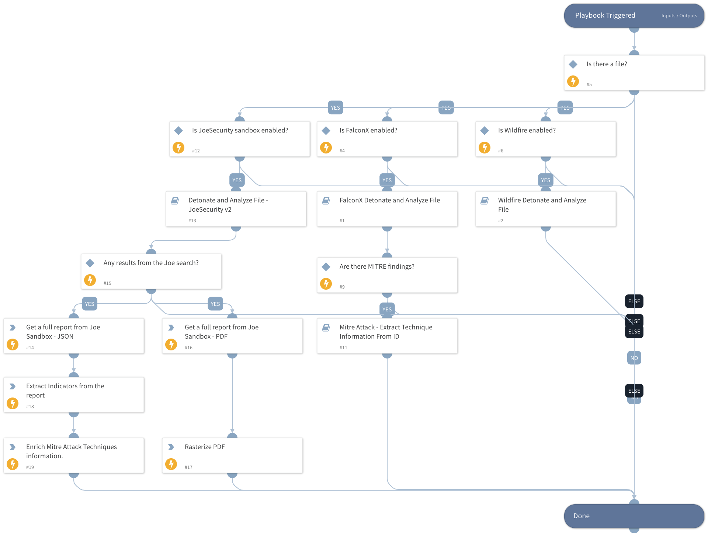

This playbook uploads, detonates, and analyzes files for supported sandboxes. Currently supported sandboxes are Falcon Intelligence Sandbox and Wildfire. 

## Dependencies

This playbook uses the following sub-playbooks, integrations, and scripts.

### Sub-playbooks

* Detonate File - JoeSecurity V2
* Wildfire Detonate and Analyze File
* CrowdStrike Falcon Intelligence Sandbox Detonate and Analyze File
* Mitre Attack - Extract Technique Information From ID

### Integrations

This playbook does not use any integrations.

### Scripts

* IsIntegrationAvailable

### Commands

* joe-download-report
* attack-pattern
* rasterize-pdf
* extractIndicators

## Playbook Inputs

---

| **Name** | **Description** | **Default Value** | **Required** |
| --- | --- | --- | --- |
| File | The details of the file to search for. |  | Optional |

## Playbook Outputs

---

| **Path** | **Description** | **Type** |
| --- | --- | --- |
| csfalconx.resource.tags | The analysis tags. | string |
| csfalconx.resource.sha256 | The SHA256 hash of the scanned file. | string |
| csfalconx.resource.file_name | The name of the uploaded file. | string |
| csfalconx.resource.sandbox | The Falcon Intelligence Sandbox findings. | string |
| csfalconx.resource.intel | The Falcon Intelligence Sandbox intelligence results. | string |
| WildFire.Report | The Wildfire findings. | string |
| AttackPattern | The MITRE Attack pattern information. | unknown |
| MITREATTACK | Full MITRE data for the attack pattern. | unknown |
| DBotScore | DBotScore object. | unknown |
| Joe.Analysis | Joe Analysis object. | unknown |

## Playbook Image

---

