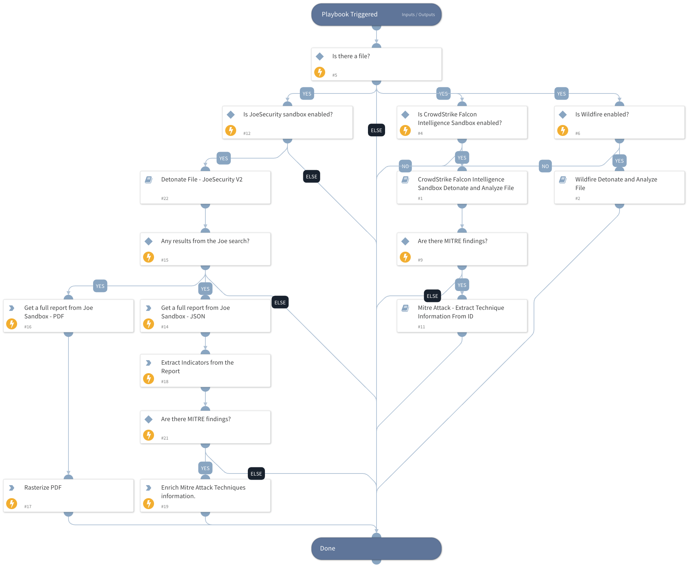

This playbook uploads, detonates, and analyzes files for supported sandboxes. Currently supported sandboxes are Falcon Intelligence Sandbox, JoeSecurity, and Wildfire. 

## Dependencies

This playbook uses the following sub-playbooks, integrations, and scripts.

### Sub-playbooks

* CrowdStrike Falcon Intelligence Sandbox Detonate and Analyze File
* Wildfire Detonate and Analyze File
* Mitre Attack - Extract Technique Information From ID
* Detonate File - JoeSecurity V2

### Integrations

This playbook does not use any integrations.

### Scripts

* IsIntegrationAvailable

### Commands

* rasterize-pdf
* joe-download-report
* attack-pattern
* extractIndicators

## Playbook Inputs

---

| **Name** | **Description** | **Default Value** | **Required** |
| --- | --- | --- | --- |
| File | The details of the file to search for. | File | Optional |

## Playbook Outputs

---

| **Path** | **Description** | **Type** |
| --- | --- | --- |
| csfalconx.resource.tags | The analysis tags. | string |
| csfalconx.resource.sha256 | The SHA256 hash of the scanned file. | string |
| csfalconx.resource.file_name | The name of the uploaded file. | string |
| csfalconx.resource.sandbox | The Falcon Intelligence Sandbox findings. | string |
| csfalconx.resource.intel | The Falcon Intelligence Sandbox intelligence results. | string |
| WildFire.Report | The Wildfire findings. | string |
| AttackPattern | The MITRE Attack pattern information. | string |
| MITREATTACK | Full MITRE data for the attack pattern. | string |
| DBotScore | DBotScore object. | string |
| Joe.Analysis | Joe Analysis object. | string |
| DBotScore.Vendor | The vendor used to calculate the score. | string |
| DBotScore.Indicator | The indicator that was tested. | string |
| DBotScore.Type | The indicator type. | string |
| DBotScore.Score | The actual score. | string |
| DBotScore.Malicious | DBotScore Malicious object | string |
| DBotScore.Malicious.Vendor | The vendor used to calculate the score. | string |
| DBotScore.Malicious.Detections | The sub analysis detection statuses | string |
| DBotScore.Malicious.SHA1 | The SHA1 of the file | string |
| Joe.Analysis.ID | Web ID | string |
| Joe.Analysis.Status | Analysis Status | string |
| Joe.Analysis.Comments | Analysis Comments | string |
| Joe.Analysis.Time | Submitted Time | date |
| Joe.Analysis.Runs | Sub-Analysis Information | string |
| Joe.Analysis.Result | Analysis Results | string |
| Joe.Analysis.Errors | Raised errors during sampling | string |
| Joe.Analysis.Systems | Analysis OS | string |
| Joe.Analysis.MD5 | MD5 of analysis sample | string |
| Joe.Analysis.SHA1 | SHA1 of analysis sample | string |
| Joe.Analysis.SHA256 | SHA256 of analysis sample | string |
| Joe.Analysis.SampleName | Sample Data, could be a file name or URL | string |
| InfoFile | Report file object | string |
| InfoFile.Name | The filename. | string |
| InfoFile.EntryID | The entry ID of the report. | string |
| InfoFile.Size | File size. | number |
| InfoFile.Type | File type, e.g., "PE". | string |
| InfoFile.Info | Basic information of the file. | string |
| InfoFile.Extension | The extension of the image file. | string |
| File | File object | string |
| File.Extension | File extension. | string |
| File.MD5 | The MD5 hash of the file. | string |
| File.Name | The full file name. | string |
| File.SHA1 | The SHA1 hash of the file. | string |
| File.SHA256 | The SHA256 hash of the file. | string |
| ExtractedIndicators | outputs.extractindicators | string |
| AttackPattern.STIXID | The STIX ID of the Attack Pattern. | string |
| AttackPattern.KillChainPhases | The kill chain phases of the Attack Pattern. | string |
| AttackPattern.FirstSeenBySource | The first seen by source of the Attack Pattern. | string |
| AttackPattern.Description | The description of the Attack Pattern. | string |
| AttackPattern.OperatingSystemRefs | The operating system references of the Attack Pattern. | string |
| AttackPattern.Publications | The publications of the Attack Pattern. | string |
| AttackPattern.MITREID | The MITRE ID of the Attack Pattern. | string |
| AttackPattern.Tags | The tags of the Attack Pattern. | string |

## Playbook Image

---

