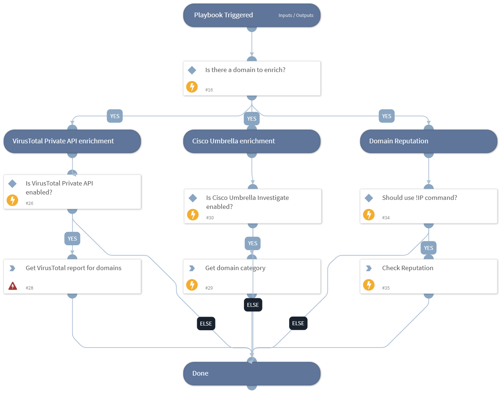

Enrich domains using one or more integrations.
Domain enrichment includes:
* Threat information
* Domain reputation using !domain command

## Dependencies

This playbook uses the following sub-playbooks, integrations, and scripts.

### Sub-playbooks

This playbook does not use any sub-playbooks.

### Integrations

This playbook does not use any integrations.

### Scripts

This playbook does not use any scripts.

### Commands

* umbrella-domain-categorization
* domain

## Playbook Inputs

---

| **Name** | **Description** | **Default Value** | **Required** |
| --- | --- | --- | --- |
| Domain | The domain name to enrich. | Domain.Name | Optional |
| UseReputationCommand | Define if you would like to use the \!url command. Note: This input should be used whenever there is no auto-extract enabled in the investigation flow. Possible values: True / False. | False | Required |

## Playbook Outputs

---

| **Path** | **Description** | **Type** |
| --- | --- | --- |
| Domain | The domain objects. | unknown |
| DBotScore | Indicator, Score, Type, and Vendor. | unknown |
| Domain.Name | Bad domain found. | unknown |
| Domain.Malicious.Vendor | For malicious domains, the vendor that made the decision. | unknown |
| DBotScore.Indicator | The indicator that was tested. | unknown |
| DBotScore.Type | The indicator type. | unknown |
| DBotScore.Score | The actual DBot score. | unknown |
| DBotScore.Reliability | Reliability of the source providing the intelligence data. | unknown |

## Playbook Image

---

