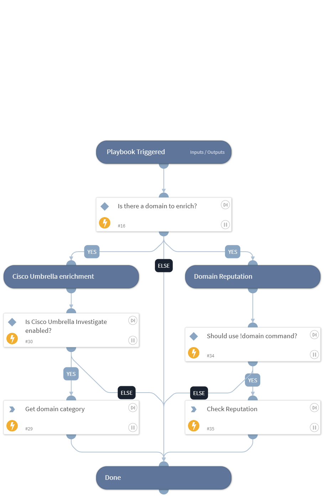

Enrich domains using one or more integrations.
Domain enrichment includes:
* Threat information
* Domain reputation using !domain command

## Dependencies

This playbook uses the following sub-playbooks, integrations, and scripts.

### Sub-playbooks

This playbook does not use any sub-playbooks.

### Integrations

This playbook does not use any integrations.

### Scripts

This playbook does not use any scripts.

### Commands

* umbrella-domain-categorization
* domain

## Playbook Inputs

---

| **Name** | **Description** | **Default Value** | **Required** |
| --- | --- | --- | --- |
| Domain | The domain name to enrich. | Domain.Name | Optional |
| UseReputationCommand | Define if you would like to use the \!url command. Note: This input should be used whenever there is no auto-extract enabled in the investigation flow. Possible values: True / False. | False | Required |

## Playbook Outputs

---

| **Path** | **Description** | **Type** |
| --- | --- | --- |
| Domain | The domain objects. | string |
| DBotScore | Indicator, Score, Type, and Vendor. | string |
| Domain.Name | Bad domain found. | string |
| Domain.Malicious.Vendor | For malicious domains, the vendor that made the decision. | string |
| DBotScore.Indicator | The indicator that was tested. | string |
| DBotScore.Type | The indicator type. | string |
| DBotScore.Score | The actual DBot score. | number |
| Domain.SecurityCategories | The Umbrella security category, or categories, that match this domain | string |
| Domain.ContentCategories | The Umbrella content category or categories that match this domain | string |
| Domain.Malicious.Description | For malicious domains, the reason for the vendor to make the decision | string |
| Domain.CreationDate | The date on which the domain was created. | string |
| Domain.DomainStatus | The status of the domain. | string |
| Domain.UpdatedDate | The date on which the domain was last updated. | string |
| Domain.ExpirationDate | The expiration date of the domain. | string |
| Domain.Umbrella.RiskScore | The status will be "-1" if the domain is believed to be malicious, "1" if the domain is believed to be benign, "0" if it hasn't been classified yet. | string |
| Domain.Umbrella.SecureRank  | Suspicious rank for a domain that reviews based on the lookup behavior of client IP for the domain. Securerank is designed to identify hostnames requested by known infected clients but never requested by clean clients, assuming these domains are more likely to be bad. Scores returned range from -100 \(suspicious\) to 100 \(benign\). Note, this parameter is deprecated by the API, and will be equal to 0. | string |
| Domain.Umbrella.FirstQueriedTime | The time when the attribution for this Domain was made. | string |
| Domain.Umbrella.ContentCategories | The Umbrella content category or categories that match this domain. If none of them match, the return will be blank. | string |
| Domain.Umbrella.MalwareCategories | The Umbrella security category, or categories, that match this domain or that this domain is associated with. If none match, the return will be blank. | string |
| DBotScore.Vendor | The vendor used to calculate the score. | string |
| Domain.Admin.Country | The country of the domain administrator. | string |
| Domain.Admin.Email | The email address of the domain administrator. | string |
| Domain.Admin.Name | The name of the domain administrator. | string |
| Domain.Admin.Phone | The phone number of the domain administrator. | string |
| Domain.Registrant.Country | The country of the registrant. | string |
| Domain.Registrant.Email | The email address of the registrant. | string |
| Domain.Registrant.Name | The name of the registrant. | string |
| Domain.Registrant.Phone | The phone number of the registrant. | string |
| Domain.Registrar.Name | The name of the registrar, such as "GoDaddy". | string |

## Playbook Image

---

