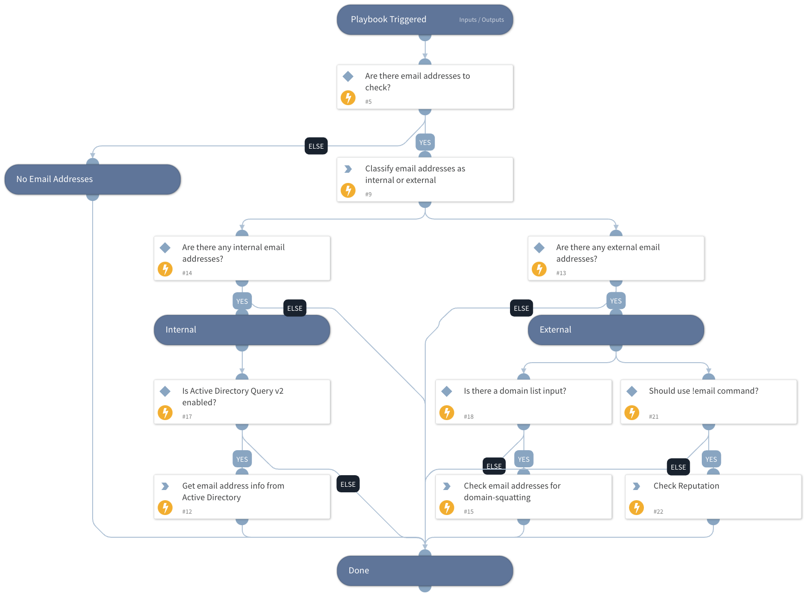

Enrich email addresses.
- Get information from Active Directory for internal addresses
- Get the domain-squatting reputation for external addresses
- Email address reputation using !email command

## Dependencies

This playbook uses the following sub-playbooks, integrations, and scripts.

### Sub-playbooks

This playbook does not use any sub-playbooks.

### Integrations

This playbook does not use any integrations.

### Scripts

* IsEmailAddressInternal
* EmailDomainSquattingReputation
* Exists

### Commands

* ad-get-user
* email

## Playbook Inputs

---

| **Name** | **Description** | **Default Value** | **Required** |
| --- | --- | --- | --- |
| InternalDomains | A CSV list of internal domains. The list will be used to determine whether an email address is internal or external. | inputs.InternalDomains | Optional |
| Email | The email addresses to enrich. | Account.Email.Address | Optional |
| Domain | The domains associated with the incident. These domains will be checked for domain-squatting. | inputs.Domain | Optional |
| UseReputationCommand | Define if you would like to use the \!email command. Note: This input should be used whenever there is no auto-extract enabled in the investigation flow. Possible values: True / False. | False | Required |

## Playbook Outputs

---

| **Path** | **Description** | **Type** |
| --- | --- | --- |
| Account | The Account object. | unknown |
| Account.Email.NetworkType | The email account NetworkType \(Internal/External\). | string |
| Account.Email.Distance.Domain | The compared domain. | string |
| Account.Email.Distance.Value | The distance between the email domain and the compared domain.  | number |
| DBotScore | The DBotScore object. | unknown |

## Playbook Image

---

