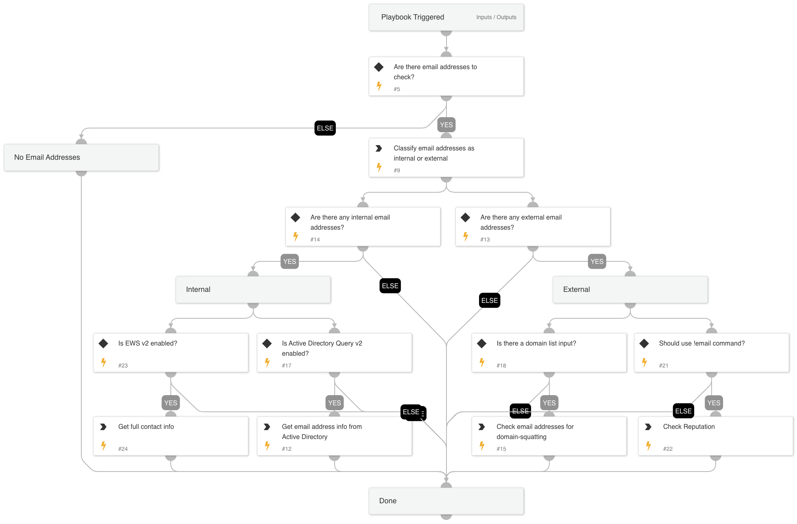

Enrich email addresses.
- Get information from Active Directory for internal addresses
- Get the domain-squatting reputation for external addresses
- Email address reputation using !email command

## Dependencies

This playbook uses the following sub-playbooks, integrations, and scripts.

### Sub-playbooks

This playbook does not use any sub-playbooks.

### Integrations

This playbook does not use any integrations.

### Scripts

* IsEmailAddressInternal
* EmailDomainSquattingReputation
* Exists

### Commands

* email
* ad-get-user

## Playbook Inputs

---

| **Name** | **Description** | **Default Value** | **Required** |
| --- | --- | --- | --- |
| InternalDomains | A CSV list of internal domains. The list will be used to determine whether an email address is internal or external. |  | Optional |
| Email | The email addresses to enrich. | Account.Email.Address | Optional |
| Domain | The domains associated with the incident. These domains will be checked for domain-squatting. |  | Optional |
| UseReputationCommand | Define if you would like to use the \!email command. Note: This input should be used whenever there is no auto-extract enabled in the investigation flow. Possible values: True / False. The default value is false. | False | Required |

## Playbook Outputs

---

| **Path** | **Description** | **Type** |
| --- | --- | --- |
| Account | The Account object. | unknown |
| Account.Email.NetworkType | The email account NetworkType \(Internal/External\). | string |
| Account.Email.Distance.Domain | The compared domain. | string |
| Account.Email.Distance.Value | The distance between the email domain and the compared domain.  | number |
| DBotScore | The DBotScore object. | unknown |
| Account.Email.Username | The Email account username | string |
| Account.Email.Domain | The Email account domain | string |
| ActiveDirectory.Users.dn | The user distinguished name. | unknown |
| ActiveDirectory.Users.displayName | The user display name. | unknown |
| ActiveDirectory.Users.name | The user common name. | unknown |
| ActiveDirectory.Users.sAMAccountName | The user sAMAccountName. | unknown |
| ActiveDirectory.Users.userAccountControl | The user account control flag. | unknown |
| ActiveDirectory.Users.manager | The manager of the user. | unknown |
| ActiveDirectory.Users.memberOf | Groups in which the user is a member. | unknown |
| ActiveDirectory.Users.userAccountControlFields.SCRIPT | Whether the login script is run. Works for \*Windows Server 2012 R2\*. | unknown |
| ActiveDirectory.Users.userAccountControlFields.ACCOUNTDISABLE | Whether the user account is disabled. Works for \*Windows Server 2012 R2\*. | unknown |
| ActiveDirectory.Users.userAccountControlFields.HOMEDIR_REQUIRED | Whether the home folder is required. Works for \*Windows Server 2012 R2\*. | unknown |
| ActiveDirectory.Users.userAccountControlFields.LOCKOUT | Whether the user is locked out. Works for \*Windows Server 2012 R2\*. | unknown |
| ActiveDirectory.Users.userAccountControlFields.PASSWD_NOTREQD | Whether the password is required. Works for \*Windows Server 2012 R2\*. | unknown |
| ActiveDirectory.Users.userAccountControlFields.PASSWD_CANT_CHANGE | Whether the user can change the password. Works for \*Windows Server 2012 R2\*. | unknown |
| ActiveDirectory.Users.userAccountControlFields.ENCRYPTED_TEXT_PWD_ALLOWED | Whether the user can send an encrypted password. Works for \*Windows Server 2012 R2\*. | unknown |
| ActiveDirectory.Users.userAccountControlFields.TEMP_DUPLICATE_ACCOUNT | Whether this is an account for users whose primary account is in another domain. Works for \*Windows Server 2012 R2\*. | unknown |
| ActiveDirectory.Users.userAccountControlFields.NORMAL_ACCOUNT | Whether this is a default account type that represents a typical user. Works for \*Windows Server 2012 R2\*. | unknown |
| ActiveDirectory.Users.userAccountControlFields.INTERDOMAIN_TRUST_ACCOUNT | Whether the account is permitted to trust a system domain that trusts other domains. Works for \*Windows Server 2012 R2\*. | unknown |
| ActiveDirectory.Users.userAccountControlFields.WORKSTATION_TRUST_ACCOUNT | Whether this is a computer account for a computer running Microsoft Windows NT 4.0 Workstation, Microsoft Windows NT 4.0 Server, Microsoft Windows 2000 Professional, or Windows 2000 Server and is a member of this domain. | unknown |
| ActiveDirectory.Users.userAccountControlFields.SERVER_TRUST_ACCOUNT | Whether this is a computer account for a domain controller that is a member of this domain. Works for \*Windows Server 2012 R2\*. | unknown |
| ActiveDirectory.Users.userAccountControlFields.DONT_EXPIRE_PASSWORD | Whether to never expire the password on the account. | unknown |
| ActiveDirectory.Users.userAccountControlFields.MNS_LOGON_ACCOUNT | Whether this is an MNS login account. | unknown |
| ActiveDirectory.Users.userAccountControlFields.SMARTCARD_REQUIRED | Whether to force the user to log in by using a smart card. | unknown |
| ActiveDirectory.Users.userAccountControlFields.TRUSTED_FOR_DELEGATION | Whether the service account \(the user or computer account\) under which a service runs is trusted for Kerberos delegation. | unknown |
| ActiveDirectory.Users.userAccountControlFields.NOT_DELEGATED | Whether the security context of the user isn't delegated to a service even if the service account is set as trusted for Kerberos delegation. | unknown |
| ActiveDirectory.Users.userAccountControlFields.USE_DES_KEY_ONLY | Whether to restrict this principal to use only Data Encryption Standard \(DES\) encryption types for keys. | unknown |
| ActiveDirectory.Users.userAccountControlFields.DONT_REQ_PREAUTH | Whether this account require Kerberos pre-authentication for logging on. | unknown |
| ActiveDirectory.Users.userAccountControlFields.PASSWORD_EXPIRED | Whether the user password expired. | unknown |
| ActiveDirectory.Users.userAccountControlFields.TRUSTED_TO_AUTH_FOR_DELEGATION | Whether the account is enabled for delegation. | unknown |
| ActiveDirectory.Users.userAccountControlFields.PARTIAL_SECRETS_ACCOUNT | Whether the account is a read-only domain controller \(RODC\). | unknown |
| ActiveDirectory.UsersPageCookie | An opaque string received in a paged search, used for requesting subsequent entries. | unknown |
| Account.DisplayName | The user display name. | unknown |
| Account.Groups | Groups for which the user is a member. | unknown |
| Account.Manager | The user manager. | unknown |
| Account.ID | The user distinguished name. | unknown |
| Account.Username | The user samAccountName. | unknown |
| Account.Email | The user email address. | unknown |
| ActiveDirectory.Users.mail | The user email address. | unknown |
| Account.Email.Address | The Email account full address | string |
| Account.Email.Distance | The email address distance compare to the domains in query. | number |
| DBotScore.Indicator | The Indicator. | string |
| DBotScore.Type | The Indicator Type. | string |
| DBotScore.Vendor | The DBot score vendor. | string |
| DBotScore.Score | The DBot score. | number |
| DBotScore.Reliability | The actual score. | unknown |
| Email.Relationships.EntityA | The source of the relationship. | unknown |
| Email.Relationships.EntityB | The destination of the relationship. | unknown |
| Email.Relationships.Relationship | The name of the relationship. | unknown |
| Email.Relationships.EntityAType | The type of the source of the relationship. | unknown |
| Email.Relationships.EntityBType | The type of the destination of the relationship. | unknown |

## Playbook Image

---

