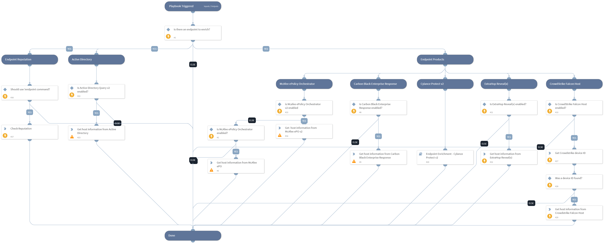

Enrich an endpoint by hostname using one or more integrations.
Supported integrations:
- Active Directory Query v2
- McAfee ePO v2
- VMware Carbon Black EDR v2
- Cylance Protect v2
- CrowdStrike Falcon
- ExtraHop Reveal(x)

- Endpoint reputation using !endpoint command

## Dependencies

This playbook uses the following sub-playbooks, integrations, and scripts.

### Sub-playbooks

* Endpoint Enrichment - Cylance Protect v2

### Integrations

This playbook does not use any integrations.

### Scripts

* Exists

### Commands

* cs-falcon-search-device
* extrahop-devices-search
* epo-find-system
* cb-edr-sensors-list
* endpoint
* ad-get-computer

## Playbook Inputs

---

| **Name** | **Description** | **Default Value** | **Required** |
| --- | --- | --- | --- |
| Hostname | The hostname of the endpoint to enrich. | Endpoint.Hostname | Optional |
| UseReputationCommand | Define if you would like to use the \!endpoint command. Note: This input should be used whenever there is no auto-extract enabled in the investigation flow. Possible values: True / False. | False | Required |
| IPAddress | The IP address of the endpoint to enrich. |  | Optional |
| EndpointID | The endpoint ID of the endpoint to enrich. |  | Optional |

## Playbook Outputs

---

| **Path** | **Description** | **Type** |
| --- | --- | --- |
| Endpoint | The endpoint object of the endpoint that was enriched. | unknown |
| Endpoint.Hostname | The hostnames of the endpoints that were enriched. | string |
| Endpoint.OS | The operating systems running on the endpoints that were enriched. | string |
| Endpoint.IP | A list of the IP addresses of the endpoints. | unknown |
| Endpoint.MAC | A list of the MAC addresses of the endpoints that were enriched. | unknown |
| Endpoint.Domain | The domain names of the endpoints that were enriched. | string |
| CylanceProtectDevice | The device information about the hostname that was enriched using Cylance Protect v2. | unknown |
| ExtraHop.Device.Macaddr | The MAC Address of the device. | String |
| ExtraHop.Device.DeviceClass | The class of the device. | String |
| ExtraHop.Device.UserModTime | The time of the most recent update, expressed in milliseconds since the epoch. | Number |
| ExtraHop.Device.AutoRole | The role automatically detected by the ExtraHop. | String |
| ExtraHop.Device.ParentId | The ID of the parent device. | Number |
| ExtraHop.Device.Vendor | The device vendor. | String |
| ExtraHop.Device.Analysis | The level of analysis preformed on the device. | string |
| ExtraHop.Device.DiscoveryId | The UUID given by the Discover appliance. | String |
| ExtraHop.Device.DefaultName | The default name of the device. | String |
| ExtraHop.Device.DisplayName | The display name of device. | String |
| ExtraHop.Device.OnWatchlist | Whether the device is on the advanced analysis allow list. | Boolean |
| ExtraHop.Device.ModTime | The time of the most recent update, expressed in milliseconds since the epoch. | Number |
| ExtraHop.Device.IsL3 | Indicates whether the device is a Layer 3 device. | Boolean |
| ExtraHop.Device.Role | The role of the device. | String |
| ExtraHop.Device.DiscoverTime | The time that the device was discovered. | Number |
| ExtraHop.Device.Id | The ID of the device. | Number |
| ExtraHop.Device.Ipaddr4 | The IPv4 address of the device. | String |
| ExtraHop.Device.Vlanid | The ID of VLan. | Number |
| ExtraHop.Device.Ipaddr6 | The IPv6 address of the device. | string |
| ExtraHop.Device.NodeId | The Node ID of the Discover appliance. | number |
| ExtraHop.Device.Description | A user customizable description of the device. | string |
| ExtraHop.Device.DnsName | The DNS name associated with the device. | string |
| ExtraHop.Device.DhcpName | The DHCP name associated with the device. | string |
| ExtraHop.Device.CdpName | The Cisco Discovery Protocol name associated with the device. | string |
| ExtraHop.Device.NetbiosName | The NetBIOS name associated with the device. | string |
| ExtraHop.Device.Url | Link to the device details page in ExtraHop. | string |
| Endpoint.IPAddress | The endpoint IP address. | unknown |
| Endpoint.ID | The endpoint ID. | unknown |
| Endpoint.Status | The endpoint status. | unknown |
| Endpoint.IsIsolated | The endpoint isolation status. | unknown |
| Endpoint.MACAddress | The endpoint MAC address. | unknown |
| Endpoint.Vendor | The integration name of the endpoint vendor. | unknown |
| Endpoint.Relationships | The endpoint relationships of the endpoint that was enriched. | unknown |
| Endpoint.Processor | The model of the processor. | unknown |
| Endpoint.Processors | The number of processors. | unknown |
| Endpoint.Memory | Memory on this endpoint. | unknown |
| Endpoint.Model | The model of the machine or device. | unknown |
| Endpoint.BIOSVersion | The endpoint's BIOS version. | unknown |
| Endpoint.OSVersion | The endpoint's operation system version. | unknown |
| Endpoint.DHCPServer | The DHCP server of the endpoint. | unknown |
| McAfee.ePO.Endpoint | The endpoint that was enriched. | unknown |
| Endpoint.Groups | Groups for which the computer is listed as a member. | unknown |
| ActiveDirectory.ComputersPageCookie | An opaque string received in a paged search, used for requesting subsequent entries. | unknown |
| ActiveDirectory.Computers.dn | The computer distinguished name. | unknown |
| ActiveDirectory.Computers.memberOf | Groups for which the computer is listed. | unknown |
| ActiveDirectory.Computers.name | The computer name. | unknown |
| CrowdStrike.Device | The information about  the endpoint. | unknown |
| ActiveDirectory.Computers | The information about the hostname that was enriched using Active Directory. | unknown |
| CarbonBlackEDR.Sensor.systemvolume_total_size | The size, in bytes, of system volume of endpoint on which sensor in installed. | unknown |
| CarbonBlackEDR.Sensor.emet_telemetry_path | The path of emet telemtry associated with the sensor. | unknown |
| CarbonBlackEDR.Sensor.os_environment_display_string | Human-readable string of the installed OS. | unknown |
| CarbonBlackEDR.Sensor.emet_version | The emet version associated with the sensor. | unknown |
| CarbonBlackEDR.Sensor.emet_dump_flags | The flags of emet dump associated with the sensor. | unknown |
| CarbonBlackEDR.Sensor.clock_delta | The clock delta associated with the sensor. | unknown |
| CarbonBlackEDR.Sensor.supports_cblr | Whether the sensor supports cblr. | unknown |
| CarbonBlackEDR.Sensor.sensor_uptime | The uptime of the process. | unknown |
| CarbonBlackEDR.Sensor.last_update | When the sensor last updated. | unknown |
| CarbonBlackEDR.Sensor.physical_memory_size | The size in bytes of physical memory. | unknown |
| CarbonBlackEDR.Sensor.build_id | The sensor version installed on this endpoint. From the /api/builds/ endpoint. | unknown |
| CarbonBlackEDR.Sensor.uptime | Endpoint uptime in seconds. | unknown |
| CarbonBlackEDR.Sensor.is_isolating | Boolean representing sensor-reported isolation status. | unknown |
| CarbonBlackEDR.Sensor.event_log_flush_time | If event_log_flush_time is set, the server will instruct the sensor to immediately send all data before this date, ignoring all other throttling mechansims. To force a host current, set this value to a value far in the future. When the sensor has finished sending it’s queued data, this value will be null. | unknown |
| CarbonBlackEDR.Sensor.computer_dns_name | The DNS name of the endpoint on which the sensor is installed. | unknown |
| CarbonBlackEDR.Sensor.emet_report_setting | The report setting of EMET associated with sensor. | unknown |
| CarbonBlackEDR.Sensor.id | The sensor id of this sensor. | unknown |
| CarbonBlackEDR.Sensor.emet_process_count | The number of EMET processes associated with the sensor. | unknown |
| CarbonBlackEDR.Sensor.emet_is_gpo | Whther the EMET is gpo. | unknown |
| CarbonBlackEDR.Sensor.power_state | The sensor power state. | unknown |
| CarbonBlackEDR.Sensor.network_isolation_enabled | Boolean representing network isolation request status. | unknown |
| CarbonBlackEDR.Sensor.systemvolume_free_size | The bytes free on the system volume. | unknown |
| CarbonBlackEDR.Sensor.status | The sensor status. | unknown |
| CarbonBlackEDR.Sensor.num_eventlog_bytes | Number bytes of eventlog. | unknown |
| CarbonBlackEDR.Sensor.sensor_health_message | Human-readable string indicating sensor’s self-reported status. | unknown |
| CarbonBlackEDR.Sensor.build_version_string | Human-readable string of the sensor version. | unknown |
| CarbonBlackEDR.Sensor.computer_sid | Machine SID of this host. | unknown |
| CarbonBlackEDR.Sensor.next_checkin_time | Next expected communication from this computer in server-local time and zone. | unknown |
| CarbonBlackEDR.Sensor.node_id | The node ID associated with the sensor. | unknown |
| CarbonBlackEDR.Sensor.cookie | The cookie associated with the sensor. | unknown |
| CarbonBlackEDR.Sensor.emet_exploit_action | The EMET exploit action associated with the sensor. | unknown |
| CarbonBlackEDR.Sensor.computer_name | NetBIOS name of this computer. | unknown |
| CarbonBlackEDR.Sensor.license_expiration | When the licene of the sensor expires. | unknown |
| CarbonBlackEDR.Sensor.supports_isolation | Whther sensor supports isolation. | unknown |
| CarbonBlackEDR.Sensor.parity_host_id | The ID of the parity host associated with the sensor. | unknown |
| CarbonBlackEDR.Sensor.supports_2nd_gen_modloads | Whether the sensor support modload of 2nd generation. | unknown |
| CarbonBlackEDR.Sensor.network_adapters | A pipe-delimited list list of IP,MAC pairs for each network interface. | unknown |
| CarbonBlackEDR.Sensor.sensor_health_status | self-reported health score, from 0 to 100. Higher numbers are better. | unknown |
| CarbonBlackEDR.Sensor.registration_time | Time this sensor originally registered in server-local time and zone. | unknown |
| CarbonBlackEDR.Sensor.restart_queued | Whether a restart of the sensot is queued. | unknown |
| CarbonBlackEDR.Sensor.notes | The notes associated with the sensor. | unknown |
| CarbonBlackEDR.Sensor.num_storefiles_bytes | Number of storefiles bytes associated with the sensor. | unknown |
| CarbonBlackEDR.Sensor.os_environment_id | The ID of the os enviroment of the sensor. | unknown |
| CarbonBlackEDR.Sensor.shard_id | The ID of the shard associated with the sensor. | unknown |
| CarbonBlackEDR.Sensor.boot_id | A sequential counter of boots since the sensor was installed. | unknown |
| CarbonBlackEDR.Sensor.last_checkin_time | Last communication with this computer in server-local time and zone. | unknown |
| CarbonBlackEDR.Sensor.os_type | The operating system type of the computer. | unknown |
| CarbonBlackEDR.Sensor.group_id | The sensor group id this sensor is assigned to. | unknown |
| CarbonBlackEDR.Sensor.uninstall | when set, indicates sensor will be directed to uninstall on next checkin. | unknown |

## Playbook Image

---

