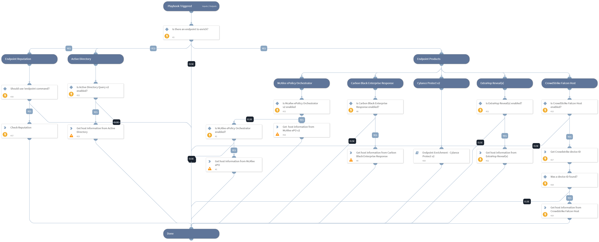

Enrich an endpoint by hostname using one or more integrations.
Supported integrations:
- Active Directory Query v2
- McAfee ePolicy Orchestrator
- Carbon Black Enterprise Response v2
- Cylance Protect v2
- CrowdStrike Falcon Host
- ExtraHop Reveal(x)

- Endpoint reputation using !endpoint command

## Dependencies

This playbook uses the following sub-playbooks, integrations, and scripts.

### Sub-playbooks

* Endpoint Enrichment - Cylance Protect v2

### Integrations

* McAfee ePO v2
* carbonblack-v2
* Active Directory Query v2
* epo

### Scripts

* Exists

### Commands

* cb-sensor-info
* extrahop-device-search
* endpoint
* cs-device-details
* cs-device-search
* ad-get-computer
* epo-find-system

## Playbook Inputs

---

| **Name** | **Description** | **Default Value** | **Required** |
| --- | --- | --- | --- |
| Hostname | The hostname of the endpoint to enrich. | Endpoint.Hostname | Optional |
| UseReputationCommand | Define if you would like to use the \!endpoint command. Note: This input should be used whenever there is no auto-extract enabled in the investigation flow. Possible values: True / False. | False | Required |
| IPAddress | The IP address of the endpoint to enrich. |  | Optional |
| EndpointID | The endpoint ID of the endpoint to enrich. |  | Optional |

## Playbook Outputs

---

| **Path** | **Description** | **Type** |
| --- | --- | --- |
| Endpoint | The endpoint object of the endpoint that was enriched. | unknown |
| Endpoint.Hostname | The hostnames of the endpoints that were enriched. | string |
| Endpoint.OS | The operating systems running on the endpoints that were enriched. | string |
| Endpoint.IP | A list of the IP addresses of the endpoints. | unknown |
| Endpoint.MAC | A list of the MAC addresses of the endpoints that were enriched. | unknown |
| Endpoint.Domain | The domain names of the endpoints that were enriched. | string |
| CylanceProtectDevice | The device information about the hostname that was enriched using Cylance Protect v2. | unknown |
| ExtraHop.Device.Macaddr | The MAC Address of the device. | String |
| ExtraHop.Device.DeviceClass | The class of the device. | String |
| ExtraHop.Device.UserModTime | The time of the most recent update, expressed in milliseconds since the epoch. | Number |
| ExtraHop.Device.AutoRole | The role automatically detected by the ExtraHop. | String |
| ExtraHop.Device.ParentId | The ID of the parent device. | Number |
| ExtraHop.Device.Vendor | The device vendor. | String |
| ExtraHop.Device.Analysis | The level of analysis preformed on the device. | string |
| ExtraHop.Device.DiscoveryId | The UUID given by the Discover appliance. | String |
| ExtraHop.Device.DefaultName | The default name of the device. | String |
| ExtraHop.Device.DisplayName | The display name of device. | String |
| ExtraHop.Device.OnWatchlist | Whether the device is on the advanced analysis allow list. | Boolean |
| ExtraHop.Device.ModTime | The time of the most recent update, expressed in milliseconds since the epoch. | Number |
| ExtraHop.Device.IsL3 | Indicates whether the device is a Layer 3 device. | Boolean |
| ExtraHop.Device.Role | The role of the device. | String |
| ExtraHop.Device.DiscoverTime | The time that the device was discovered. | Number |
| ExtraHop.Device.Id | The ID of the device. | Number |
| ExtraHop.Device.Ipaddr4 | The IPv4 address of the device. | String |
| ExtraHop.Device.Vlanid | The ID of VLan. | Number |
| ExtraHop.Device.Ipaddr6 | The IPv6 address of the device. | string |
| ExtraHop.Device.NodeId | The Node ID of the Discover appliance. | number |
| ExtraHop.Device.Description | A user customizable description of the device. | string |
| ExtraHop.Device.DnsName | The DNS name associated with the device. | string |
| ExtraHop.Device.DhcpName | The DHCP name associated with the device. | string |
| ExtraHop.Device.CdpName | The Cisco Discovery Protocol name associated with the device. | string |
| ExtraHop.Device.NetbiosName | The NetBIOS name associated with the device. | string |
| ExtraHop.Device.Url | Link to the device details page in ExtraHop. | string |
| Endpoint.IPAddress | The endpoint IP address. | unknown |
| Endpoint.ID | The endpoint ID. | unknown |
| Endpoint.Status | The endpoint status. | unknown |
| Endpoint.IsIsolated | The endpoint isolation status. | unknown |
| Endpoint.MACAddress | The endpoint MAC address. | unknown |
| Endpoint.Vendor | The integration name of the endpoint vendor. | unknown |
| ActiveDirectory.Computers | The information about the hostname that was enriched using Active Directory. | unknown |
| ActiveDirectory.Computers.dn | The computer distinguished name. | unknown |
| ActiveDirectory.Computers.memberOf | Groups for which the computer is listed. | unknown |
| ActiveDirectory.Computers.name | The computer name. | unknown |
| Endpoint.Groups | Groups for which the computer is listed as a member. | unknown |
| ActiveDirectory.ComputersPageCookie | An opaque string received in a paged search, used for requesting subsequent entries. | unknown |

## Playbook Image

---

