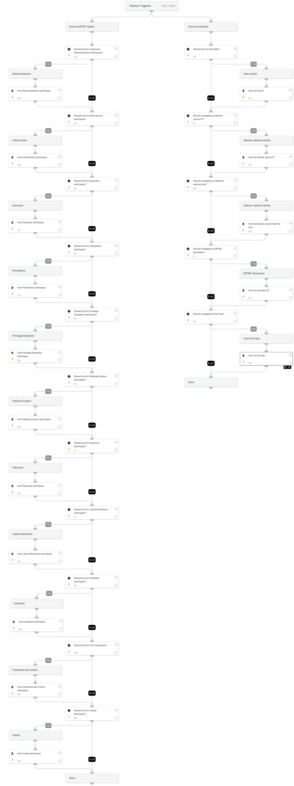

This playbook handles all the endpoint investigation actions by performing the following tasks  on every alert associated with the incident:
* Pre-defined MITRE Tactics
* Host fields (Host ID)
* Attacker fields (Attacker IP, External host)
* MITRE techniques
* File hash (currently, the playbook supports only SHA256)  

Note: The playbook inputs enable manipulating the execution flow; read the input descriptions for details.

## Dependencies

This playbook uses the following sub-playbooks, integrations, and scripts.

### Sub-playbooks

This playbook does not use any sub-playbooks.

### Integrations

This playbook does not use any integrations.

### Scripts

* SearchIncidentsV2

### Commands

This playbook does not use any commands.

## Playbook Inputs

---

| **Name** | **Description** | **Default Value** | **Required** |
| --- | --- | --- | --- |
| HuntReconnaissanceTechniques | Set to True to hunt for identified alerts with MITRE Reconnaissance techniques. | True | Optional |
| HuntInitialAccessTechniques | Set to True to hunt for identified alerts with MITRE Access techniques. | True | Optional |
| HuntExecutionTechniques | Set to True to hunt for identified alerts with MITRE Execution techniques. | True | Optional |
| HuntPersistenceTechniques | Set to True to hunt for identified alerts with MITRE Persistence techniques. | True | Optional |
| HuntPrivilegeEscalationTechniques | Set to True to hunt for identified alerts with MITRE Privilege Escalation techniques. | True | Optional |
| HuntDefenseEvasionTechniques | Set to True to hunt for identified alerts with MITRE Defense Evasion techniques. | True | Optional |
| HuntDiscoveryTechniques | Set to True to hunt for identified alerts with MITRE Discovery techniques. | True | Optional |
| HuntLateralMovementTechniques | Set to True to hunt for identified alerts with MITRE Lateral Movement techniques. | True | Optional |
| HuntCollectionTechniques | Set to True to hunt for MITRE Collection techniques identified alerts. | True | Optional |
| HuntCnCTechniques | Set to True to hunt for identified alerts with MITRE Command and Control techniques. | True | Optional |
| HuntImpactTechniques | Set to True to hunt for identified alerts with MITRE Impact techniques. | True | Optional |
| HuntAttacker | Set to True to hunt the attacker IP address or external hostname. |  | Optional |
| HuntByTechnique | Set to True to hunt by a specific MITRE technique. |  | Optional |
| HuntByHost | Set to True to hunt by the endpoint ID. The agentID input must be provided as well. |  | Optional |
| HuntByFile | Boolean. Set to True to hunt by a specific file hash. Supports SHA256. |  | Optional |
| agentID | The agent ID. | * | Optional |
| attackerRemoteIP | The IP address of the attacker. The 'HuntAttacker' inputs should also be set to True. |  | Optional |
| attackerExternalHost | The external host used by the attacker. The 'HuntAttacker' inputs should also be set to True. |  | Optional |
| mitreTechniqueID | A MITRE technique identifier. The 'HuntByTechnique' inputs should also be set to True. |  | Optional |
| FileSHA256 | The file SHA256. The 'HuntByFile' inputs should also be set to True. |  | Optional |

## Playbook Outputs

---
There are no outputs for this playbook.

## Playbook Image

---

