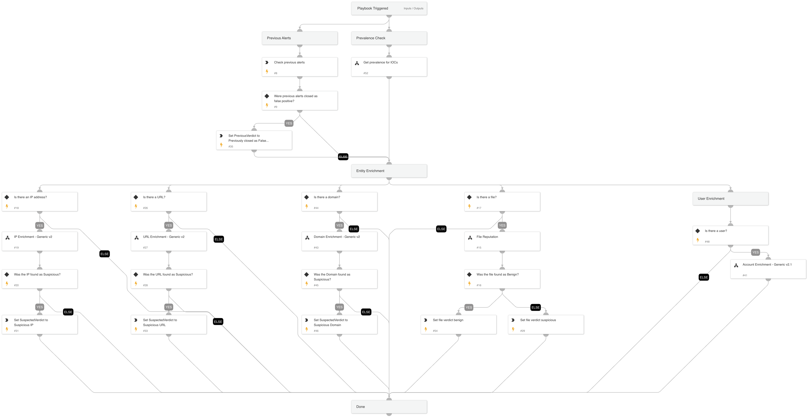

This playbook checks prior alert closing reasons and performs enrichment and prevalence checks on different IOC types. It then returns the information needed to establish the alert's verdict.

## Dependencies

This playbook uses the following sub-playbooks, integrations, and scripts.

### Sub-playbooks

* URL Enrichment - Generic v2
* File Reputation
* IP Enrichment - Generic v2
* Account Enrichment - Generic v2.1
* Get prevalence for IOCs
* Domain Enrichment - Generic v2

### Integrations

This playbook does not use any integrations.

### Scripts

* Set
* SearchIncidentsV2

### Commands

This playbook does not use any commands.

## Playbook Inputs

---

| **Name** | **Description** | **Default Value** | **Required** |
| --- | --- | --- | --- |
| threshold | The number of previous alerts that were closed as false positive alerts. This threshold establishes whether the Previous Verdict key will be marked as false positive. | 2 | Optional |
| query | A query for the previous alerts search. Use free form query \(Lucene syntax\) as a filter. All other filters are ignored when this filter is used. | (initiatorsha256:${inputs.FileSHA256} or hostip:${inputs.IP}) and sourceBrand:"${alert.sourceBrand}" and name:"${alert.name}" | Optional |
| CloseReason | The closing reason of the previous alerts to search for. Possible values are: - Resolved - Threat Handled - Resolved - True Positive - Resolved - False Positive - Resolved - Security Testing - Resolved - Known Issue - Resolved - Duplicate Incident - Resolved - Other - Resolved - Auto | Resolved - False Positive,Resolved - Duplicate Incident,Resolved - Known Issue | Optional |
| FileSHA256 | File SHA256 to enrich and give verdict. | alert.initiatorsha256 | Optional |
| IP | IP address to enrich and give verdict. | alert.hostip | Optional |
| InternalRange | A list of internal IP ranges to check IP addresses against. The comma-separated list should be provided in CIDR notation. For example, a list of ranges is: "172.16.0.0/12,10.0.0.0/8,192.168.0.0/16" \(without quotes\). | lists.PrivateIPs | Optional |
| ResolveIP | Determines whether to convert the IP address to a hostname using a DNS query \(True/ False\). |  | Optional |
| URL | URL to enrich and give verdict. | alert.url | Optional |
| User | User to enrich and give verdict. \(AWS IAM or Active Directory\). | alert.username | Optional |
| Domain | Domain to enrich and give verdict. | alert.domainname | Optional |
| CommandLine | The CMD to run the prevalence check. |  | Optional |
| ProcessName | The process name to run the prevalence check. |  | Optional |
| RegistryKey | The registry key to run the prevalence check. The input registry value must be provided as well. |  | Optional |
| RegistryValue | The registry value to run prevalence check. The input registry key must be provided as well. |  | Optional |
| UseReputationCommand | Set 'True' to use the reputation commands \(\!ip, \!domain, \!url\) to enrich the IP, URL, and domain. | True | Optional |

## Playbook Outputs

---

| **Path** | **Description** | **Type** |
| --- | --- | --- |
| PreviousVerdict | Suspected verdict for previous alerts. | string |
| VTFileVerdict | Check for VirusTotal verdict. | unknown |
| NSRLFileVerdict | Check for the file presence in NSRL DB. | unknown |
| VTFileSigners | Check VirusTotal if the file is signed by a trusted publisher. | unknown |
| XDRFileSigners | Check XDR alert if the file is signed by a trusted publisher. | unknown |
| IP | The IP objects. | unknown |
| DBotScore | Indicator's dbot Score, dbot Type and Vendor. | unknown |
| Endpoint | The endpoint's object. | unknown |
| URL | The URL object. | uknown |
| AWS.IAM.Users | AWS IAM user information. | unknown |
| AWS.IAM.Users.AccessKeys | AWS IAM user access keys information. | unknown |
| Account | The account object. | unknown |
| ActiveDirectory.Users | Active Directory user information. | unknown |
| IPVerdict | Specifies whether the IP addresses were found as suspicious. | unknown |
| URLVerdict | Specifies whether the URLs were found as suspicious. | unknown |
| FileVerdict | Specifies whether the files were found as suspicious. | unknown |
| WildFire.Report | WildFire report object. | unknown |
| WildFire.Report.verdict | The verdict of the report. | unknown |
| WildFire.Verdicts.Verdict | Verdict of the file. | unknown |
| WildFire.Verdicts.VerdictDescription | Description of the file verdict. | unknown |
| DomainVerdict | Domain verdict | unknown |
| Core.AnalyticsPrevalence.Ip.value | Whether the IP address is prevalent or not. | unknown |
| Core.AnalyticsPrevalence.Ip.data.global_prevalence.value | The global prevalence of the IP. | unknown |
| Core.AnalyticsPrevalence.Ip.data.local_prevalence.value | The local prevalence of the IP. | unknown |
| Core.AnalyticsPrevalence.Hash.value | Whether the hash is prevalent or not. | unknown |
| Core.AnalyticsPrevalence.Hash.data.global_prevalence.value | The global prevalence of the hash. | unknown |
| Core.AnalyticsPrevalence.Hash.data.local_prevalence.value | The local prevalence of the hash. | unknown |
| Core.AnalyticsPrevalence.Domain.value | Whether the domain is prevalent or not. | unknown |
| Core.AnalyticsPrevalence.Domain.data.global_prevalence.value | The global prevalence of the domain. | unknown |
| Core.AnalyticsPrevalence.Domain.data.local_prevalence.value | The local prevalence of the domain. | unknown |
| Core.AnalyticsPrevalence.Process.value | Whether the process is prevalent or not. | unknown |
| Core.AnalyticsPrevalence.Process.data.global_prevalence.value | The global prevalence of the process. | unknown |
| Core.AnalyticsPrevalence.Process.data.local_prevalence.value | The local prevalence of the process. | unknown |
| Core.AnalyticsPrevalence.Registry.value | Whether the registry is prevalent or not. | unknown |
| Core.AnalyticsPrevalence.Registry.data.global_prevalence.value | The global prevalence of the registry. | unknown |
| Core.AnalyticsPrevalence.Registry.data.local_prevalence.value | The local prevalence of the registry. | unknown |
| Core.AnalyticsPrevalence.Cmd.value | Whether the CMD is prevalent or not. | unknown |
| Core.AnalyticsPrevalence.Cmd.data.global_prevalence.value | The global prevalence of the CMD. | unknown |
| Core.AnalyticsPrevalence.Cmd.data.local_prevalence.value | The local prevalence of the CDM. | unknown |

## Playbook Image

---

