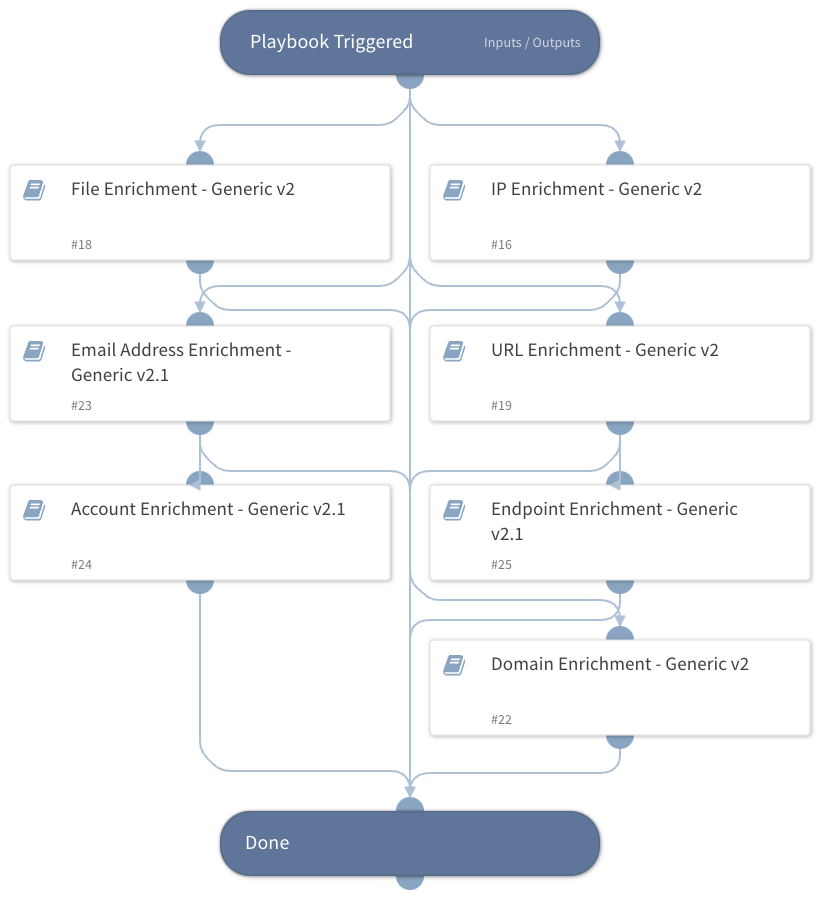

Enrich entities using one or more integrations

## Dependencies

This playbook uses the following sub-playbooks, integrations, and scripts.

### Sub-playbooks

* File Enrichment - Generic v2
* URL Enrichment - Generic v2
* Endpoint Enrichment - Generic v2.1
* Domain Enrichment - Generic v2
* Account Enrichment - Generic v2.1
* Email Address Enrichment - Generic v2.1
* IP Enrichment - Generic v2

### Integrations

This playbook does not use any integrations.

### Scripts

This playbook does not use any scripts.

### Commands

This playbook does not use any commands.

## Playbook Inputs

---

| **Name** | **Description** | **Default Value** | **Required** |
| --- | --- | --- | --- |
| IP | The IP addresses to enrich | IP.Address | Optional |
| InternalRange | A list of internal IP ranges to check IP addresses against. The comma-separated list should be provided in CIDR notation. For example, a list of ranges would be: "172.16.0.0/12,10.0.0.0/8,192.168.0.0/16" \(without quotes\). | lists.PrivateIPs | Optional |
| MD5 | File MD5 to enrich | File.MD5 | Optional |
| SHA256 | File SHA256 to enrich | File.SHA256 | Optional |
| SHA1 | File SHA1 to enrich | File.SHA1 | Optional |
| URL | URL to enrich | URL.Data | Optional |
| Email | The email addresses to enrich | Account.Email.Address | Optional |
| Hostname | The hostname to enrich | Endpoint.Hostname | Optional |
| Username | The Username to enrich | Account.Username | Optional |
| Domain | The domain name to enrich | Domain.Name | Optional |
| ResolveIP | Determines whether the IP Enrichment - Generic playbook should convert IP addresses to hostnames using a DNS query. You can set this to either True or False. | False | Optional |
| InternalDomains | A CSV list of internal domains. The list will be used to determine whether an email address is internal or external. |  | Optional |
| UseReputationCommand | Define whether you wish to use the reputation command during the enrichment process. Note: This input should be used whenever auto-extract is not enabled in the investigation flow. The default value is false Possible values: True / False. | False | Required |

## Playbook Outputs

---

| **Path** | **Description** | **Type** |
| --- | --- | --- |
| IP | The IP object. | unknown |
| Endpoint | The endpoint object. | string |
| Endpoint.Hostname | The hostname that was enriched. | string |
| Endpoint.OS | The endpoint's operating system. | string |
| Endpoint.IP | A list of endpoint IP addresses. | string |
| Endpoint.MAC | A list of endpoint MAC addresses. | string |
| Endpoint.Domain | The endpoint domain name. | string |
| DBotScore | The DBotScore object. | string |
| DBotScore.Indicator | The indicator that was tested. | string |
| DBotScore.Type | The indicator type. | string |
| DBotScore.Vendor | Vendor used to calculate the score. | string |
| DBotScore.Score | The actual score. | number |
| File | The file object. | string |
| File.SHA1 | SHA1 hash of the file. | string |
| File.SHA256 | SHA256 hash of the file. | string |
| File.MD5 | MD5 hash of the file. | string |
| File.Malicious | Whether the file is malicious. | string |
| File.Malicious.Vendor | For malicious files, the vendor that made the decision. | string |
| URL | The URL object. | string |
| URL.Data | The enriched URL. | string |
| URL.Malicious | Whether the detected URL was malicious. | string |
| URL.Vendor | Vendor that labeled the URL as malicious. | string |
| URL.Description | Additional information for the URL. | string |
| Domain | The domain object. | string |
| Account | The account object. | string |
| Account.Email | The email of the account. | string |
| Account.Email.NetworkType | The email account NetworkType \(Internal/External\). | string |
| Account.Email.Distance | The object that contains the distance between the email domain and the compared domain.  | string |
| Account.Email.Distance.Domain | The compared domain. | string |
| Account.Email.Distance.Value | The distance between the email domain and the compared domain.  | number |
| ActiveDirectory.Users | An object containing information about the user from Active Directory. | string |
| ActiveDirectory.Users.sAMAccountName | The user's samAccountName. | string |
| ActiveDirectory.Users.userAccountControl | The user's account control flag. | string |
| ActiveDirectory.Users.mail | The user's email address. | string |
| ActiveDirectory.Users.memberOf | Groups the user is a member of. | string |
| CylanceProtectDevice | The device information about the hostname that was enriched using Cylance Protect v2. | string |
| File.VirusTotal.Scans | The scan object. | string |
| File.VirusTotal.Scans.Source | Vendor that scanned this hash. | string |
| File.VirusTotal.Scans.Detected | Whether a scan was detected for this hash \(True/False\). | boolean |
| File.VirusTotal.Scans.Result | Scan result for this hash - signature, etc. | string |
| IAM | Generic IAM output. | string |
| UserManagerEmail | The email of the user's manager. | string |
| UserManagerDisplayName | The display name of the user's manager. | string |
| ActiveDirectory.Users.manager | The manager of the user. | string |
| ActiveDirectory.Users.dn | The user distinguished name. | string |
| ActiveDirectory.Users.displayName | The user display name. | string |
| ActiveDirectory.Users.name | The user common name. | string |
| ActiveDirectory.Users.userAccountControlFields | The user account control fields. | string |
| IdentityIQ.Identity | Identity asset from IdentityIQ. | string |
| PingOne.Account | Account in PingID. | string |
| IAM.Vendor.active | When true, indicates that the employee's status is active in the 3rd-party integration. | string |
| IAM.Vendor.brand | Name of the integration. | string |
| IAM.Vendor.details | Provides the raw data from the 3rd-party integration. | string |
| IAM.Vendor.email | The employee's email address. | string |
| IAM.Vendor.errorCode | HTTP error response code. | string |
| IAM.Vendor.errorMessage | Reason why the API failed. | string |
| IAM.Vendor.id | The employee's user ID in the app. | string |
| IAM.Vendor.instanceName | Name of the integration instance. | string |
| IAM.Vendor.success | When true, indicates that the command was executed successfully. | string |
| IAM.Vendor.username | The employee's username in the app. | string |
| IAM.Vendor.action | The command name. | string |
| IdentityIQ.Identity.userName | The IdentityIQ username \(primary ID\). | string |
| IdentityIQ.Identity.id | The IdentityIQ internal ID \(UUID\). | string |
| IdentityIQ.Identity.active | Indicates whether the ID is active or inactive in IdentityIQ. | string |
| IdentityIQ.Identity.lastModified | Timestamp of when the identity was last modified. | string |
| IdentityIQ.Identity.displayName | The display name of the identity. | string |
| IdentityIQ.Identity.emails | Array of email objects. | string |
| IdentityIQ.Identity.entitlements | Array of entitlement objects that the identity has. | string |
| IdentityIQ.Identity.roles | Array of role objects that the identity has. | string |
| IdentityIQ.Identity.capabilities | Array of string representations of the IdentityIQ capabilities assigned to this identity. | string |
| IdentityIQ.Identity.name | Account name. | string |
| IdentityIQ.Identity.manager | The account's manager returned from IdentityIQ. | string |
| IdentityIQ.Identity.name.formatted | The display name of the identity. | string |
| IdentityIQ.Identity.name.familyName | The last name of the identity. | string |
| IdentityIQ.Identity.name.givenName | The first name of the identity. | string |
| IdentityIQ.Identity.manager.userName | The IdentityIQ username \(primary ID\) of the identity's manager. | string |
| IdentityIQ.Identity.emails.type | Type of the email being returned. | string |
| IdentityIQ.Identity.emails.value | The email address of the identity. | string |
| IdentityIQ.Identity.emails.primary | Indicates if this email address is the identity's primary email. | string |
| PingOne.Account.ID | PingOne account ID. | string |
| PingOne.Account.Username | PingOne account username. | string |
| PingOne.Account.DisplayName | PingOne account display name. | string |
| PingOne.Account.Email | PingOne account email. | string |
| PingOne.Account.Enabled | PingOne account enabled status. | string |
| PingOne.Account.CreatedAt | PingOne account create date. | string |
| PingOne.Account.UpdatedAt | PingOne account updated date. | string |
| Account.PasswordChanged | Timestamp for when the user's password was last changed. | string |
| Account.StatusChanged | Timestamp for when the user's status was last changed. | string |
| Account.Activated | Timestamp for when the user was activated. | string |
| Account.Created | Timestamp for when the user was created. | string |
| Account.Status | Okta account status. | string |
| Account.Username | The user SAM account name. | string |
| Account.ID | The user distinguished name. | string |
| Account.Manager | The user manager. | string |
| Account.Groups | Groups for which the user is a member. | string |
| Account.DisplayName | The user display name. | string |
| Account.ManagerEmail | The manager email. | string |
| Account.JobTitle | User’s job title. | string |
| Account.TelephoneNumber | User’s mobile phone number. | string |
| Account.Office | User’s office location. | string |
| Account.Type | The account entity type. | string |
| ActiveDirectory.Users.userAccountControlFields.SCRIPT | Whether the login script is run. Works for \*Windows Server 2012 R2\*. | string |
| ActiveDirectory.Users.userAccountControlFields.ACCOUNTDISABLE | Whether the user account is disabled. Works for \*Windows Server 2012 R2\*. | string |
| ActiveDirectory.Users.userAccountControlFields.HOMEDIR_REQUIRED | Whether the home folder is required. Works for \*Windows Server 2012 R2\*. | string |
| ActiveDirectory.Users.userAccountControlFields.LOCKOUT | Whether the user is locked out. Works for \*Windows Server 2012 R2\*. | string |
| ActiveDirectory.Users.userAccountControlFields.PASSWD_NOTREQD | Whether the password is required. Works for \*Windows Server 2012 R2\*. | string |
| ActiveDirectory.Users.userAccountControlFields.PASSWD_CANT_CHANGE | Whether the user can change the password. Works for \*Windows Server 2012 R2\*. | string |
| ActiveDirectory.Users.userAccountControlFields.ENCRYPTED_TEXT_PWD_ALLOWED | Whether the user can send an encrypted password. Works for \*Windows Server 2012 R2\*. | string |
| ActiveDirectory.Users.userAccountControlFields.TEMP_DUPLICATE_ACCOUNT | Whether this is an account for users whose primary account is in another domain. Works for \*Windows Server 2012 R2\*. | string |
| ActiveDirectory.Users.userAccountControlFields.NORMAL_ACCOUNT | Whether this is a default account type that represents a typical user. Works for \*Windows Server 2012 R2\*. | string |
| ActiveDirectory.Users.userAccountControlFields.INTERDOMAIN_TRUST_ACCOUNT | Whether the account is permitted to trust a system domain that trusts other domains. Works for \*Windows Server 2012 R2\*. | string |
| ActiveDirectory.Users.userAccountControlFields.WORKSTATION_TRUST_ACCOUNT | Whether this is a computer account for a computer running Microsoft Windows NT 4.0 Workstation, Microsoft Windows NT 4.0 Server, Microsoft Windows 2000 Professional, or Windows 2000 Server and is a member of this domain. | string |
| ActiveDirectory.Users.userAccountControlFields.PARTIAL_SECRETS_ACCOUNT | Whether the account is a read-only domain controller \(RODC\). | string |
| ActiveDirectory.Users.userAccountControlFields.TRUSTED_TO_AUTH_FOR_DELEGATION | Whether the account is enabled for delegation. | string |
| ActiveDirectory.Users.userAccountControlFields.DONT_REQ_PREAUTH | Whether this account require Kerberos pre-authentication for logging on. | string |
| ActiveDirectory.Users.userAccountControlFields.USE_DES_KEY_ONLY | Whether to restrict this principal to use only Data Encryption Standard \(DES\) encryption types for keys. | string |
| ActiveDirectory.Users.userAccountControlFields.NOT_DELEGATED | Whether the security context of the user isn't delegated to a service even if the service account is set as trusted for Kerberos delegation. | string |
| ActiveDirectory.Users.userAccountControlFields.TRUSTED_FOR_DELEGATION | Whether the service account \(the user or computer account\) under which a service runs is trusted for Kerberos delegation. | string |
| ActiveDirectory.Users.userAccountControlFields.SMARTCARD_REQUIRED | Whether to force the user to log in by using a smart card. | string |
| ActiveDirectory.Users.userAccountControlFields.MNS_LOGON_ACCOUNT | Whether this is an MNS login account. | string |
| ActiveDirectory.Users.userAccountControlFields.SERVER_TRUST_ACCOUNT | Whether this is a computer account for a domain controller that is a member of this domain. Works for \*Windows Server 2012 R2\*. | string |
| ActiveDirectory.Users.userAccountControlFields.DONT_EXPIRE_PASSWORD | Whether to never expire the password on the account. | string |
| ActiveDirectory.Users.userAccountControlFields.PASSWORD_EXPIRED | Whether the user password expired. | string |
| IAM.Vendor | The returning results vendor. | string |
| IAM.UserProfile | The user profile. | string |
| SailPointIdentityNow.Account | The IdentityNow account object. | string |
| SailPointIdentityNow.Account.id | The IdentityNow internal ID \(UUID\). | string |
| SailPointIdentityNow.Account.name | Name of the identity on this account. | string |
| SailPointIdentityNow.Account.identityId | The IdentityNow internal identity ID. | string |
| SailPointIdentityNow.Account.nativeIdentity | The IdentityNow internal native identity ID. | string |
| SailPointIdentityNow.Account.sourceId | Source ID that maps this account. | string |
| SailPointIdentityNow.Account.created | Timestamp when the account was created. | string |
| SailPointIdentityNow.Account.modified | Timestamp when the account was last modified. | string |
| SailPointIdentityNow.Account.attributes | Map of variable number of attributes unique to this account. | string |
| SailPointIdentityNow.Account.authoritative | Indicates whether the account is the true source for this identity. | string |
| SailPointIdentityNow.Account.disabled | Indicates whether the account is disabled. | string |
| SailPointIdentityNow.Account.locked | Indicates whether the account is locked. | string |
| SailPointIdentityNow.Account.systemAccount | Indicates whether the account is a system account. | string |
| SailPointIdentityNow.Account.uncorrelated | Indicates whether the account is uncorrelated. | string |
| SailPointIdentityNow.Account.manuallyCorrelated | Indicates whether the account was manually correlated. | string |
| SailPointIdentityNow.Account.hasEntitlements | Indicates whether the account has entitlement. | string |
| MSGraphUser.ID | User's ID. | string |
| MSGraphUser.DisplayName | User's display name. | string |
| MSGraphUser.GivenName | User's given name. | string |
| MSGraphUser.JobTitle | User's job title. | string |
| MSGraphUser.Mail | User's mail address. | string |
| MSGraphUser.Surname | User's surname. | string |
| MSGraphUser.UserPrincipalName | User's principal name. | string |
| MSGraphUser.MobilePhone | User's mobile phone number. | string |
| MSGraphUser.OfficeLocation | User's office location. | string |
| MSGraphUser.BusinessPhones | User's business phone numbers. | string |
| MSGraphUserManager.Manager.ID | Manager's user ID. | string |
| MSGraphUserManager.Manager.DisplayName | User's display name. | string |
| MSGraphUserManager.Manager.GivenName | User's given name. | string |
| MSGraphUserManager.Manager.Mail | User's mail address. | string |
| MSGraphUserManager.Manager.Surname | User's surname. | string |
| MSGraphUserManager.Manager.UserPrincipalName | User's principal name. | string |
| MSGraphUserManager.Manager.BusinessPhones | User's business phone numbers. | string |
| MSGraphUserManager.Manager.JobTitle | User's job title. | string |
| MSGraphUserManager.Manager.MobilePhone | User's mobile phone number. | string |
| MSGraphUserManager.Manager.OfficeLocation | User's office location. | string |
| PaloAltoNetworksXDR.RiskyUser | The account object. | string |
| PaloAltoNetworksXDR.RiskyUser.type | Form of identification element. | string |
| PaloAltoNetworksXDR.RiskyUser.id | Identification value of the type field. | string |
| PaloAltoNetworksXDR.RiskyUser.score | The score assigned to the user. | string |
| PaloAltoNetworksXDR.RiskyUser.reasons | The account risk objects. | string |
| PaloAltoNetworksXDR.RiskyUser.reasons.date created | Date when the incident was created. | string |
| PaloAltoNetworksXDR.RiskyUser.reasons.description | Description of the incident. | string |
| PaloAltoNetworksXDR.RiskyUser.reasons.severity | The severity of the incident | string |
| PaloAltoNetworksXDR.RiskyUser.reasons.status | The incident status | string |
| PaloAltoNetworksXDR.RiskyUser.reasons.points | The score. | string |
| AWS.IAM.Users | AWS IAM output. | string |
| AWS.IAM.Users.UserName | The friendly name identifying the user. | string |
| AWS.IAM.Users.UserId | The stable and unique string identifying the user. | string |
| AWS.IAM.Users.Arn | The Amazon Resource Name \(ARN\) that identifies the user. | string |
| AWS.IAM.Users.CreateDate | The date and time when the user was created. | string |
| AWS.IAM.Users.Path | The path to the user. | string |
| AWS.IAM.Users.PasswordLastUsed | The date and time,  when the user's password was last used to sign in to an AWS website. | string |
| Account.Email.Address | User’s mail address. | string |
| URL.Malicious.Vendor | For malicious URLs, the vendor that made the decision. | string |
| URL.Malicious.Description | For malicious URLs, the reason that the vendor made the decision. | string |
| DBotScore.Reliability | Reliability of the source providing the intelligence data. | string |
| Endpoint.IPAddress | The endpoint IP address. | string |
| Endpoint.ID | The endpoint ID. | string |
| Endpoint.Status | The endpoint status. | string |
| Endpoint.IsIsolated | The endpoint isolation status. | string |
| Endpoint.MACAddress | The endpoint MAC address. | string |
| Endpoint.Vendor | The integration name of the endpoint vendor. | string |
| Endpoint.Relationships | The endpoint relationships of the endpoint that was enriched. | string |
| Endpoint.Processor | The model of the processor. | string |
| Endpoint.Processors | The number of processors. | string |
| Endpoint.Memory | Memory on this endpoint. | string |
| Endpoint.Model | The model of the machine or device. | string |
| Endpoint.BIOSVersion | The endpoint's BIOS version. | string |
| Endpoint.OSVersion | The endpoint's operation system version. | string |
| Endpoint.DHCPServer | The DHCP server of the endpoint. | string |
| Endpoint.Groups | Groups for which the computer is listed as a member. | string |
| ExtraHop.Device.Macaddr | The MAC Address of the device. | String |
| ExtraHop.Device.DeviceClass | The class of the device. | String |
| ExtraHop.Device.UserModTime | The time of the most recent update, expressed in milliseconds since the epoch. | Number |
| ExtraHop.Device.AutoRole | The role automatically detected by the ExtraHop. | String |
| ExtraHop.Device.ParentId | The ID of the parent device. | Number |
| ExtraHop.Device.Vendor | The device vendor. | String |
| ExtraHop.Device.Analysis | The level of analysis preformed on the device. | string |
| ExtraHop.Device.DiscoveryId | The UUID given by the Discover appliance. | String |
| ExtraHop.Device.DefaultName | The default name of the device. | String |
| ExtraHop.Device.DisplayName | The display name of device. | String |
| ExtraHop.Device.OnWatchlist | Whether the device is on the advanced analysis allow list. | Boolean |
| ExtraHop.Device.ModTime | The time of the most recent update, expressed in milliseconds since the epoch. | Number |
| ExtraHop.Device.IsL3 | Indicates whether the device is a Layer 3 device. | Boolean |
| ExtraHop.Device.Role | The role of the device. | String |
| ExtraHop.Device.DiscoverTime | The time that the device was discovered. | Number |
| ExtraHop.Device.Id | The ID of the device. | Number |
| ExtraHop.Device.Ipaddr4 | The IPv4 address of the device. | String |
| ExtraHop.Device.Vlanid | The ID of VLan. | Number |
| ExtraHop.Device.Ipaddr6 | The IPv6 address of the device. | string |
| ExtraHop.Device.NodeId | The Node ID of the Discover appliance. | number |
| ExtraHop.Device.Description | A user customizable description of the device. | string |
| ExtraHop.Device.DnsName | The DNS name associated with the device. | string |
| ExtraHop.Device.DhcpName | The DHCP name associated with the device. | string |
| ExtraHop.Device.CdpName | The Cisco Discovery Protocol name associated with the device. | string |
| ExtraHop.Device.NetbiosName | The NetBIOS name associated with the device. | string |
| ExtraHop.Device.Url | Link to the device details page in ExtraHop. | string |
| McAfee.ePO.Endpoint | The endpoint that was enriched. | string |
| ActiveDirectory.ComputersPageCookie | An opaque string received in a paged search, used for requesting subsequent entries. | string |
| ActiveDirectory.Computers | The information about the hostname that was enriched using Active Directory. | string |
| ActiveDirectory.Computers.dn | The computer distinguished name. | string |
| ActiveDirectory.Computers.memberOf | Groups for which the computer is listed. | string |
| ActiveDirectory.Computers.name | The computer name. | string |
| CrowdStrike.Device | The information about  the endpoint. | string |
| CarbonBlackEDR.Sensor.systemvolume_total_size | The size, in bytes, of the system volume of the endpoint on which the sensor is installed. installed. | number |
| CarbonBlackEDR.Sensor.emet_telemetry_path | The path of the EMET telemetry associated with the sensor. | string |
| CarbonBlackEDR.Sensor.os_environment_display_string | Human-readable string of the installed OS. | string |
| CarbonBlackEDR.Sensor.emet_version | The EMET version associated with the sensor. | string |
| CarbonBlackEDR.Sensor.emet_dump_flags | The flags of the EMET dump associated with the sensor. | string |
| CarbonBlackEDR.Sensor.clock_delta | The clock delta associated with the sensor. | string |
| CarbonBlackEDR.Sensor.supports_cblr | Whether the sensor supports Carbon Black Live Response \(CbLR\). | string |
| CarbonBlackEDR.Sensor.sensor_uptime | The uptime of the process. | string |
| CarbonBlackEDR.Sensor.last_update | When the sensor was last updated. | string |
| CarbonBlackEDR.Sensor.physical_memory_size | The size in bytes of physical memory. | number |
| CarbonBlackEDR.Sensor.build_id | The sensor version installed on this endpoint. From the /api/builds/ endpoint. | string |
| CarbonBlackEDR.Sensor.uptime | Endpoint uptime in seconds. | string |
| CarbonBlackEDR.Sensor.is_isolating | Boolean representing sensor-reported isolation status. | boolean |
| CarbonBlackEDR.Sensor.event_log_flush_time | If event_log_flush_time is set, the server will instruct the sensor to immediately send all data before this date, ignoring all other throttling mechanisms. To force a host current, set this value to a value far in the future. When the sensor has finished sending its queued data, this value will be null. | string |
| CarbonBlackEDR.Sensor.computer_dns_name | The DNS name of the endpoint on which the sensor is installed. | string |
| CarbonBlackEDR.Sensor.emet_report_setting | The report setting of the EMET associated with the sensor. | string |
| CarbonBlackEDR.Sensor.id | The ID of this sensor. | string |
| CarbonBlackEDR.Sensor.emet_process_count | The number of EMET processes associated with the sensor. | string |
| CarbonBlackEDR.Sensor.emet_is_gpo | Whether the EMET is a GPO. | string |
| CarbonBlackEDR.Sensor.power_state | The sensor power state. | string |
| CarbonBlackEDR.Sensor.network_isolation_enabled | Boolean representing the network isolation request status. | boolean |
| CarbonBlackEDR.Sensor.systemvolume_free_size | The amount of free bytes on the system volume. | string |
| CarbonBlackEDR.Sensor.status | The sensor status. | string |
| CarbonBlackEDR.Sensor.num_eventlog_bytes | The number of event log bytes. | number |
| CarbonBlackEDR.Sensor.sensor_health_message | Human-readable string indicating the sensor’s self-reported status. | string |
| CarbonBlackEDR.Sensor.build_version_string | Human-readable string of the sensor version. | string |
| CarbonBlackEDR.Sensor.computer_sid | Machine SID of this host. | string |
| CarbonBlackEDR.Sensor.next_checkin_time | Next expected communication from this computer in server-local time and zone. | string |
| CarbonBlackEDR.Sensor.node_id | The node ID associated with the sensor. | string |
| CarbonBlackEDR.Sensor.cookie | The cookie associated with the sensor. | string |
| CarbonBlackEDR.Sensor.emet_exploit_action | The EMET exploit action associated with the sensor. | string |
| CarbonBlackEDR.Sensor.computer_name | NetBIOS name of this computer. | string |
| CarbonBlackEDR.Sensor.license_expiration | When the license of the sensor expires. | string |
| CarbonBlackEDR.Sensor.supports_isolation | Whether the sensor supports isolation. | string |
| CarbonBlackEDR.Sensor.parity_host_id | The ID of the parity host associated with the sensor. | string |
| CarbonBlackEDR.Sensor.supports_2nd_gen_modloads | Whether the sensor support modload of 2nd generation. | string |
| CarbonBlackEDR.Sensor.network_adapters | A pipe-delimited list of IP,MAC pairs for each network interface. | string |
| CarbonBlackEDR.Sensor.sensor_health_status | Self-reported health score, from 0 to 100. Higher numbers indicate a better health status. | string |
| CarbonBlackEDR.Sensor.registration_time | Time this sensor was originally registered in server-local time and zone. | string |
| CarbonBlackEDR.Sensor.restart_queued | Whether a restart of the sensor is queued. | string |
| CarbonBlackEDR.Sensor.notes | The notes associated with the sensor. | string |
| CarbonBlackEDR.Sensor.num_storefiles_bytes | Number of storefiles bytes associated with the sensor. | string |
| CarbonBlackEDR.Sensor.os_environment_id | The ID of the OS environment of the sensor. | string |
| CarbonBlackEDR.Sensor.shard_id | The ID of the shard associated with the sensor. | string |
| CarbonBlackEDR.Sensor.boot_id | A sequential counter of boots since the sensor was installed. | string |
| CarbonBlackEDR.Sensor.last_checkin_time | Last communication with this computer in server-local time and zone. | string |
| CarbonBlackEDR.Sensor.os_type | The operating system type of the computer. | string |
| CarbonBlackEDR.Sensor.group_id | The sensor group ID this sensor is assigned to. | string |
| CarbonBlackEDR.Sensor.uninstall | When set, indicates that the sensor will be directed to uninstall on next check-in. | string |
| PaloAltoNetworksXDR.Endpoint.endpoint_id | The endpoint ID. | string |
| PaloAltoNetworksXDR.Endpoint.endpoint_name | The endpoint name. | string |
| PaloAltoNetworksXDR.Endpoint.endpoint_type | The endpoint type. | string |
| PaloAltoNetworksXDR.Endpoint.endpoint_status | The status of the endpoint. | string |
| PaloAltoNetworksXDR.Endpoint.os_type | The endpoint OS type. | string |
| PaloAltoNetworksXDR.Endpoint.ip | A list of IP addresses. | string |
| PaloAltoNetworksXDR.Endpoint.users | A list of users. | string |
| PaloAltoNetworksXDR.Endpoint.domain | The endpoint domain. | string |
| PaloAltoNetworksXDR.Endpoint.alias | The endpoint's aliases. | string |
| PaloAltoNetworksXDR.Endpoint.first_seen | First seen date/time in Epoch \(milliseconds\). | string |
| PaloAltoNetworksXDR.Endpoint.last_seen | Last seen date/time in Epoch \(milliseconds\). | string |
| PaloAltoNetworksXDR.Endpoint.content_version | Content version. | string |
| PaloAltoNetworksXDR.Endpoint.installation_package | Installation package. | string |
| PaloAltoNetworksXDR.Endpoint.active_directory | Active directory. | string |
| PaloAltoNetworksXDR.Endpoint.install_date | Install date in Epoch \(milliseconds\). | string |
| PaloAltoNetworksXDR.Endpoint.endpoint_version | Endpoint version. | string |
| PaloAltoNetworksXDR.Endpoint.is_isolated | Whether the endpoint is isolated. | string |
| PaloAltoNetworksXDR.Endpoint.group_name | The name of the group to which the endpoint belongs. | string |
| PaloAltoNetworksXDR.Endpoint.count | Number of endpoints returned. | number |
| Account.Domain | The domain of the account. | string |
| PaloAltoNetworksXDR.RiskyHost.type | Form of identification element. | string |
| PaloAltoNetworksXDR.RiskyHost.id | Identification value of the type field. | string |
| PaloAltoNetworksXDR.RiskyHost.score | The score assigned to the host. | string |
| PaloAltoNetworksXDR.RiskyHost.reasons | The endpoint risk objects. | string |
| PaloAltoNetworksXDR.RiskyHost.reasons.date created | Date when the incident was created. | string |
| PaloAltoNetworksXDR.RiskyHost.reasons.description | Description of the incident. | string |
| PaloAltoNetworksXDR.RiskyHost.reasons.severity | The severity of the incident. | string |
| PaloAltoNetworksXDR.RiskyHost.reasons.status | The incident status. | string |
| PaloAltoNetworksXDR.RiskyHost.reasons.points | The score. | string |
| Core.Endpoint.endpoint_id | The endpoint ID. | string |
| Core.Endpoint.endpoint_name | The endpoint name. | string |
| Core.Endpoint.endpoint_type | The endpoint type. | string |
| Core.Endpoint.endpoint_status | The status of the endpoint. | string |
| Core.Endpoint.os_type | The endpoint OS type. | string |
| Core.Endpoint.ip | A list of IP addresses. | string |
| Core.Endpoint.users | A list of users. | string |
| Core.Endpoint.domain | The endpoint domain. | string |
| Core.Endpoint.alias | The endpoint's aliases. | string |
| Core.Endpoint.first_seen | First seen date/time in Epoch \(milliseconds\). | string |
| Core.Endpoint.last_seen | Last seen date/time in Epoch \(milliseconds\). | string |
| Core.Endpoint.content_version | Content version. | string |
| Core.Endpoint.installation_package | Installation package. | string |
| Core.Endpoint.active_directory | Active directory. | string |
| Core.Endpoint.install_date | Install date in Epoch \(milliseconds\). | string |
| Core.Endpoint.endpoint_version | Endpoint version. | string |
| Core.Endpoint.is_isolated | Whether the endpoint is isolated. | string |
| Core.Endpoint.group_name | The name of the group to which the endpoint belongs. | string |
| Core.RiskyHost.type | Form of identification element. | string |
| Core.RiskyHost.id | Identification value of the type field. | string |
| Core.RiskyHost.score | The score assigned to the host. | string |
| Core.RiskyHost.reasons.date created | Date when the incident was created. | date |
| Core.RiskyHost.reasons.description | Description of the incident. | string |
| Core.RiskyHost.reasons.severity | The severity of the incident. | string |
| Core.RiskyHost.reasons.status | The incident status. | string |
| Core.RiskyHost.reasons.points | The score. | string |
| Domain.Malicious.Vendor | For malicious domains, the vendor that made the decision. | string |
| Domain.Name | Bad domain found. | string |

## Playbook Image

---

