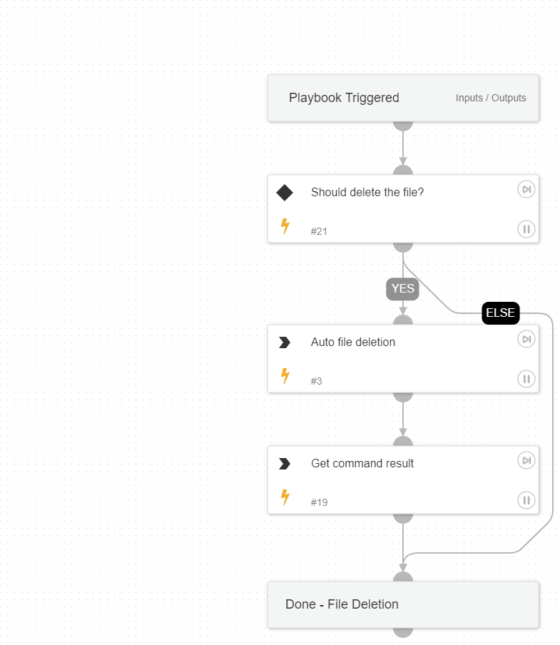

This playbook is one of the sub-playbooks in the eradication plan. 
This playbook handles the deletion of files as a crucial step in the eradication action.

## Dependencies

This playbook uses the following sub-playbooks, integrations, and scripts.

### Sub-playbooks

This playbook does not use any sub-playbooks.

### Integrations

This playbook does not use any integrations.

### Scripts

This playbook does not use any scripts.

### Commands

* core-run-script-delete-file
* core-get-script-execution-results

## Playbook Inputs

---

| **Name** | **Description** | **Default Value** | **Required** |
| --- | --- | --- | --- |
| FileRemediation | Choose 'Quarantine' or 'Delete'  to avoid file remediation conflicts.  For example, choosing 'Delete' ignores the 'Quarantine file' task under the containment playbook and executes only file deletion. | Delete | Optional |
| EndpointID | The endpoint ID. | Endpoints | Optional |
| FilePath | The file path for the file deletion task. | Path | Optional |

## Playbook Outputs

---
There are no outputs for this playbook.

## Playbook Image

---

