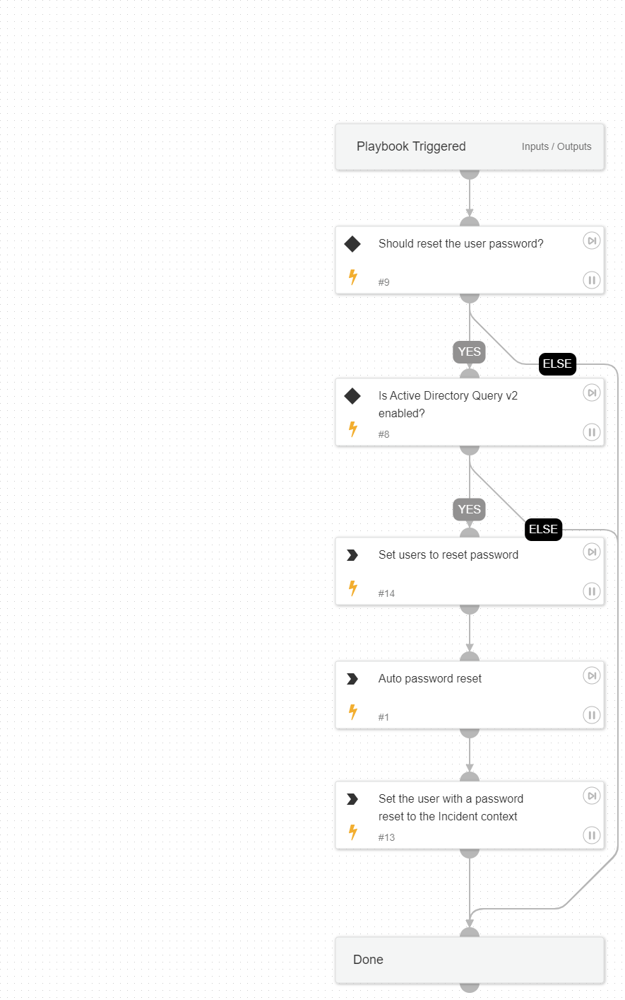

This playbook is one of the sub-playbooks in the eradication plan. 
This playbook handles the resetting of users' passwords as a crucial step in the containment action.

## Dependencies

This playbook uses the following sub-playbooks, integrations, and scripts.

### Sub-playbooks

This playbook does not use any sub-playbooks.

### Integrations

This playbook does not use any integrations.

### Scripts

* SetAndHandleEmpty
* CompareLists
* IsIntegrationAvailable

### Commands

* setParentIncidentContext
* ad-expire-password

## Playbook Inputs

---

| **Name** | **Description** | **Default Value** | **Required** |
| --- | --- | --- | --- |
| UserRemediation | Set to 'True' to reset the user's password. | True | Optional |
| Username | The username to reset the password for. |  | Optional |

## Playbook Outputs

---
There are no outputs for this playbook.

## Playbook Image

---

