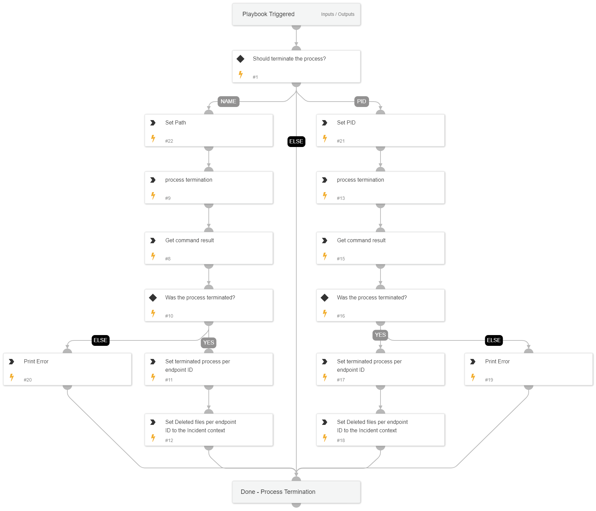

This playbook is one of the sub-playbooks in the eradication plan. 
This playbook handles the termination of the processes as a crucial step in the eradication action.
The playbook executes actions of process termination, which is a crucial step in the eradication process.
The process termination can be performed based on either the process ID or the process name.

## Dependencies

This playbook uses the following sub-playbooks, integrations, and scripts.

### Sub-playbooks

This playbook does not use any sub-playbooks.

### Integrations

This playbook does not use any integrations.

### Scripts

* PrintErrorEntry
* Set

### Commands

* setParentIncidentContext
* core-run-script-execute-commands
* core-get-script-execution-results
* core-run-script-kill-process

## Playbook Inputs

---

| **Name** | **Description** | **Default Value** | **Required** |
| --- | --- | --- | --- |
| ProcessTermination | Choose 'PID' to terminate the process by PID or 'Name' to terminate the process by process name.  Note: If neither option is selected, the process will not be terminated. | Name | Optional |
| EndpointID | The endpoint ID to run commands over. |  | Optional |
| FilePath | The file path for the process termination. |  | Optional |
| ProcessID | The process ID to terminate. |  | Optional |

## Playbook Outputs

---

| **Path** | **Description** | **Type** |
| --- | --- | --- |
| TerminatedProcessFromEndpoints | The terminated process from endpoint | unknown |

## Playbook Image

---

