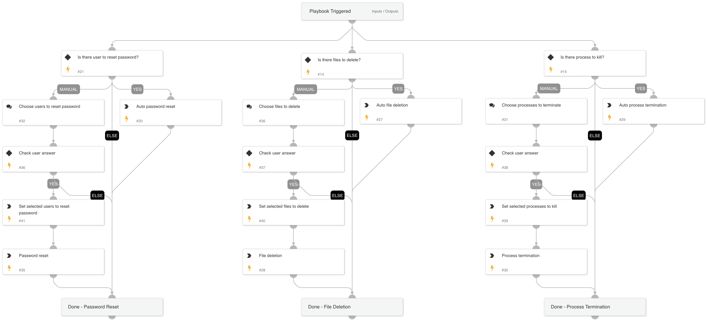

This playbook handles all the eradication actions available with Cortex XSIAM, including the following sub-playbooks:
* Eradication Plan - Reset user password
* Eradication Plan - Delete file
* Eradication Plan - Kill process (currently, the playbook supports terminating a process by name)  

Note: The playbook inputs enable manipulating the execution flow. Read the input descriptions for details.

## Dependencies

This playbook uses the following sub-playbooks, integrations, and scripts.

### Sub-playbooks

* Eradication Plan - Terminate Process
* Eradication Plan - Reset Password
* Eradication Plan - Delete File

### Integrations

This playbook does not use any integrations.

### Scripts

* Set

### Commands

This playbook does not use any commands.

## Playbook Inputs

---

| **Name** | **Description** | **Default Value** | **Required** |
| --- | --- | --- | --- |
| AutoEradicate | Set to True to execute the eradication playbook automatically. | True | Optional |
| EndpointID | The endpoint ID. | alert.agentid | Optional |
| FilePath | The file path for the file deletion and for the process termination task. | foundIncidents.CustomFields.initiatorpath | Optional |
| Username | The username to reset the password for. | foundIncidents.CustomFields.username | Optional |
| FileRemediation | Choose 'Quarantine' or 'Delete'  to avoid file remediation conflicts.  For example, choosing 'Delete' ignores the 'Quarantine file' task under the containment playbook and executes only file deletion. | Delete | Optional |
| UserRemediation | Set to 'True' to reset the user's password. | True | Optional |
| ProcessTermination | Choose 'PID' to terminate the process using the Process ID, or 'Name' to terminate the process using its name. Please note that providing the file path is mandatory for the process termination.  If 'PID' is chosen, the input \`ProcessID\` should not be empty; otherwise, the termination will not proceed. | Name | Optional |
| ProcessID | The process ID to terminate. |  | Optional |

## Playbook Outputs

---

| **Path** | **Description** | **Type** |
| --- | --- | --- |
| TerminatedProcessFromEndpoints | The terminated process from endpoint | unknown |

## Playbook Image

---

