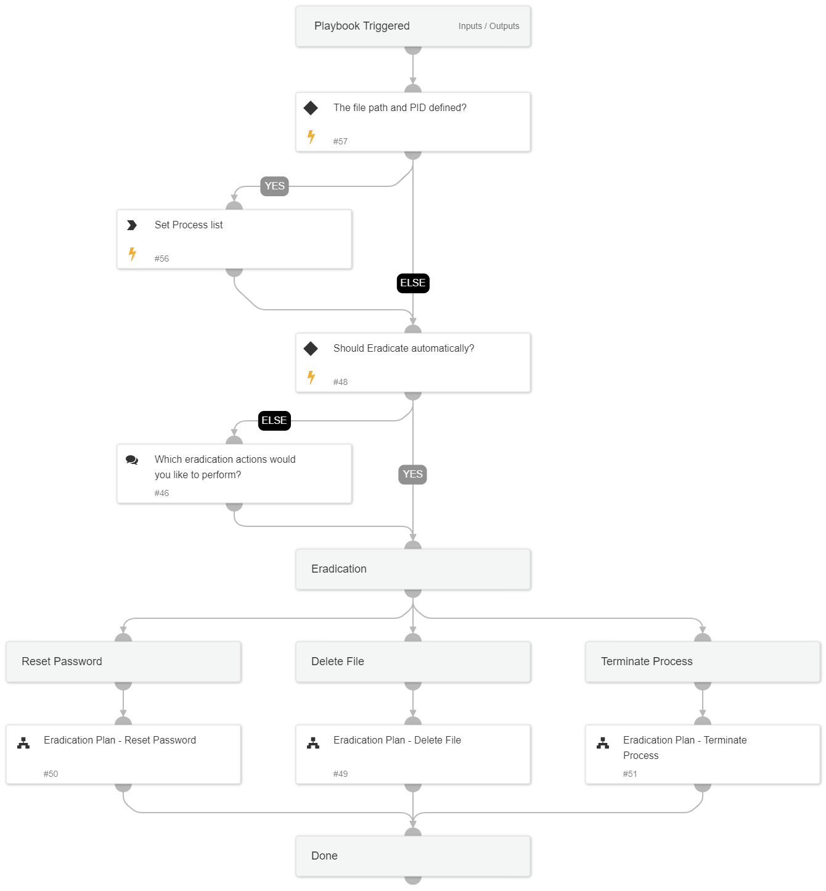

This playbook handles all the eradication actions available with Cortex XSIAM, including the following sub-playbooks:
* Eradication Plan - Reset user password
* Eradication Plan - Delete file
* Eradication Plan - Kill process (currently, the playbook supports terminating a process by name)  

Note: The playbook inputs enable manipulating the execution flow; read the input descriptions for details.

## Dependencies

This playbook uses the following sub-playbooks, integrations, and scripts.

### Sub-playbooks

* Eradication Plan - Reset Password
* Eradication Plan - Terminate Process
* Eradication Plan - Delete File

### Integrations

This playbook does not use any integrations.

### Scripts

This playbook does not use any scripts.

### Commands

This playbook does not use any commands.

## Playbook Inputs

---

| **Name** | **Description** | **Default Value** | **Required** |
| --- | --- | --- | --- |
| AutoEradicate | Set to True to execute the eradication playbook automatically. | True | Optional |
| EndpointID | The endpoint ID. | alert.agentid | Optional |
| FilePath | The file path for the file deletion task. | foundIncidents.CustomFields.initiatorpath | Optional |
| Username | The username to reset the password for. | foundIncidents.CustomFields.username | Optional |
| FileRemediation | Choose 'Quarantine' or 'Delete'  to avoid file remediation conflicts.  For example, choosing 'Delete' ignores the 'Quarantine file' task under the containment playbook and executes only file deletion. | Delete | Optional |
| UserRemediation | Set to 'True' to reset the user's password. | True | Optional |
| ProcessTermination | Set to 'True' to terminate the process by path. | True | Optional |

## Playbook Outputs

---
There are no outputs for this playbook.

## Playbook Image

---

