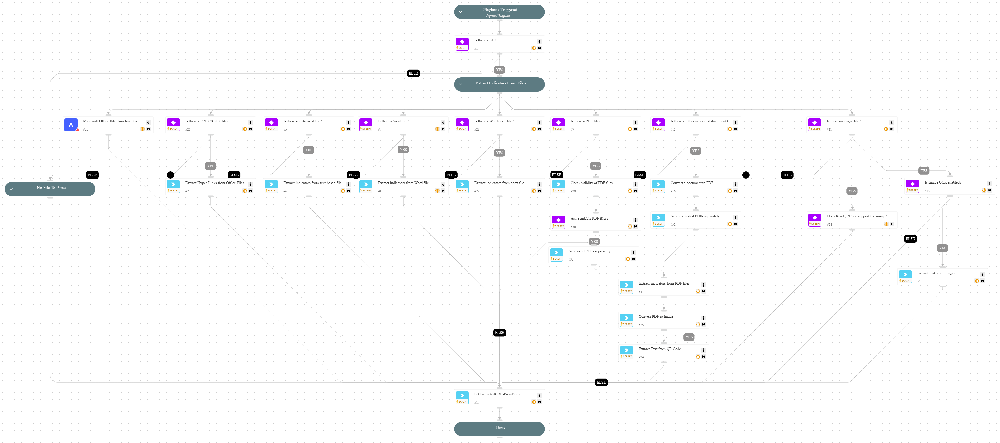

This playbook extracts indicators from a file.
Supported file types:
- CSV
- PDF
- TXT
- HTM, HTML
- DOC, DOCX
- PPT
- PPTX
- RTF
- XLS
- XLSX
- XML
- XLSM
- DOCM
- PPTM
- DOTM
- XLSB
- DOT
- PPSM.
The playbook does not support encrypted / password-protected files such as XLSB. Such files will be skipped.

## Dependencies

This playbook uses the following sub-playbooks, integrations, and scripts.

### Sub-playbooks

* Microsoft Office File Enrichment - Oletools

### Integrations

This playbook does not use any integrations.

### Scripts

* ConvertFile
* ExtractHyperlinksFromOfficeFiles
* ExtractIndicatorsFromTextFile
* ExtractIndicatorsFromWordFile
* IsPDFFileEncrypted
* ReadPDFFileV2
* ReadQRCode
* SetAndHandleEmpty

### Commands

* image-ocr-extract-text
* rasterize-pdf

## Playbook Inputs

---

| **Name** | **Description** | **Default Value** | **Required** |
| --- | --- | --- | --- |
| File | The file to extract indicators from. | File | Optional |
| Indicator Query | Indicators matching the indicator query will be used as playbook input |  | Optional |
| Decode | Available values: "True" or "False". Default is "False" When this is set to "True", in case a macro was found within the file \(using oletools\), it will output all the obfuscated strings with their decoded content \(Hex, Base64, StrReverse, Dridex, VBA\). | False | Optional |
| MaxImagesFromPDF | The maximum number of images that can be extracted from a PDF file. We recommend setting a low number if you don't need all images extracted from PDF files. If no value is specified, a default of 20 will be used. | 10 | Optional |

## Playbook Outputs

---

| **Path** | **Description** | **Type** |
| --- | --- | --- |
| Domain.Name | The extracted domains. | string |
| Account.Email.Address | The extracted email addresses. | string |
| File.MD5 | The extracted MD5 hash. | string |
| File.SHA1 | The extracted SHA1 hash. | string |
| File.SHA256 | The extracted SHA256 hash. | string |
| IP.Address | The extracted IP addresses. | string |
| File.Text | The text or images extracted from the PDF file. | string |
| File.Producer | The PDF file producer. | string |
| File.Title | The title of the PDF file. | string |
| File.xap | The XAP of the PDF file. | string |
| File.Author | The author of the file. | string |
| File.dc | The DC of the file. | string |
| File.xapmm | The XAPMM of the file. | string |
| File.ModDate | The mod date of the file. | string |
| File.CreationDate | The creation date of the file. | string |
| File.Pages | The number of pages in the file. | string |
| URL.Data | The list of URLs that were extracted from the file. | string |
| ExtractedURLsFromFiles | The list of URLs that were extracted from the file. This output is a duplicate of the URL.Data output and it enables parent playbooks to identify the URLs generated by this playbook. | String |
| Oletools.Oleid.ole_command_result | Indicator list from the oleid command. | string |
| Oletools.Oleid.file_name | File name. | string |
| Oletools.Oleid.sha256 | SHA256 hash. | string |
| Oletools.Oleid.ole_command_result.File_format | Indicator file format. | string |
| Oletools.Oleid.ole_command_result.Container_format | Indicator container format. | string |
| Oletools.Oleid.ole_command_result.Encrypted | Indicator encrypted. | string |
| Oletools.Oleid.ole_command_result.VBA_Macros | Indicator VBA macros. | string |
| Oletools.Oleid.ole_command_result.XLM_Macros | Indicator XLM macros. | string |
| Oletools.Oleid.ole_command_result.External_Relationships | Indicator external relationships. | string |
| Oletools.Oleid.ole_command_result.ObjectPool | Indicator object pool. | string |
| Oletools.Oleid.ole_command_result.Flash_objects | Indicator flash objects. | string |
| Oletools.Oleid.ole_command_result.File_format.Value | Indicator file format value. | string |
| Oletools.Oleid.ole_command_result.File_format.Ole_Risk | Indicator file format OLE risk. | string |
| Oletools.Oleid.ole_command_result.File_format.Description | Indicator file format description. | string |
| Oletools.Oleid.ole_command_result.Container_format.Value | Indicator container format value. | string |
| Oletools.Oleid.ole_command_result.Container_format.Ole_Risk | Indicator container format OLE risk. | string |
| Oletools.Oleid.ole_command_result.Container_format.Description | Indicator container format description. | string |
| Oletools.Oleid.ole_command_result.Encrypted.Value | Indicator encrypted value. | string |
| Oletools.Oleid.ole_command_result.Encrypted.Ole_Risk | Indicator encrypted OLE risk. | string |
| Oletools.Oleid.ole_command_result.Encrypted.Description | Indicator encrypted description. | string |
| Oletools.Oleid.ole_command_result.VBA_Macros.Value | Indicator VBA macros value. | string |
| Oletools.Oleid.ole_command_result.VBA_Macros.Ole_Risk | Indicator VBA macros OLE risk. | string |
| Oletools.Oleid.ole_command_result.VBA_Macros.Description | Indicator VBA macros description. | string |
| Oletools.Oleid.ole_command_result.XLM_Macros.Value | Indicator XLM macros value. | string |
| Oletools.Oleid.ole_command_result.XLM_Macros.Ole_Risk | Indicator XLM macros OLE risk. | string |
| Oletools.Oleid.ole_command_result.XLM_Macros.Description | Indicator XLM macros description. | string |
| Oletools.Oleid.ole_command_result.External_Relationships.Value | Indicator XLM macros value. | string |
| Oletools.Oleid.ole_command_result.External_Relationships.Ole_Risk | Indicator XLM macros OLE risk. | string |
| Oletools.Oleid.ole_command_result.External_Relationships.Description | Indicator XLM macros description. | string |
| Oletools.Oleid.ole_command_result.ObjectPool.Value | Indicator object pool value. | string |
| Oletools.Oleid.ole_command_result.ObjectPool.Ole_Risk | Indicator object pool OLE risk. | string |
| Oletools.Oleid.ole_command_result.ObjectPool.Description | Indicator object pool description. | string |
| Oletools.Oleid.ole_command_result.Flash_objects.Value | Indicator Flash objects value. | string |
| Oletools.Oleid.ole_command_result.Flash_objects.Ole_Risk | Indicator Flash objects OLE risk. | string |
| Oletools.Oleid.ole_command_result.Flash_objects.Description | Indicator Flash objects description. | string |
| Oletools.Oleobj.ole_command_result.hyperlinks | List of hyperlinks. | string |
| Oletools.Oleobj.file_name | File name. | string |
| Oletools.Oleobj.sha256 | SHA256 hash. | string |
| Oletools.Olevba.file_name | File name. | string |
| Oletools.Olevba.sha256 | SHA256 hash. | string |
| Oletools.Olevba.ole_command_result.macro_analyze | Macro analyze. | string |
| Oletools.Olevba.ole_command_result.macro_src_code | Macro source code. | string |
| Oletools.Olevba.ole_command_result.macro_list | Macro list. | string |
| DBotScore.Indicator | The indicator that was tested. | string |
| DBotScore.Type | The indicator type. | string |
| DBotScore.Vendor | The vendor used to calculate the score. | string |
| DBotScore.Score | The actual score. | number |
| QRCodeReader | The QR code reader primary key object. | unknown |
| QRCodeReader.Text | The raw text extracted from the QR code image. | String |
| QRCodeReader.Domain | The domains extracted from the QR code image if they are present. | String |
| QRCodeReader.URL | The URLs extracted from the QR code image if they are present. | String |
| QRCodeReader.IP | The IPs extracted from the QR code image if they are present. | String |
| ExtractedHyperLink | Extracted hyperlinks from supported Office documents \(xlsx,docx,pptx\). | unknown |
| ExtractedHyperLink.URL | The URL of the extracted hyperlink. | String |
| ExtractedHyperLink.FileName | The Office file from which the hyperlinks are extracted. | String |

## Playbook Image

---

