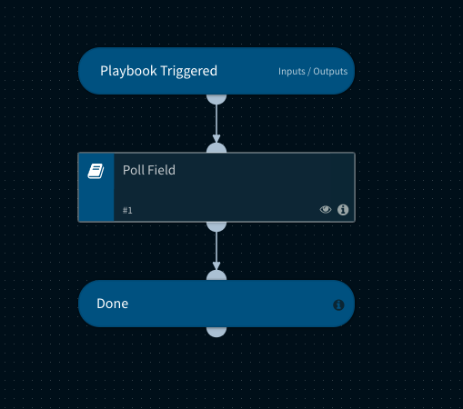

This playbook polls a field to check if a specific value exists.

## Dependencies
This playbook uses the following sub-playbooks, integrations, and scripts.

### Sub-playbooks
* Generic Polling

### Integrations
This playbook does not use any integrations.

### Scripts
* CheckFieldValue 

### Commands
This playbook does not use any commands.

## Playbook Inputs
---

| **Name** | **Description** | **Default Value** | **Required** |
| --- | --- | --- | --- |
| field | The field to poll for a value. Ensure that you use the lower case version of the field. For example, the Details field should be details. |  | Required |
| value | The regex to check the field for. By default this contains .\+, which matches anything other than None. | .+ | Required |
| frequency | How often to check \(in minutes\). | 1 | Required |
| timeout | When to timeout \(in minutes\). | 10 | Required |

## Playbook Outputs
---
There are no outputs for this playbook.

## Playbook Image
---

