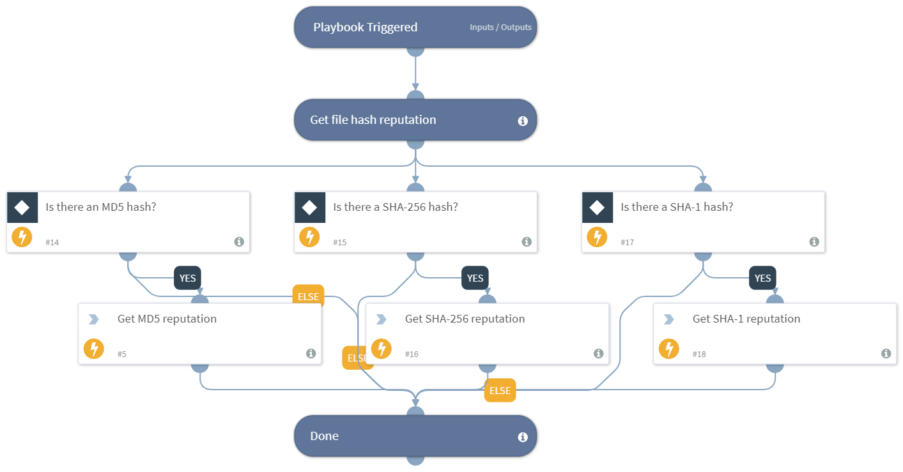

Gets a file's reputation using one or more integrations.

## Dependencies
This playbook uses the following sub-playbooks, integrations, and scripts.

### Sub-playbooks
This playbook does not use any sub-playbooks.

### Integrations
This playbook does not use any integrations.

### Scripts
* FileReputation

### Commands
This playbook does not use any commands.

## Playbook Inputs
---

| **Name** | **Description** | **Default Value** | **Source** | **Required** |
| --- | --- | --- | --- | --- |
| MD5 | The MD5 hash to enrich. | MD5 | File | Optional |
| SHA256 | The SHA256 hash to enrich. | SHA256 | File | Optional |
| SHA1 | The SHA1 hash to enrich. | SHA1 | File | Optional |

## Playbook Outputs
---

| **Path** | **Description** | **Type** |
| --- | --- | --- |
| File | The file's object. | unknown |
| File.MD5 | The MD5 hash of the file. | string |
| File.SHA1 | The SHA1 hash of the file. | string |
| File.SHA256 | The SHA256 hash of the file. | string |
| File.Malicious.Vendor | The vendor that made the decision that the file is malicious. | string |
| DBotScore | The DBotScore's object. | unknown |
| DBotScore.Indicator | The tested indicator. | string |
| DBotScore.Type | The type of the indicator. | string |
| DBotScore.Vendor | The vendor used to calculate the score. | string |
| DBotScore.Score | The actual score. | number |

## Playbook Image
---

