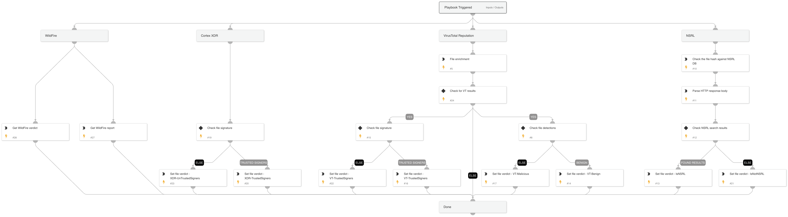

This playbook checks the file reputation and sets the verdict as a new context key.

The verdict is composed by 3 main components:

* VirusTotal detection rate
* Digital certificate signers
* NSRL DB

Note: a user can provide a list of trusted signers of his own using the playbook inputs
 

## Dependencies

This playbook uses the following sub-playbooks, integrations, and scripts.

### Sub-playbooks

This playbook does not use any sub-playbooks.

### Integrations

This playbook does not use any integrations.

### Scripts

* Set
* http
* ParseJSON

### Commands

* wildfire-report
* wildfire-get-verdict
* file

## Playbook Inputs

---

| **Name** | **Description** | **Default Value** | **Required** |
| --- | --- | --- | --- |
| DetectionThreshold | The minimum number of positive engines needed to mark file as malicious. | 5 | Optional |
| TrustedPublishers | A list of trusted publishers | Microsoft Root Authority,Microsoft Timestamping Service, Microsoft Code Signing PCA, Microsoft Corporation | Optional |
| FileSHA256 | The file SHA256. |  | Optional |

## Playbook Outputs

---

| **Path** | **Description** | **Type** |
| --- | --- | --- |
| VTFileVerdict | VirusTotal file verdict. | unknown |
| NSRLFileVerdict | NSRL file verdict. | unknown |
| VTFileSigners | VirusTotal file signers. | unknown |
| XDRFileSigners | XDR file signers. | unknown |
| WildFire.Report | WildFire report details. | unknown |
| WildFire.Verdicts | WildFire verdict. | unknown |

## Playbook Image

---

