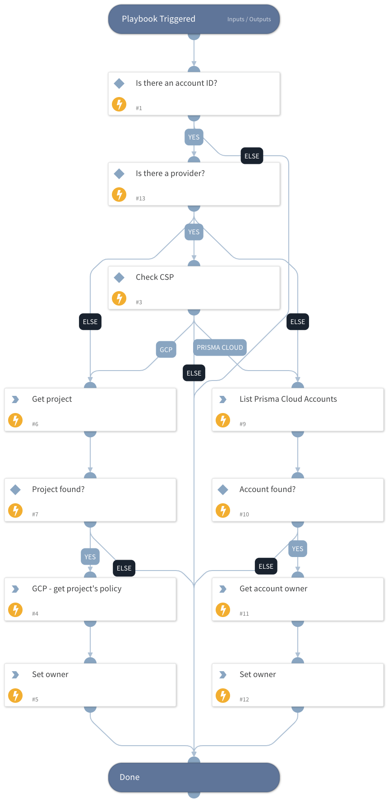

Retrieves the owners of a cloud account based on account ID.
Current supported platforms:
- GCP
- Prisma Cloud.

## Dependencies

This playbook uses the following sub-playbooks, integrations, and scripts.

### Sub-playbooks

This playbook does not use any sub-playbooks.

### Integrations

This playbook does not use any integrations.

### Scripts

SetAndHandleEmpty

### Commands

* gcp-iam-project-iam-policy-get
* gcp-iam-projects-get
* prisma-cloud-account-owner-list
* prisma-cloud-account-list

## Playbook Inputs

---

| **Name** | **Description** | **Default Value** | **Required** |
| --- | --- | --- | --- |
| AccountID | The account ID to search the owner for. |  | Optional |
| Provider | The account CSP. Available options: - PrismaCloud - GCP |  | Optional |

## Playbook Outputs

---

| **Path** | **Description** | **Type** |
| --- | --- | --- |
| CloudAccountOwner | The owner's email, if found. | unknown |

## Playbook Image

---

